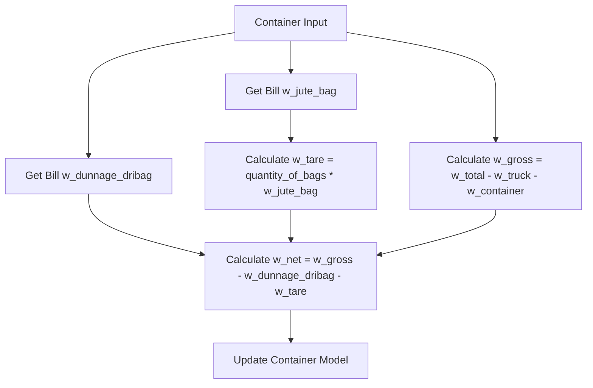

# Design Document

## Overview

This design outlines the refactoring approach to align the CFCCashew Inspection System's backend models, services, repositories, and frontend components with the current database schema. The refactoring will ensure complete utilization of all database fields, proper business logic implementation, and type-safe frontend interfaces.

## Architecture

The refactoring follows the existing layered architecture pattern:

```
Frontend (Vue.js + TypeScript) ↔ API Controllers ↔ Services ↔ Repositories ↔ Models ↔ Database
```

### Key Changes Required

1. **Model Layer**: Update fillable arrays, casts, and relationships
2. **Service Layer**: Implement complete business logic with all database fields
3. **Repository Layer**: Add query methods for new fields
4. **API Layer**: Update request validation and response formatting
5. **Frontend Layer**: Update TypeScript interfaces and Vue components

## Components and Interfaces

### Backend Components

#### 1. Model Updates

**Bill Model Changes:**
- Add missing fillable fields: `w_dunnage_dribag`, `w_jute_bag`, `net_on_bl`, `quantity_of_bags_on_bl`, `origin`, `inspection_start_date`, `inspection_end_date`, `inspection_location`, `sampling_ratio`
- Update casts for proper type handling of dates, decimals, and integers
- Fix weight calculation methods to use correct field sources

**Container Model Changes:**
- Add missing fillable fields: `container_condition`, `seal_condition`
- Update weight calculation methods to reference Bill model for `w_dunnage_dribag` and `w_jute_bag`
- Ensure proper casting of all weight fields

**CuttingTest Model Changes:**
- Verify all fields are properly accessible
- Ensure validation methods use correct field references

#### 2. Service Layer Updates

**BillService Enhancements:**
- Handle all Bill fields in CRUD operations
- Implement inspection date management
- Add origin and sampling ratio handling
- Update weight calculation coordination with containers

**ContainerService Enhancements:**
- Fix weight calculations to use Bill model fields where specified
- Implement container and seal condition validation
- Add business rule validations for weight discrepancies

**CuttingTestService Enhancements:**
- Implement all validation alerts as per business rules
- Ensure proper outturn rate calculations
- Add moisture validation and alerts

#### 3. Repository Layer Updates

**BillRepository Enhancements:**
- Add query methods for inspection date ranges
- Add filtering by origin and sampling ratio
- Optimize queries to include related data efficiently

**ContainerRepository Enhancements:**
- Add queries for container/seal condition filtering
- Implement weight range queries
- Add moisture alert queries (>11%)

**CuttingTestRepository Enhancements:**
- Add queries for validation alert detection
- Implement type-specific filtering improvements

### Frontend Components

#### 1. TypeScript Interface Updates

Create comprehensive interfaces matching the complete database schema:

```typescript
interface Bill {
  id: number;
  bill_number: string | null;
  seller: string | null;
  buyer: string | null;
  w_dunnage_dribag: number | null;
  w_jute_bag: number;
  net_on_bl: number | null;
  quantity_of_bags_on_bl: number | null;
  origin: string | null;
  inspection_start_date: string;
  inspection_end_date: string;
  inspection_location: string | null;
  sampling_ratio: number;
  note: string | null;
  // ... timestamps and relationships
}

interface Container {
  id: number;
  truck: string | null;
  container_number: string | null;
  quantity_of_bags: number | null;
  w_total: number | null;
  w_truck: number | null;
  w_container: number | null;
  w_gross: number | null;
  w_tare: number | null;
  w_net: number | null;
  container_condition: string;
  seal_condition: string;
  note: string | null;
  // ... timestamps and relationships
}
```

#### 2. Vue Component Updates

**Bill Form Components:**
- Add form fields for inspection dates, origin, sampling ratio
- Implement date pickers for inspection start/end dates
- Add validation for required fields

**Container Form Components:**
- Add condition selection dropdowns
- Update weight calculation displays
- Implement real-time weight calculation updates

**Display Components:**
- Update bill detail views to show all fields
- Add container condition indicators
- Implement weight discrepancy alerts in UI

## Data Models

### Updated Model Relationships

The many-to-many relationship between Bills and Containers remains unchanged, but the pivot table usage needs verification:

```php
// Bill Model
public function containers(): BelongsToMany
{
    return $this->belongsToMany(Container::class)
        ->withTimestamps()
        ->withPivot(['note']); // Verify pivot fields match database
}
```

### Weight Calculation Flow



## Error Handling

### Validation Enhancements

1. **Container Number Validation**: Implement ISO format validation (4 letters + 7 digits)
2. **Weight Discrepancy Alerts**: Implement all business rule validations
3. **Date Validation**: Ensure inspection dates are logical and within acceptable ranges
4. **Moisture Validation**: Alert for moisture > 11% as per business rules

### Error Response Standardization

```php
// Service layer error handling
public function validateWeightDiscrepancies(CuttingTest $test): array
{
    $alerts = [];
    
    if (($test->sample_weight - $test->w_sample_after_cut) > 5) {
        $alerts[] = 'Sample weight discrepancy exceeds 5g';
    }
    
    // Additional validations...
    
    return $alerts;
}
```

## Testing Strategy

### Backend Testing

1. **Model Tests**: Verify all fillable fields and casts work correctly
2. **Service Tests**: Test weight calculations with complete field sets
3. **Repository Tests**: Verify new query methods return expected results
4. **Integration Tests**: Test complete workflows with all fields

### Frontend Testing

1. **Component Tests**: Verify forms handle all database fields
2. **Type Safety Tests**: Ensure TypeScript interfaces prevent runtime errors
3. **Integration Tests**: Test API communication with complete data structures

### Test Data Requirements

- Create factory updates for all new fields
- Ensure seeders populate complete data sets
- Add edge case test data for validation scenarios

## Implementation Phases

### Phase 1: Backend Model Updates
- Update Model fillable arrays and casts
- Fix weight calculation methods
- Update relationships if needed

### Phase 2: Service Layer Refactoring
- Implement complete business logic
- Add validation methods
- Update calculation methods

### Phase 3: Repository Enhancements
- Add new query methods
- Optimize existing queries
- Add filtering capabilities

### Phase 4: API Layer Updates
- Update request validation rules
- Modify response formatting
- Add new endpoints if needed

### Phase 5: Frontend Refactoring
- Update TypeScript interfaces
- Modify Vue components
- Add new form fields and displays

### Phase 6: Testing and Validation
- Comprehensive testing of all changes
- Data migration verification
- Performance testing