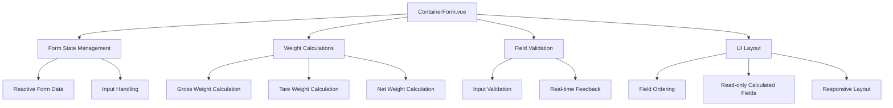
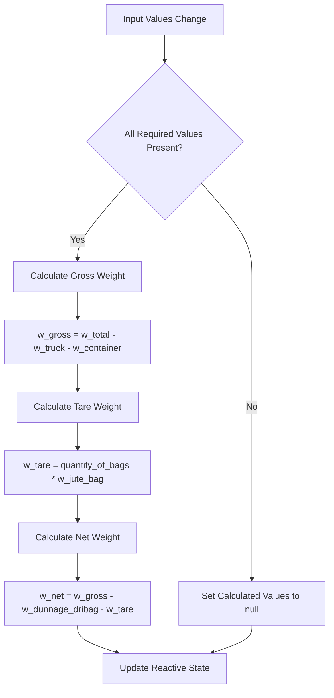
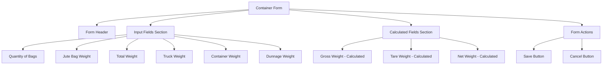
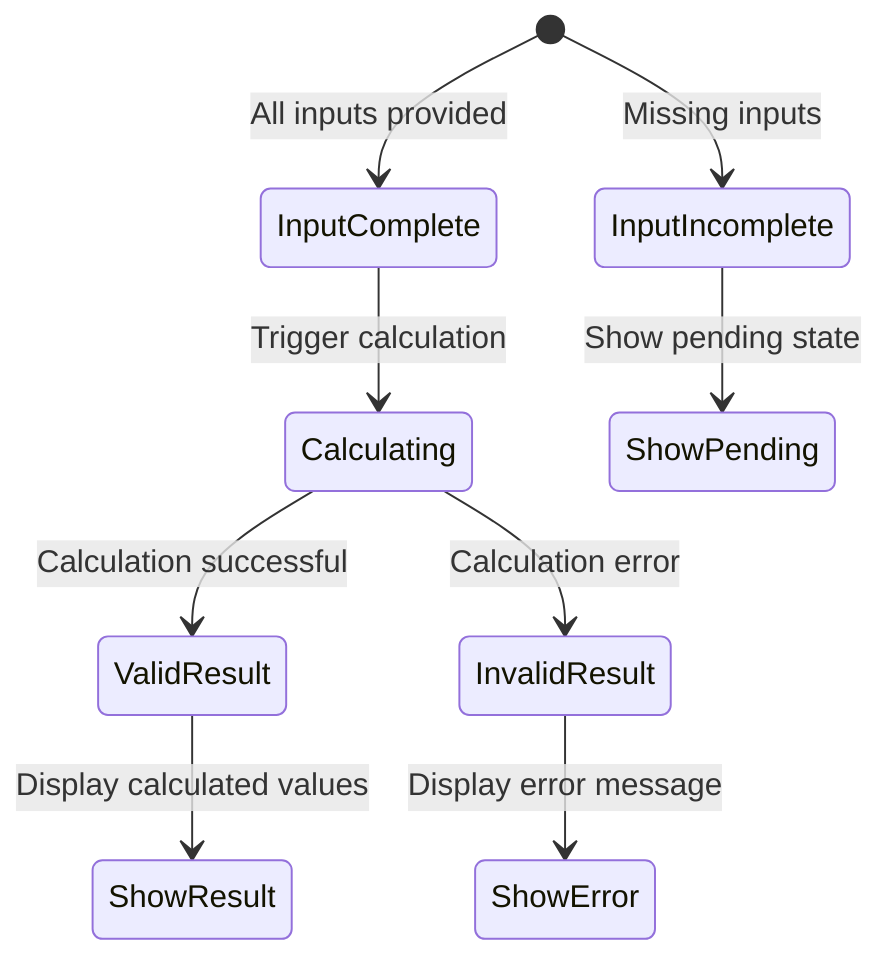

# Container Form Logic Enhancement Design

## Overview

This design outlines the enhancement of the Container form component to implement proper weight calculation formulas, field reordering, automatic calculation, and improved user interface layout. The goal is to ensure accurate weight calculations and a more intuitive user experience.

## Current State Analysis

The current ContainerForm component requires several improvements:

- Weight calculations are not automated
- Field ordering doesn't follow logical workflow
- Calculated fields (gross, tare, net weight) are manually editable
- Factory and validation logic may not align with business formulas

## Requirements

### Weight Calculation Formulas

```
w_gross = w_total - w_truck - w_container
w_tare = quantity_of_bags * w_jute_bag
w_net = w_gross - w_dunnage_dribag - w_tare
```

### Field Order Requirements

1. Quantity of Bags
2. Jute Bag Weight
3. Total Weight
4. Truck Weight
5. Container Weight
6. Gross Weight (calculated)
7. Tare Weight (calculated)
8. Net Weight (calculated)
9. Note

### Auto-calculation Requirements

- Gross Weight, Tare Weight, and Net Weight must be automatically calculated
- These calculated fields should be read-only
- Calculations should update in real-time as input values change

### UI Layout Requirements

- Container Information title should include created_at and updated_at timestamps inline

## Technology Stack

- **Frontend**: Vue 3 + TypeScript + Composition API
- **UI Components**: Custom UI library with shadcn/ui components
- **Form Handling**: Vue reactive forms with computed properties
- **Backend**: Laravel with form request validation
- **Database**: MySQL with Eloquent ORM

## Component Architecture

### ContainerForm Component Structure



### Form Data Model

```typescript
interface ContainerFormData {
    // Input fields (editable)
    quantity_of_bags: number | null;
    w_jute_bag: number;
    w_total: number | null;
    w_truck: number | null;
    w_container: number | null;
    w_dunnage_dribag: number | null;

    // Calculated fields (read-only)
    w_gross: number | null;
    w_tare: number | null;
    w_net: number | null;

    // Other fields
    truck: string | null;
    container_number: string | null;
    note: string | null;
    bill_id: number;
}
```

### Calculation Logic Implementation



## Data Layer Modifications

### Factory Updates

The ContainerFactory needs adjustment to properly implement calculation formulas:

```php
// Current implementation already follows formulas but needs validation
$grossWeight = $totalWeight - $truckWeight - $containerWeight;
$tareWeight = $quantityOfBags * $juteWeight;
$netWeight = $grossWeight - $dunnageWeight - $tareWeight;
```

### Validation Rules Enhancement

Request validation should ensure calculated fields are not manually set:

```php
// Remove validation for calculated fields from requests
// These will be computed automatically
unset($rules['w_gross'], $rules['w_tare'], $rules['w_net']);
```

### Model Updates

Container model should include calculation methods for consistency:

```php
// Add calculation methods to Container model
public function calculateGrossWeight(): float
public function calculateTareWeight(): float
public function calculateNetWeight(): float
```

## Frontend Component Design

### Form Field Organization

| Section                                         | Fields                  | Type  |
| ----------------------------------------------- | ----------------------- | ----- |
| Container Details                               | truck, container_number | Input |
| quantity_of_bags, w_jute_bag                    | Input                   |
| w_total, w_truck, w_container, w_dunnage_dribag | Input                   |
| w_gross, w_tare, w_net                          | Read-only Display       |
| note                                            | Textarea                |

### Reactive Calculation System

```typescript
// Computed properties for automatic calculations
const grossWeight = computed(() => {
    const { w_total, w_truck, w_container } = formData;
    if (!w_total || !w_truck || !w_container) return null;
    return w_total - w_truck - w_container;
});

const tareWeight = computed(() => {
    const { quantity_of_bags, w_jute_bag } = formData;
    if (!quantity_of_bags || !w_jute_bag) return null;
    return quantity_of_bags * w_jute_bag;
});

const netWeight = computed(() => {
    const gross = grossWeight.value;
    const tare = tareWeight.value;
    const { w_dunnage_dribag } = formData;

    if (!gross || !tare || !w_dunnage_dribag) return null;
    return gross - w_dunnage_dribag - tare;
});
```

### Form Layout Structure



## UI/UX Enhancements

### Container Information Display

The Container Information section should display timestamps inline with the title:

```html
<CardTitle class="flex items-center justify-between">
    <span>Container Information</span>
    <div class="space-y-1 text-sm text-muted-foreground">
        <div>Created: {{ formatDate(container.created_at) }}</div>
        <div>Updated: {{ formatDate(container.updated_at) }}</div>
    </div>
</CardTitle>
```

### Calculated Field Styling

Calculated fields should be visually distinct:

- Read-only background color
- Different border styling
- Calculator icon indicators
- Tooltips explaining calculation formulas

### Real-time Feedback

```typescript
// Visual feedback for calculations
const calculationStatus = computed(() => ({
    gross: grossWeight.value !== null ? 'calculated' : 'pending',
    tare: tareWeight.value !== null ? 'calculated' : 'pending',
    net: netWeight.value !== null ? 'calculated' : 'pending',
}));
```

## Form Validation Strategy

### Input Validation Rules

| Field            | Validation Rules                   |
| ---------------- | ---------------------------------- |
| quantity_of_bags | required, integer, min:1           |
| w_jute_bag       | required, numeric, min:0.01, max:9 |
| w_total          | required, integer, min:1           |
| w_truck          | required, integer, min:1           |
| w_container      | required, integer, min:1           |
| w_dunnage_dribag | required, integer, min:0           |

### Business Logic Validation

```typescript
// Additional validation for logical constraints
const validationRules = computed(() => ({
    // Total weight should be greater than truck + container weight
    totalWeightValid: w_total > w_truck + w_container,

    // Net weight should be positive
    netWeightPositive: netWeight.value > 0,

    // Gross weight should be sufficient for dunnage + tare
    grossWeightSufficient:
        grossWeight.value > w_dunnage_dribag + tareWeight.value,
}));
```

## Error Handling & User Feedback

### Calculation Error States



### User Feedback Messages

- **Missing Inputs**: "Please fill in all required fields to see calculated weights"
- **Invalid Calculation**: "Weight calculation results in negative values. Please check your inputs"
- **Successful Calculation**: Visual indicators showing calculated values with formulas

## Testing Strategy

### Unit Testing Requirements

```typescript
// Test calculation functions
describe('Weight Calculations', () => {
    test('calculates gross weight correctly');
    test('calculates tare weight correctly');
    test('calculates net weight correctly');
    test('handles missing input values');
    test('validates business logic constraints');
});
```

### Integration Testing

```php
// Laravel feature tests
test('container form submits with calculated weights')
test('validation prevents invalid weight combinations')
test('factory generates valid weight relationships')
```

## Implementation Phases

### Phase 1: Backend Foundation

- Update ContainerFactory with correct formulas
- Modify validation requests to remove calculated fields
- Add calculation methods to Container model
- Update seeders and tests

### Phase 2: Frontend Form Logic

- Implement reactive calculation system
- Create computed properties for weight calculations
- Add real-time validation feedback
- Implement field reordering

### Phase 3: UI/UX Polish

- Style calculated fields as read-only
- Add calculation status indicators
- Enhance Container Information display
- Implement responsive layout improvements

### Phase 4: Testing & Validation

- Comprehensive unit and integration tests
- User acceptance testing
- Performance optimization
- Error handling refinement
