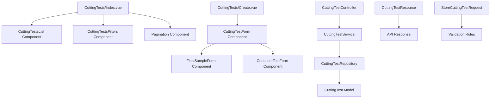
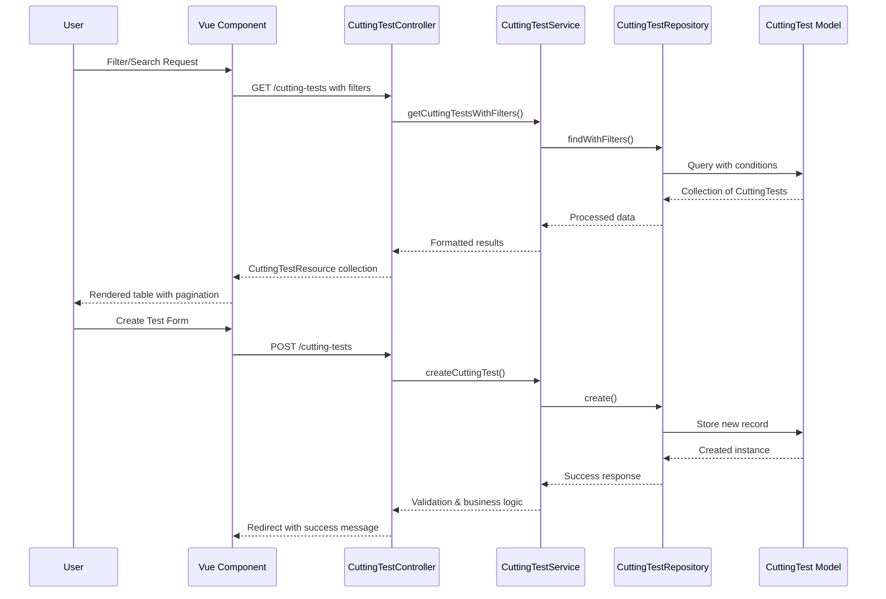
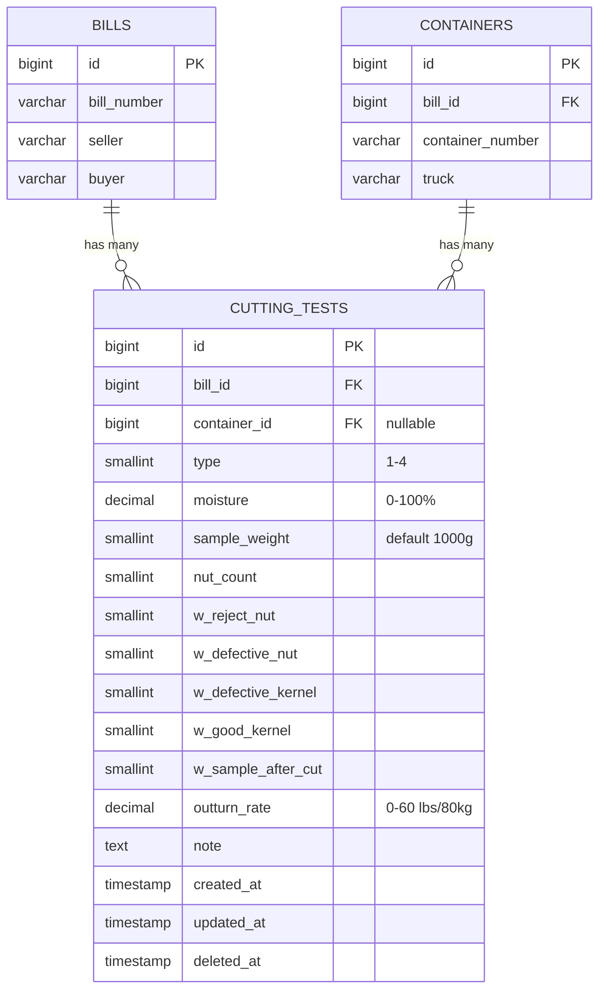
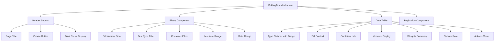
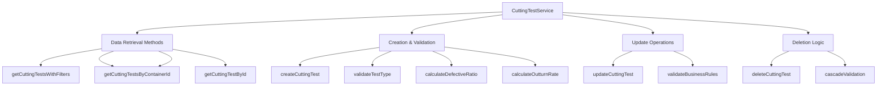
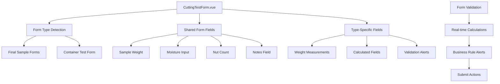

# Cutting Tests Section Functionality - Design Document

## Overview

This design document outlines the implementation of the Cutting Tests section functionality for the CFCCashew Inspection System. The feature encompasses a comprehensive cutting tests listing page with filtering capabilities and cutting test creation forms for both final sample tests and container tests.

The cutting tests functionality serves as a quality control system for cashew inspection, allowing inspectors to record and analyze moisture levels, weights, nut counts, and outturn rates across different test types.

## Architecture

### Component Architecture



### Data Flow Architecture



## Technology Stack & Dependencies

### Backend Dependencies

- **Laravel Framework**: 12.0 for backend services
- **CuttingTest Model**: Eloquent model with relationships
- **CuttingTestType Enum**: Type safety for test categories
- **StoreCuttingTestRequest**: Form validation
- **CuttingTestResource**: API response formatting

### Frontend Dependencies

- **Vue 3**: 3.5+ with Composition API
- **TypeScript**: Type safety and intellisense
- **Inertia.js**: Server-side rendering with SPA experience
- **Tailwind CSS**: Utility-first styling
- **shadcn-vue Components**: UI component library
- **Lucide Vue Icons**: Icon system
- **lodash-es**: Utility functions (debounce for search)

### Existing Composables

- **useBreadcrumbs**: Navigation breadcrumb management
- **usePagination**: Pagination logic and page navigation
- **useFiltering**: Search and filter state management

## API Endpoints Reference

### Cutting Tests Resource Routes

| Method    | URI                        | Controller Method | Description                       |
| --------- | -------------------------- | ----------------- | --------------------------------- |
| GET       | `/cutting-tests`           | `index()`         | List cutting tests with filtering |
| GET       | `/cutting-tests/create`    | `create()`        | Show creation form                |
| POST      | `/cutting-tests`           | `store()`         | Create new cutting test           |
| GET       | `/cutting-tests/{id}`      | `show()`          | Show cutting test details         |
| GET       | `/cutting-tests/{id}/edit` | `edit()`          | Show edit form                    |
| PUT/PATCH | `/cutting-tests/{id}`      | `update()`        | Update cutting test               |
| DELETE    | `/cutting-tests/{id}`      | `destroy()`       | Delete cutting test               |

### Request/Response Schema

#### Index Request Parameters

```typescript
interface CuttingTestFilters {
    bill_number?: string; // Filter by Bill number
    test_type?: 1 | 2 | 3 | 4; // Filter by test type
    container_id?: number; // Filter by container
    moisture_min?: number; // Minimum moisture level
    moisture_max?: number; // Maximum moisture level
    date_from?: string; // Start date filter
    date_to?: string; // End date filter
    per_page?: number; // Pagination size
    page?: number; // Page number
}
```

#### CuttingTest Resource Response

```typescript
interface CuttingTestResource {
    id: number;
    bill_id: number;
    container_id: number | null;
    type: 1 | 2 | 3 | 4;
    type_label: string;
    moisture: number | null;
    sample_weight: number;
    nut_count: number | null;
    w_reject_nut: number | null;
    w_defective_nut: number | null;
    w_defective_kernel: number | null;
    w_good_kernel: number | null;
    w_sample_after_cut: number | null;
    outturn_rate: number | null;
    note: string | null;
    defective_ratio?: {
        defective_nut: number;
        defective_kernel: number;
        ratio: number;
        formatted: string;
    };
    is_final_sample: boolean;
    is_container_test: boolean;
    bill?: Bill;
    container?: Container;
    created_at: string;
    updated_at: string;
}
```

### Authentication Requirements

All cutting test endpoints require:

- User authentication via Laravel Fortify
- Verified email status
- Standard CSRF protection for POST/PUT/DELETE requests

## Data Models & ORM Mapping

### CuttingTest Model Structure



### Model Relationships

#### CuttingTest Model

```php
// app/Models/CuttingTest.php
public function bill(): BelongsTo
{
    return $this->belongsTo(Bill::class);
}

public function container(): BelongsTo
{
    return $this->belongsTo(Container::class);
}
```

#### Data Validation Constraints

- **Type Validation**: Must be valid CuttingTestType enum (1-4)
- **Container Association**: Final samples (1-3) have null container_id, Container tests (4) require container_id
- **Moisture Range**: 0-20% with 2 decimal precision
- **Weight Constraints**: Positive integers with appropriate ranges
- **Outturn Rate**: 0-60 lbs/80kg range

## Component Architecture

### 1. CuttingTests Index Page Structure



#### Component Props Interface

```typescript
interface CuttingTestIndexProps {
    cutting_tests: CuttingTestResource[];
    pagination: {
        current_page: number;
        last_page: number;
        per_page: number;
        total: number;
        from: number | null;
        to: number | null;
        links: PaginationLink[];
    };
    filters: {
        bill_number?: string;
        test_type?: string;
        container_id?: string;
        moisture_min?: string;
        moisture_max?: string;
        date_from?: string;
        date_to?: string;
    };
}
```

### 2. Filtering System Architecture

#### Filter Component Structure

```typescript
interface FilterState {
    bill_number: string;
    test_type: string;
    container_id: string;
    moisture_min: string;
    moisture_max: string;
    date_from: string;
    date_to: string;
}

// Debounced search implementation
const debouncedSearch = debounce(() => {
    submitFilters(cleanedFilters());
}, 400);
```

#### Filter Options

- **Test Type Filter**: Dropdown with options:
    - All Tests
    - Final Sample (Type 1 - Type 2 - Type 3)
    - Container Cut (Type 4)
- **Bill Number**: Text input with autocomplete
- **Container**: Text input
- **Moisture Range**: Min/Max numeric inputs
- **Date Range**: Date picker for created_at filtering

### 3. Data Display Formatting

#### Table Column Specifications

| Column           | Display Format                   | Description                                 |
| ---------------- | -------------------------------- | ------------------------------------------- |
| Type             | Badge component                  | Color-coded by test type                    |
| Bill             | Link to bill detail              | Bill number with fallback to ID             |
| Container        | Link to container detail or text | Container number or "Final Sample"          |
| Moisture         | `xx.x%` format                   | One decimal place, null-safe                |
| Defective Nut    | `xxx/yyy.y` format               | `w_defective_nut/w_defective_nut*0.5`       |
| Defective Kernel | `xxx/yyy.y` format               | `w_defective_kernel/w_defective_kernel*0.5` |
| Weights          | Comma-separated                  | Reject, defective, good weights             |
| Outturn Rate     | `xx.xx lbs/80kg`                 | Two decimal places                          |
| Actions          | Dropdown menu                    | View, Edit, Delete options                  |

#### Badge Styling by Test Type

```typescript
const getTestTypeBadgeVariant = (type: number) => {
    switch (type) {
        case 1:
            return 'default'; // Final Sample 1st - Blue
        case 2:
            return 'default'; // Final Sample 2nd - Blue
        case 3:
            return 'default'; // Final Sample 3rd - Blue
        case 4:
            return 'secondary'; // Container Cut - Gray
        default:
            return 'outline';
    }
};
```

## Routing & Navigation

### Route Definitions

```typescript
// resources/js/routes/cutting-tests.ts
export const index = () => ({
    url: '/cutting-tests',
    method: 'get',
});

export const create = (params?: {
    bill_id?: number;
    container_id?: number;
}) => ({
    url: `/cutting-tests/create${buildQueryString(params)}`,
    method: 'get',
});

export const store = () => ({
    url: '/cutting-tests',
    method: 'post',
});

export const show = (id: number) => ({
    url: `/cutting-tests/${id}`,
    method: 'get',
});

export const edit = (id: number) => ({
    url: `/cutting-tests/${id}/edit`,
    method: 'get',
});

export const update = (id: number) => ({
    url: `/cutting-tests/${id}`,
    method: 'put',
});

export const destroy = (id: number) => ({
    url: `/cutting-tests/${id}`,
    method: 'delete',
});
```

### Navigation Integration

- **From Bill Details**: "Add Cutting Test" button with bill_id pre-filled
- **From Container Details**: "Add Container Test" with bill_id and container_id
- **From Dashboard**: Direct link to cutting tests index
- **Breadcrumb Navigation**: Home > Cutting Tests > [Current Page]

## Business Logic Layer

### CuttingTestService Architecture



#### Key Service Methods

```php
// app/Services/CuttingTestService.php

public function getCuttingTestsWithFilters(array $filters): Collection
{
    return $this->repository->findWithFilters($filters);
}

public function createCuttingTest(array $data): CuttingTest
{
    // Validate business rules
    $this->validateTestType($data);

    // Calculate derived fields
    $data = $this->calculateOutturnRate($data);

    return $this->repository->create($data);
}

private function validateTestType(array $data): void
{
    $type = $data['type'];
    $hasContainer = !empty($data['container_id']);

    // Final samples (1-3) should not have container
    if (in_array($type, [1, 2, 3]) && $hasContainer) {
        throw new ValidationException('Final samples cannot have container association');
    }

    // Container tests (4) must have container
    if ($type === 4 && !$hasContainer) {
        throw new ValidationException('Container tests require container association');
    }
}

private function calculateOutturnRate(array $data): array
{
    // Calculate outturn rate: (w_defective_kernel/2 + w_good_kernel) * 80 / 453.6
    if (isset($data['w_defective_kernel']) && isset($data['w_good_kernel'])) {
        $data['outturn_rate'] = ($data['w_defective_kernel'] / 2 + $data['w_good_kernel']) * 80 / 453.6;
    }

    return $data;
}
```

### Repository Query Methods

```php
// app/Repositories/CuttingTestRepository.php

public function findWithFilters(array $filters): Collection
{
    $query = $this->model->with(['bill', 'container'])
        ->when($filters['bill_number'] ?? null, function ($query, $billNumber) {
            $query->whereHas('bill', function ($q) use ($billNumber) {
                $q->where('bill_number', 'like', "%{$billNumber}%");
            });
        })
        ->when($filters['test_type'] ?? null, function ($query, $type) {
            $query->where('type', $type);
        })
        ->when($filters['container_id'] ?? null, function ($query, $containerId) {
            $query->where('container_id', $containerId);
        })
        ->when($filters['moisture_min'] ?? null, function ($query, $min) {
            $query->where('moisture', '>=', $min);
        })
        ->when($filters['moisture_max'] ?? null, function ($query, $max) {
            $query->where('moisture', '<=', $max);
        });

    return $query->orderBy('created_at', 'desc')->paginate($filters['per_page'] ?? 15);
}
```

## Cutting Test Creation Forms

### Form Component Architecture



### Form Field Specifications

#### Shared Fields (All Test Types)

```typescript
interface SharedCuttingTestFields {
    bill_id: number;
    container_id?: number | null;
    type: 1 | 2 | 3 | 4;
    moisture?: number | null;
    sample_weight: number; // Default: 1000g
    nut_count?: number | null;
    note?: string | null;
}
```

#### Weight Measurement Fields

```typescript
interface WeightFields {
    w_reject_nut?: number | null;
    w_defective_nut?: number | null;
    w_defective_kernel?: number | null;
    w_good_kernel?: number | null;
    w_sample_after_cut?: number | null;
}
```

#### Calculated Fields (Read-only)

```typescript
interface CalculatedFields {
    outturn_rate?: number | null; // Auto-calculated
    defective_ratio?: {
        formatted: string; // "xxx/yyy.y" format
        ratio: number;
    };
}
```

### Type-Specific Validation

#### Final Sample Forms (Types 1-3)

- **Container Association**: Must be null/undefined
- **Type Selection**: Restricted to 1, 2, or 3 based on existing samples
- **Bill Context**: Display bill information prominently

#### Container Test Form (Type 4)

- **Container Association**: Required and must exist
- **Container Context**: Display container details (number, truck, weights)
- **Multiple Tests**: Allow multiple container tests per container
- **Weight Validation**: Enhanced validation against container weights

### Real-time Calculations

#### Outturn Rate Formula

```typescript
const calculateOutturnRate = (
    defectiveKernel: number,
    goodKernel: number,
): number => {
    return ((defectiveKernel / 2 + goodKernel) * 80) / 453.6;
};
```

### Business Rule Alerts

#### Weight Validation Alerts

```typescript
// Alert if sample weight loss > 5g
if (sampleWeight - sampleAfterCut > 5) {
    showAlert('Sample weight loss exceeds 5g threshold');
}

// Alert if defective calculation discrepancy > 5g
if (defectiveNut / 3.3 - defectiveKernel > 5) {
    showAlert('Defective weight calculation discrepancy detected');
}

// Alert if good kernel calculation discrepancy > 10g
if ((sampleWeight - rejectNut - defectiveNut) / 3.3 - goodKernel > 10) {
    showAlert('Good kernel calculation discrepancy detected');
}
```

## Testing Strategy

### Unit Testing Coverage

#### Backend Test Classes

```php
// tests/Unit/CuttingTestServiceTest.php
class CuttingTestServiceTest extends TestCase
{
    /** @test */
    public function it_calculates_outturn_rate_correctly()
    {
        // Test outturn rate calculation formula
    }

    /** @test */
    public function it_validates_final_sample_container_association()
    {
        // Test business rule validation
    }

    /** @test */
    public function it_validates_container_test_requirements()
    {
        // Test container test validation
    }
}

// tests/Unit/CuttingTestRepositoryTest.php
class CuttingTestRepositoryTest extends TestCase
{
    /** @test */
    public function it_filters_by_test_type()
    {
        // Test filtering functionality
    }

    /** @test */
    public function it_filters_by_moisture_range()
    {
        // Test moisture range filtering
    }
}
```

#### Frontend Component Tests

```typescript
// tests/components/CuttingTestForm.test.ts
describe('CuttingTestForm', () => {
    test('calculates outturn rate in real-time', () => {
        // Test real-time calculation
    });

    test('validates type-specific requirements', () => {
        // Test form validation
    });

    test('displays business rule alerts', () => {
        // Test alert system
    });
});

// tests/pages/CuttingTestIndex.test.ts
describe('CuttingTest Index', () => {
    test('filters cutting tests by type', () => {
        // Test filtering functionality
    });

    test('paginates results correctly', () => {
        // Test pagination
    });

    test('formats data display properly', () => {
        // Test data formatting
    });
});
```

### Integration Testing

#### Feature Test Coverage

```php
// tests/Feature/CuttingTestControllerTest.php
class CuttingTestControllerTest extends TestCase
{
    /** @test */
    public function authenticated_user_can_view_cutting_tests_index()
    {
        // Test authenticated access to index
    }

    /** @test */
    public function user_can_filter_cutting_tests()
    {
        // Test filtering via HTTP requests
    }

    /** @test */
    public function user_can_create_final_sample_test()
    {
        // Test final sample creation workflow
    }

    /** @test */
    public function user_can_create_container_test()
    {
        // Test container test creation workflow
    }

    /** @test */
    public function form_validation_prevents_invalid_submissions()
    {
        // Test form validation rules
    }
}
```

### End-to-End Testing Scenarios

#### Critical User Journeys

1. **Inspector creates final sample test**
    - Navigate to cutting tests from bill detail
    - Select final sample type
    - Fill required fields with validation
    - Submit and verify success

2. **Inspector creates container test**
    - Navigate from container
