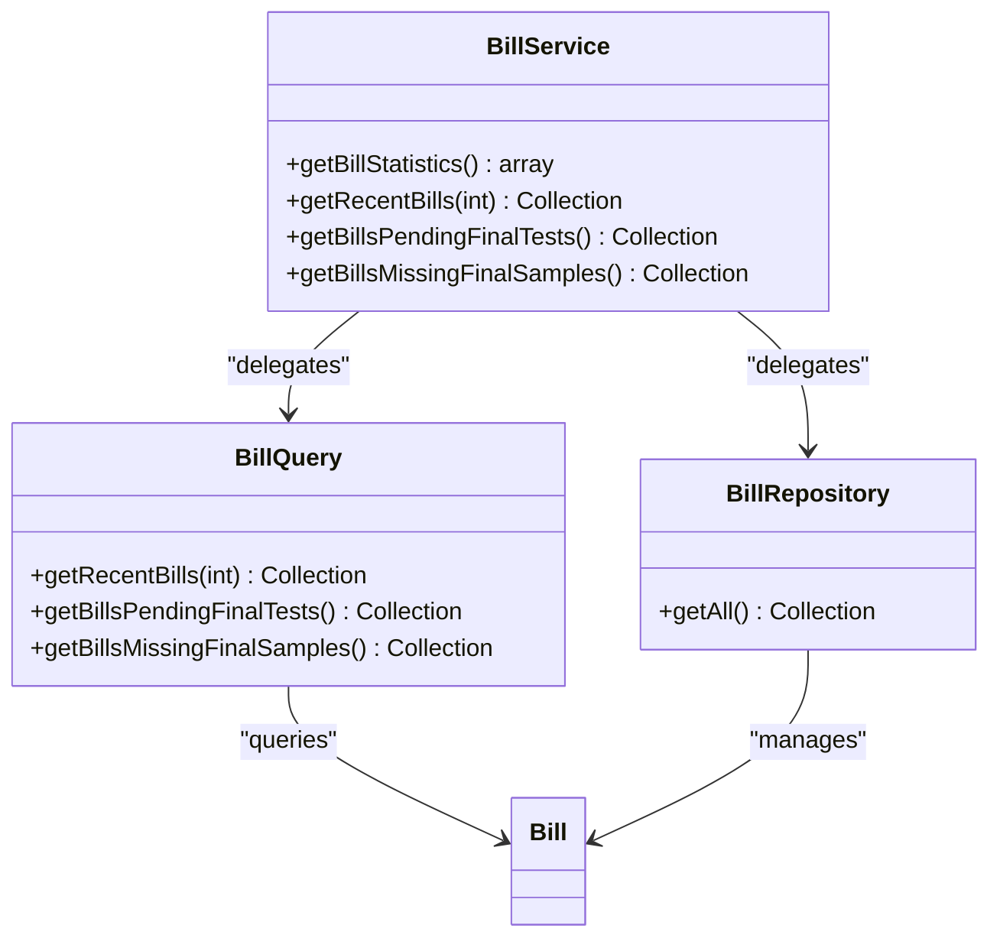
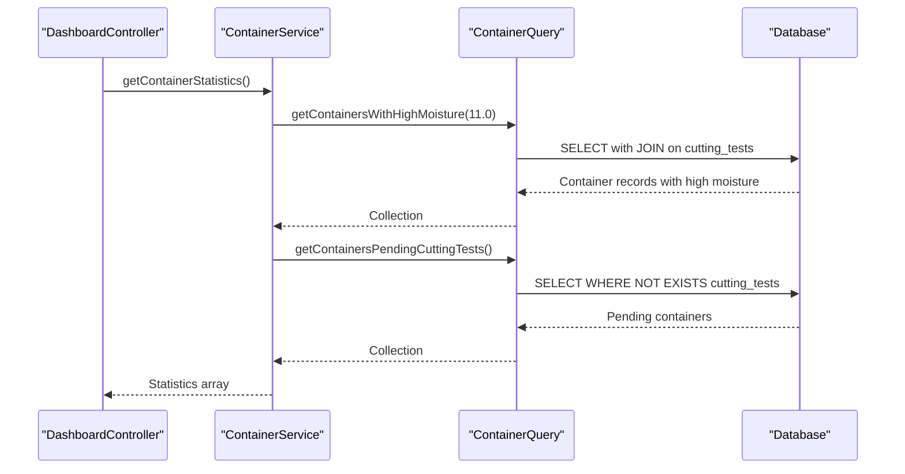
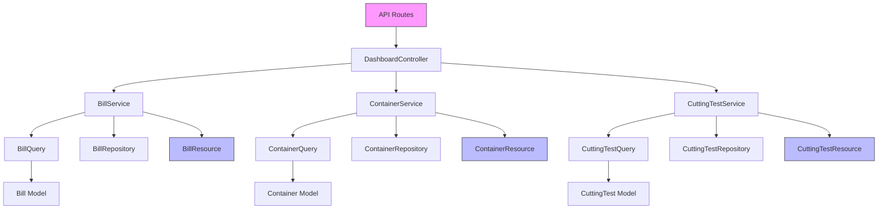

# Dashboard API

<cite>
**Referenced Files in This Document**   
- [DashboardController.php](file://app/Http/Controllers/Api/DashboardController.php)
- [api.php](file://routes/api.php)
- [BillService.php](file://app/Services/BillService.php)
- [ContainerService.php](file://app/Services/ContainerService.php)
- [CuttingTestService.php](file://app/Services/CuttingTestService.php)
- [BillQuery.php](file://app/Queries/BillQuery.php)
- [ContainerQuery.php](file://app/Queries/ContainerQuery.php)
- [CuttingTestQuery.php](file://app/Queries/CuttingTestQuery.php)
- [BillResource.php](file://app/Http/Resources/BillResource.php)
- [ContainerResource.php](file://app/Http/Resources/ContainerResource.php)
- [CuttingTestResource.php](file://app/Http/Resources/CuttingTestResource.php)
- [CuttingTestType.php](file://app/Enums/CuttingTestType.php)
- [Bill.php](file://app/Models/Bill.php)
- [Container.php](file://app/Models/Container.php)
- [CuttingTest.php](file://app/Models/CuttingTest.php)
</cite>

## Table of Contents
1. [Introduction](#introduction)
2. [API Endpoint Overview](#api-endpoint-overview)
3. [Authentication Requirements](#authentication-requirements)
4. [Response Structure](#response-structure)
5. [Data Aggregation and KPI Calculation](#data-aggregation-and-kpi-calculation)
6. [Example Responses](#example-responses)
7. [Client Usage Examples](#client-usage-examples)
8. [Caching Strategy](#caching-strategy)
9. [Error Handling](#error-handling)
10. [Architecture Overview](#architecture-overview)

## Introduction
The Dashboard API in the CFCCashew application provides a centralized endpoint for retrieving key performance indicators (KPIs) and statistical summaries across bills, containers, and cutting tests. This documentation details the `/api/dashboard/stats` endpoint and related dashboard widgets, explaining the data aggregation logic, response structure, and integration patterns used throughout the system.

## API Endpoint Overview
The primary dashboard statistics endpoint is accessible at `GET /api/dashboard/stats` and returns a comprehensive summary of key metrics used in the application's dashboard interface. This endpoint aggregates data from multiple models to provide real-time insights into operational status.

```mermaid
flowchart TD
A["GET /api/dashboard/stats"] --> B[DashboardController::stats()]
B --> C[BillService::getBillStatistics()]
B --> D[ContainerService::getContainerStatistics()]
B --> E[CuttingTestService::getCuttingTestStatistics()]
C --> F[BillQuery::getRecentBills()]
C --> G[BillQuery::getBillsPendingFinalTests()]
C --> H[BillQuery::getBillsMissingFinalSamples()]
D --> I[ContainerQuery::getContainersWithHighMoisture()]
D --> J[ContainerQuery::getContainersPendingCuttingTests()]
E --> K[CuttingTestQuery::getTestsWithHighMoisture()]
E --> L[CuttingTestQuery::getMoistureDistribution()]
F --> M[BillResource]
I --> N[ContainerResource]
K --> O[CuttingTestResource]
M --> P[JSON Response]
N --> P
O --> P
```

**Diagram sources**
- [DashboardController.php](file://app/Http/Controllers/Api/DashboardController.php#L22-L44)
- [BillService.php](file://app/Services/BillService.php#L78-L91)
- [ContainerService.php](file://app/Services/ContainerService.php#L107-L119)
- [CuttingTestService.php](file://app/Services/CuttingTestService.php#L114-L126)

**Section sources**
- [DashboardController.php](file://app/Http/Controllers/Api/DashboardController.php#L22-L44)
- [api.php](file://routes/api.php#L10-L12)

## Authentication Requirements
The dashboard endpoints require authentication via Laravel Sanctum. All requests must include a valid Bearer token in the Authorization header. The middleware configuration in the route definition enforces this requirement across all dashboard-related endpoints.

**Section sources**
- [api.php](file://routes/api.php#L9-L19)

## Response Structure
The `/api/dashboard/stats` endpoint returns a JSON object containing three main sections: bills, containers, and cutting_tests. Each section contains specific KPIs relevant to its domain.

```json
{
  "bills": {
    "total": 156,
    "pending_final_tests": 8,
    "missing_final_samples": 12
  },
  "containers": {
    "high_moisture": 5,
    "pending_tests": 3
  },
  "cutting_tests": {
    "high_moisture": 7,
    "moisture_distribution": {
      "total_tests": 245,
      "avg_moisture": 10.2,
      "min_moisture": 6.5,
      "max_moisture": 14.8,
      "distribution": {
        "low": 45,
        "medium": 165,
        "high": 35
      }
    }
  }
}
```

**Section sources**
- [DashboardController.php](file://app/Http/Controllers/Api/DashboardController.php#L22-L44)

## Data Aggregation and KPI Calculation
The dashboard statistics are calculated through a service-layer aggregation pattern, where each domain service (BillService, ContainerService, CuttingTestService) is responsible for calculating its own KPIs and returning structured data to the controller.

### Bill Statistics Calculation
Bill-related KPIs are calculated by the BillService using data from the Bill model and associated relationships. The total bills count is derived from all records in the bills table, while pending final tests and missing final samples are determined through specific query conditions.



**Diagram sources**
- [BillService.php](file://app/Services/BillService.php#L78-L91)
- [BillQuery.php](file://app/Queries/BillQuery.php#L74-L95)

**Section sources**
- [BillService.php](file://app/Services/BillService.php#L78-L91)
- [BillQuery.php](file://app/Queries/BillQuery.php#L74-L95)

### Container and Cutting Test Statistics
Container and cutting test statistics follow a similar pattern, with their respective services delegating to query objects to retrieve data based on business rules. High moisture alerts are triggered when moisture levels exceed 11.0%, which is the threshold defined in the service methods.



**Diagram sources**
- [ContainerService.php](file://app/Services/ContainerService.php#L107-L119)
- [ContainerQuery.php](file://app/Queries/ContainerQuery.php#L23-L46)

**Section sources**
- [ContainerService.php](file://app/Services/ContainerService.php#L107-L119)
- [CuttingTestService.php](file://app/Services/CuttingTestService.php#L114-L126)

## Example Responses
The dashboard API returns structured JSON responses that power various widgets in the frontend interface. Below are example responses for the main dashboard statistics and related endpoints.

### Full Dashboard Statistics
```json
{
  "bills": {
    "total": 156,
    "pending_final_tests": 8,
    "missing_final_samples": 12
  },
  "containers": {
    "high_moisture": 5,
    "pending_tests": 3
  },
  "cutting_tests": {
    "high_moisture": 7,
    "moisture_distribution": {
      "total_tests": 245,
      "avg_moisture": 10.2,
      "min_moisture": 6.5,
      "max_moisture": 14.8,
      "distribution": {
        "low": 45,
        "medium": 165,
        "high": 35
      }
    }
  }
}
```

### Recent Bills Widget
```json
{
  "data": [
    {
      "id": 156,
      "bill_number": "CFCC-2025-001",
      "seller": "Global Cashew Suppliers",
      "buyer": "Premium Nut Distributors",
      "containers_count": 3,
      "final_samples_count": 2,
      "average_outurn": 52.34,
      "created_at": "2025-09-20T10:30:00Z"
    }
  ]
}
```

### High Moisture Containers
```json
{
  "data": [
    {
      "id": 45,
      "container_number": "CFCU1234567",
      "truck": "TRK-789",
      "average_moisture": 12.5,
      "bill": {
        "bill_number": "CFCC-2025-001",
        "seller": "Global Cashew Suppliers"
      },
      "cutting_tests": [
        {
          "id": 89,
          "moisture": 12.5,
          "outturn_rate": 48.2
        }
      ]
    }
  ]
}
```

**Section sources**
- [DashboardController.php](file://app/Http/Controllers/Api/DashboardController.php#L22-L44)
- [BillResource.php](file://app/Http/Resources/BillResource.php#L15-L41)
- [ContainerResource.php](file://app/Http/Resources/ContainerResource.php#L15-L61)

## Client Usage Examples
The dashboard endpoints can be consumed using standard HTTP clients. Below are examples of how to retrieve dashboard statistics using common approaches.

### cURL Example
```bash
curl -X GET "https://cfccashew.test/api/dashboard/stats" \
  -H "Authorization: Bearer your-api-token" \
  -H "Accept: application/json"
```

### JavaScript Fetch Example
```javascript
fetch('/api/dashboard/stats', {
  method: 'GET',
  headers: {
    'Authorization': `Bearer ${apiKey}`,
    'Accept': 'application/json',
  },
})
.then(response => response.json())
.then(data => {
  console.log('Dashboard statistics:', data);
  // Update UI with KPIs
  updateKPIWidgets(data);
})
.catch(error => {
  console.error('Error fetching dashboard data:', error);
});
```

**Section sources**
- [DashboardController.php](file://app/Http/Controllers/Api/DashboardController.php#L22-L44)

## Caching Strategy
While the current implementation does not include explicit caching, the service-layer architecture provides a natural extension point for implementing caching strategies. The `getBillStatistics()`, `getContainerStatistics()`, and `getCuttingTestStatistics()` methods in their respective services could be enhanced with Laravel's cache helpers to improve performance for high-traffic scenarios.

A recommended caching approach would involve tagging related data and invalidating cache entries when bill, container, or cutting test records are created or updated through the application's CRUD operations.

**Section sources**
- [BillService.php](file://app/Services/BillService.php#L78-L91)
- [ContainerService.php](file://app/Services/ContainerService.php#L107-L119)
- [CuttingTestService.php](file://app/Services/CuttingTestService.php#L114-L126)

## Error Handling
The dashboard endpoints inherit Laravel's standard error handling and authentication mechanisms. Unauthorized access attempts return a 401 Unauthorized response, while properly authenticated requests that encounter server errors return appropriate 5xx status codes with JSON error details.

The controller methods use Laravel's JsonResponse to ensure consistent response formatting, and the middleware pipeline handles authentication before any business logic is executed.

**Section sources**
- [DashboardController.php](file://app/Http/Controllers/Api/DashboardController.php#L22-L44)
- [api.php](file://routes/api.php#L9-L19)

## Architecture Overview
The dashboard API follows a clean architecture pattern with separation of concerns across multiple layers: routes define the API contract, controllers handle HTTP concerns, services orchestrate business logic, queries handle data retrieval, and resources transform data for the API response.



**Diagram sources**
- [DashboardController.php](file://app/Http/Controllers/Api/DashboardController.php#L22-L44)
- [BillService.php](file://app/Services/BillService.php#L78-L91)
- [ContainerService.php](file://app/Services/ContainerService.php#L107-L119)
- [CuttingTestService.php](file://app/Services/CuttingTestService.php#L114-L126)

**Section sources**
- [DashboardController.php](file://app/Http/Controllers/Api/DashboardController.php#L1-L118)
- [BillService.php](file://app/Services/BillService.php#L1-L91)
- [ContainerService.php](file://app/Services/ContainerService.php#L1-L119)
- [CuttingTestService.php](file://app/Services/CuttingTestService.php#L1-L126)