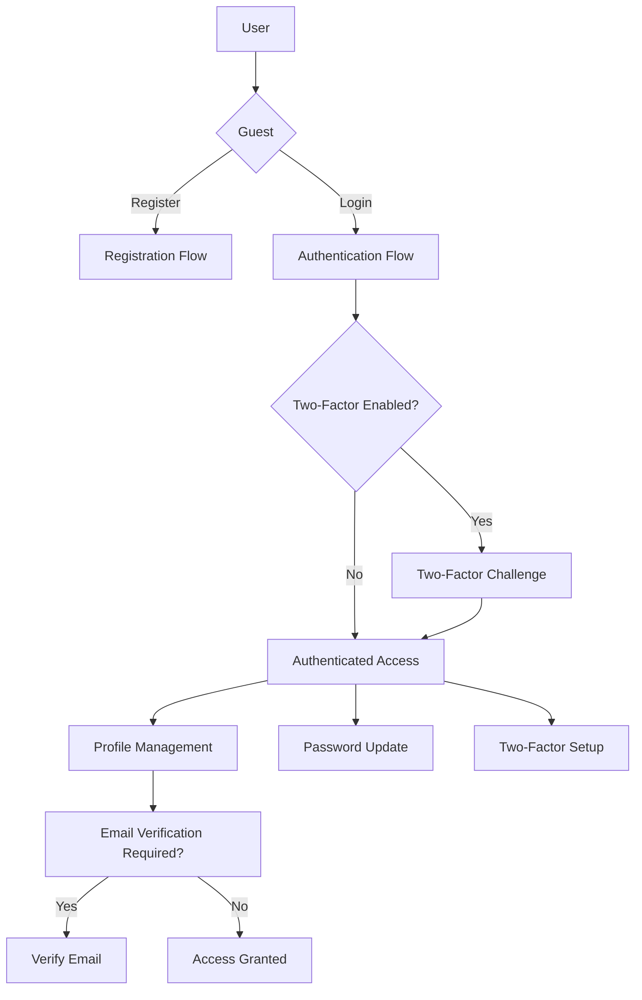
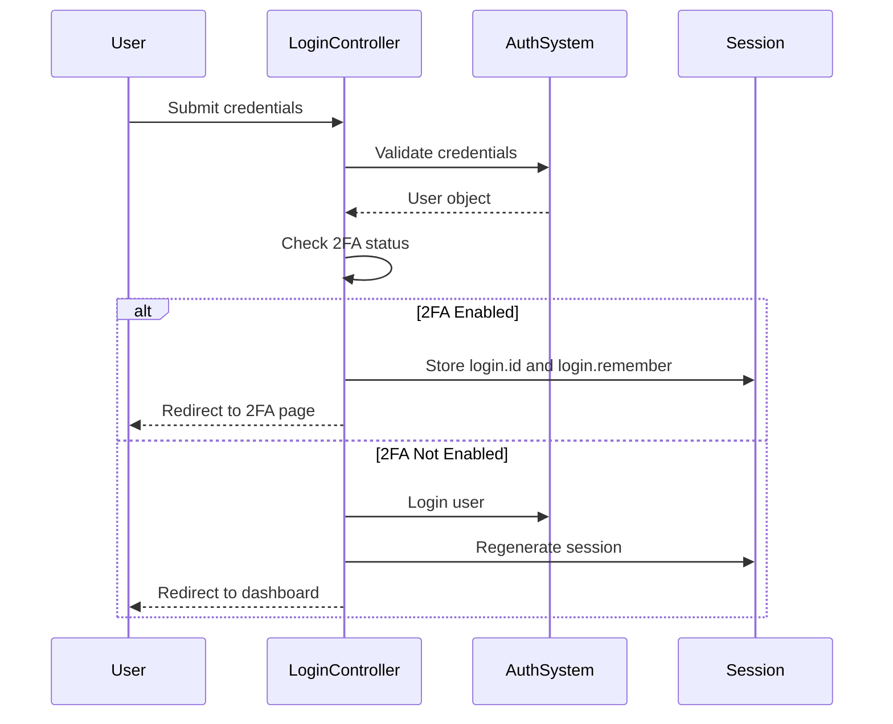
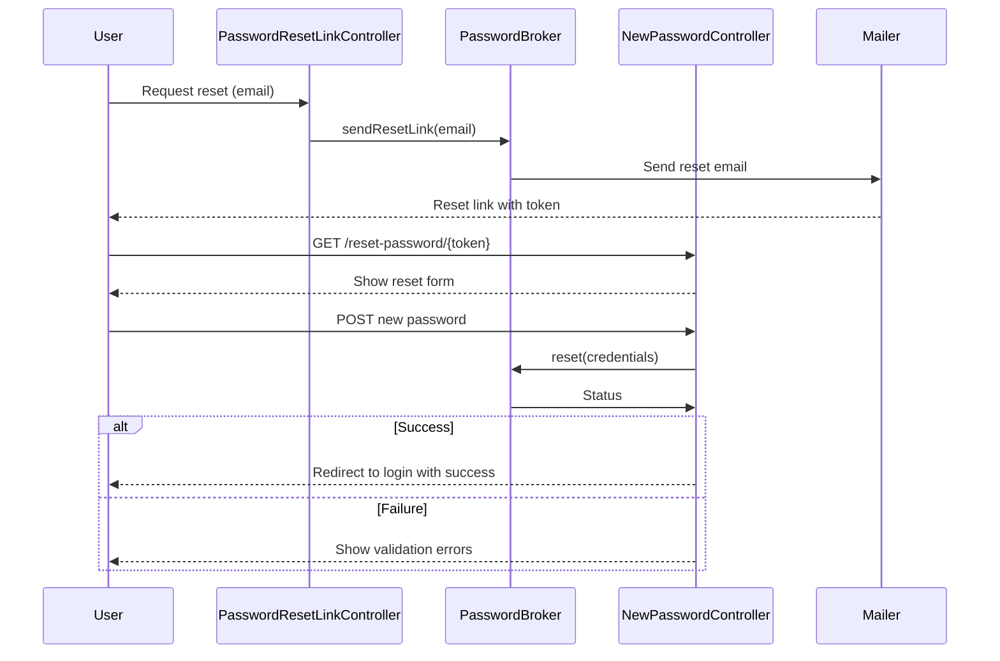
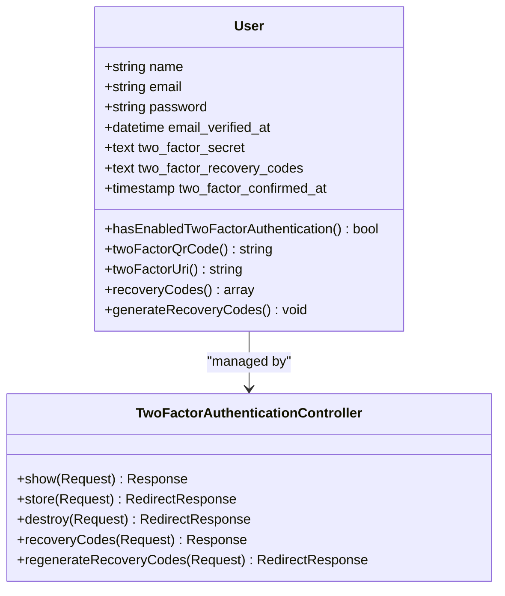
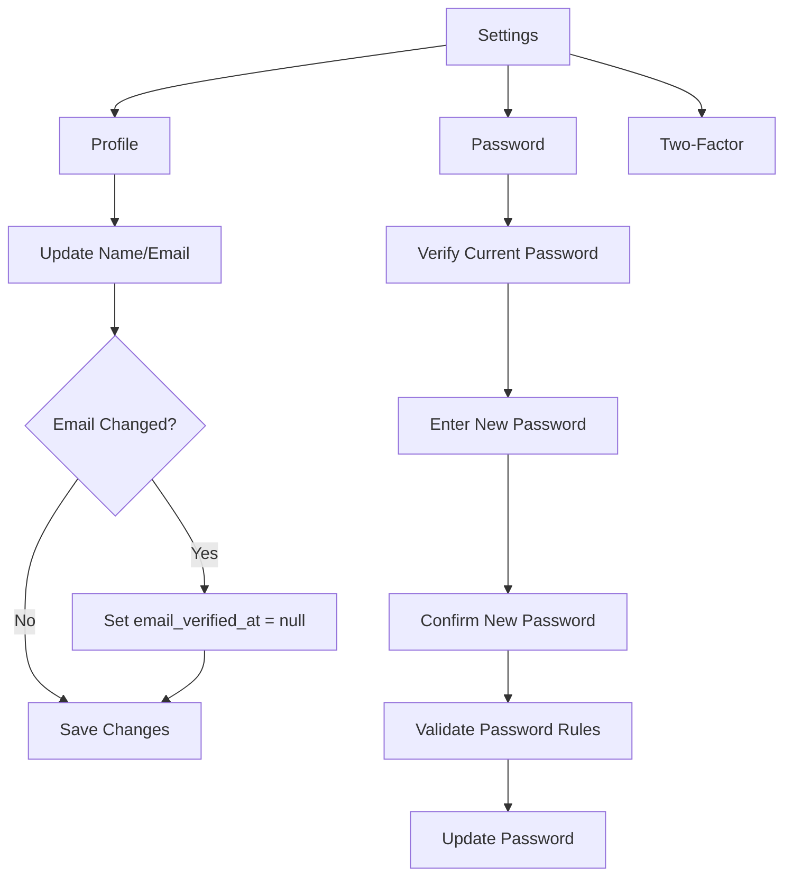

# Authentication & User Management

<cite>
**Referenced Files in This Document**   
- [User.php](file://app/Models/User.php)
- [RegisteredUserController.php](file://app/Http/Controllers/Auth/RegisteredUserController.php)
- [AuthenticatedSessionController.php](file://app/Http/Controllers/Auth/AuthenticatedSessionController.php)
- [PasswordResetLinkController.php](file://app/Http/Controllers/Auth/PasswordResetLinkController.php)
- [NewPasswordController.php](file://app/Http/Controllers/Auth/NewPasswordController.php)
- [ProfileController.php](file://app/Http/Controllers/Settings/ProfileController.php)
- [PasswordController.php](file://app/Http/Controllers/Settings/PasswordController.php)
- [TwoFactorAuthenticationController.php](file://app/Http/Controllers/Settings/TwoFactorAuthenticationController.php)
- [auth.php](file://routes/auth.php)
- [settings.php](file://routes/settings.php)
- [2025_08_14_170933_add_two_factor_columns_to_users_table.php](file://database/migrations/2025_08_14_170933_add_two_factor_columns_to_users_table.php)
</cite>

## Table of Contents
1. [Introduction](#introduction)
2. [Authentication Flow Overview](#authentication-flow-overview)
3. [User Registration](#user-registration)
4. [Login and Session Management](#login-and-session-management)
5. [Password Reset and Recovery](#password-reset-and-recovery)
6. [Email Verification](#email-verification)
7. [Two-Factor Authentication](#two-factor-authentication)
8. [Profile and Password Management](#profile-and-password-management)
9. [Security Implementation](#security-implementation)
10. [Common Issues and Troubleshooting](#common-issues-and-troubleshooting)
11. [Best Practices](#best-practices)

## Introduction
The CFCCashew application implements a robust authentication and user management system using Laravel Fortify, providing secure user registration, login, password management, and two-factor authentication. This document details the implementation, flows, and security measures in place to protect user accounts and data.

## Authentication Flow Overview

**Diagram sources**
- [auth.php](file://routes/auth.php#L1-L52)
- [settings.php](file://routes/settings.php#L1-L28)

## User Registration

The user registration process in CFCCashew follows a standard Fortify implementation with validation and automatic login upon successful registration. The system ensures email uniqueness and applies Laravel's default password complexity rules.

When a user registers, the application:
1. Validates name, email, and password
2. Creates a new User record with hashed password
3. Fires a Registered event
4. Automatically logs in the new user
5. Redirects to the dashboard

The registration interface is rendered using Inertia.js, providing a seamless SPA-like experience.

**Section sources**
- [RegisteredUserController.php](file://app/Http/Controllers/Auth/RegisteredUserController.php#L1-L51)
- [User.php](file://app/Models/User.php#L1-L50)

## Login and Session Management

The login system implements secure session handling with CSRF protection and session regeneration. Upon successful authentication, the session is regenerated to prevent session fixation attacks.

For users with two-factor authentication enabled, the system redirects to the two-factor challenge page instead of granting immediate access. The login controller stores minimal session data (user ID and remember preference) to facilitate the two-factor flow.

Session invalidation and token regeneration occur upon logout, ensuring that previous session tokens cannot be reused.

**Diagram sources**
- [AuthenticatedSessionController.php](file://app/Http/Controllers/Auth/AuthenticatedSessionController.php#L1-L63)
- [auth.php](file://routes/auth.php#L1-L52)

**Section sources**
- [AuthenticatedSessionController.php](file://app/Http/Controllers/Auth/AuthenticatedSessionController.php#L1-L63)

## Password Reset and Recovery

The password reset flow follows a secure token-based approach:
1. User requests password reset via email
2. System sends reset link with signed token
3. User clicks link and submits new password
4. System validates token and updates password
5. PasswordReset event is fired

The implementation uses Laravel's built-in password broker, which handles token generation, expiration (default 60 minutes), and database storage. The reset link contains a route-bound token parameter that is validated server-side.

**Diagram sources**
- [PasswordResetLinkController.php](file://app/Http/Controllers/Auth/PasswordResetLinkController.php#L1-L41)
- [NewPasswordController.php](file://app/Http/Controllers/Auth/NewPasswordController.php#L1-L69)

**Section sources**
- [PasswordResetLinkController.php](file://app/Http/Controllers/Auth/PasswordResetLinkController.php#L1-L41)
- [NewPasswordController.php](file://app/Http/Controllers/Auth/NewPasswordController.php#L1-L69)

## Email Verification

CFCCashew implements email verification to ensure valid user email addresses. The system follows Laravel's email verification pattern:
- New users have unverified email status
- Verification notice shown until email is verified
- Signed URLs used for verification links
- Rate limiting on verification email resending

The verification process uses Laravel's signed route feature, which cryptographically signs the URL parameters to prevent tampering. The verification link includes the user ID and hash, which are validated against the user's email address.

**Section sources**
- [auth.php](file://routes/auth.php#L1-L52)
- [User.php](file://app/Models/User.php#L1-L50)

## Two-Factor Authentication

Two-factor authentication (2FA) is implemented using Laravel Fortify's built-in support. The User model uses the TwoFactorAuthenticatable trait, and the database migration adds the necessary columns for 2FA data storage.

The 2FA flow:
1. User enables 2FA in settings
2. System generates TOTP secret and QR code
3. User scans QR code with authenticator app
4. User enters verification code to confirm setup
5. Recovery codes are generated and displayed

The database stores:
- two_factor_secret: Encrypted TOTP secret key
- two_factor_recovery_codes: JSON array of encrypted recovery codes
- two_factor_confirmed_at: Timestamp when 2FA was confirmed

During login, if 2FA is enabled, the system stores temporary session data and redirects to the 2FA challenge page where the user must enter a valid TOTP code.

**Diagram sources**
- [User.php](file://app/Models/User.php#L1-L50)
- [2025_08_14_170933_add_two_factor_columns_to_users_table.php](file://database/migrations/2025_08_14_170933_add_two_factor_columns_to_users_table.php#L1-L34)
- [TwoFactorAuthenticationController.php](file://app/Http/Controllers/Settings/TwoFactorAuthenticationController.php)

**Section sources**
- [User.php](file://app/Models/User.php#L1-L50)
- [2025_08_14_170933_add_two_factor_columns_to_users_table.php](file://database/migrations/2025_08_14_170933_add_two_factor_columns_to_users_table.php#L1-L34)

## Profile and Password Management

Users can manage their profile information and password through dedicated settings pages. The profile management allows updating name and email, with email changes requiring re-verification.

Password updates are protected by:
- Current password verification
- Rate limiting (6 attempts per minute)
- Validation against Laravel's password rules
- Hashing with Laravel's default algorithm

The system separates profile and password updates into different controllers and forms for security and usability.

**Diagram sources**
- [ProfileController.php](file://app/Http/Controllers/Settings/ProfileController.php#L1-L63)
- [PasswordController.php](file://app/Http/Controllers/Settings/PasswordController.php)

**Section sources**
- [ProfileController.php](file://app/Http/Controllers/Settings/ProfileController.php#L1-L63)
- [PasswordController.php](file://app/Http/Controllers/Settings/PasswordController.php)

## Security Implementation

CFCCashew implements multiple security measures to protect user accounts:

**Session Management**
- Session regeneration after login
- CSRF token regeneration
- Session invalidation on logout
- Configurable session lifetime

**CSRF Protection**
- Automatic CSRF token generation
- Middleware validation on state-changing requests
- Token regeneration on user authentication changes

**Security Headers**
- HTTPS enforcement in production
- Content Security Policy via middleware
- X-Frame-Options to prevent clickjacking
- X-XSS-Protection and X-Content-Type-Options

**Rate Limiting**
- 6 password reset attempts per minute
- 6 password update attempts per minute
- 6 verification email sends per minute
- Configurable via Laravel's throttle middleware

**Data Protection**
- Password hashing with bcrypt
- Two-factor secret encryption
- Recovery code encryption
- Database field protection via $hidden property

**Section sources**
- [AuthenticatedSessionController.php](file://app/Http/Controllers/Auth/AuthenticatedSessionController.php#L1-L63)
- [PasswordController.php](file://app/Http/Controllers/Settings/PasswordController.php)
- [config/session.php](file://config/session.php)
- [middleware](file://app/Http/Middleware)

## Common Issues and Troubleshooting

**Locked Accounts**
The application does not implement account locking by default. If users are unable to login:
1. Verify email is correct and case-insensitive
2. Check password meets complexity requirements
3. Ensure email is verified (if verification is required)
4. Confirm 2FA is not enabled without setup

**Expired Password Reset Links**
Reset links expire after 60 minutes. Users should:
1. Request a new password reset
2. Check spam folder for email
3. Ensure they click the link within the time window
4. Use a direct browser session (not email client links)

**Two-Factor Setup Problems**
Common 2FA issues and solutions:
- QR code not scanning: Manually enter the secret key
- Codes not accepted: Check device time synchronization
- Lost device: Use recovery codes to disable 2FA
- Recovery codes lost: Contact administrator for reset

**Email Verification Issues**
- Verification link not working: Request a new verification email
- Link shows "signature mismatch": Ensure full URL is copied
- Not receiving emails: Check spam folder and email configuration

**Section sources**
- [NewPasswordController.php](file://app/Http/Controllers/Auth/NewPasswordController.php#L1-L69)
- [VerifyEmailController.php](file://app/Http/Controllers/Auth/VerifyEmailController.php)
- [TwoFactorAuthenticationController.php](file://app/Http/Controllers/Settings/TwoFactorAuthenticationController.php)

## Best Practices

**User Data Security**
- Never store passwords in plain text
- Use Laravel's built-in hashing (automatically implemented)
- Encrypt sensitive 2FA data
- Regularly update dependencies

**Authentication Security**
- Enforce strong password policies
- Encourage 2FA adoption
- Implement monitoring for suspicious login attempts
- Use secure cookies in production

**Development Practices**
- Test authentication flows thoroughly
- Use environment-specific configuration
- Implement proper error handling without information leakage
- Regularly audit authentication code for vulnerabilities

**Compliance**
- Follow GDPR requirements for user data
- Provide clear privacy policy
- Allow account deletion
- Maintain audit logs for security events

**Section sources**
- [User.php](file://app/Models/User.php#L1-L50)
- [FortifyServiceProvider.php](file://app/Providers/FortifyServiceProvider.php)
- [config/fortify.php](file://config/fortify.php)
- [config/auth.php](file://config/auth.php)