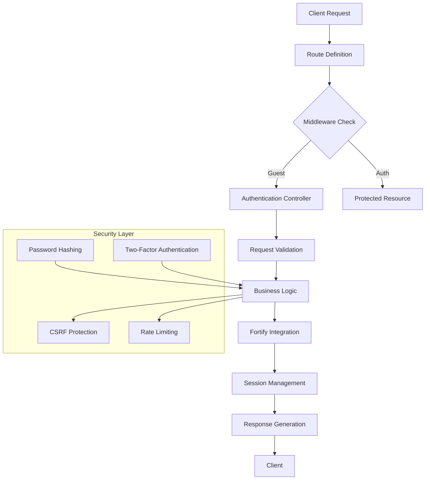
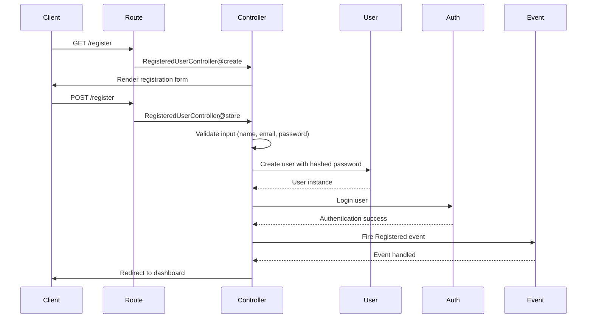
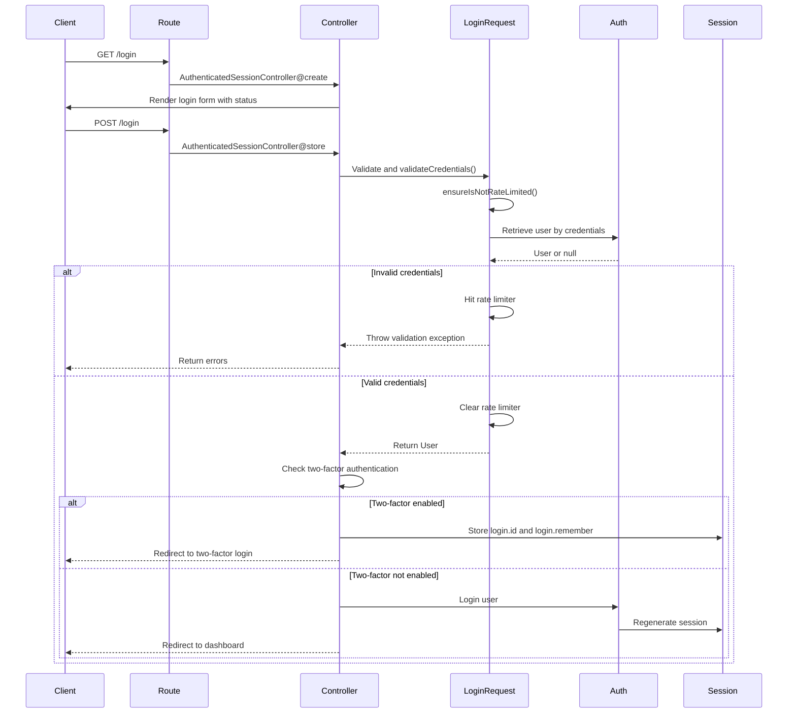
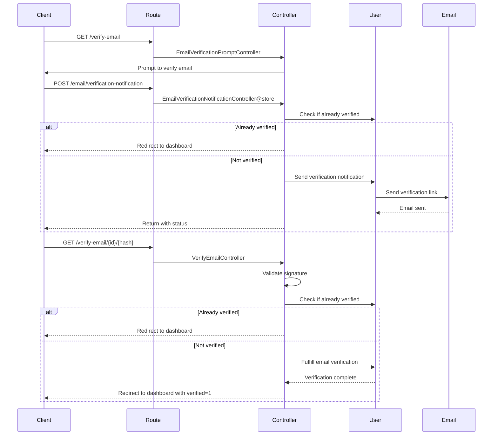

# Authentication Flows

<cite>
**Referenced Files in This Document**   
- [AuthenticatedSessionController.php](file://app/Http/Controllers/Auth/AuthenticatedSessionController.php)
- [RegisteredUserController.php](file://app/Http/Controllers/Auth/RegisteredUserController.php)
- [PasswordResetLinkController.php](file://app/Http/Controllers/Auth/PasswordResetLinkController.php)
- [NewPasswordController.php](file://app/Http/Controllers/Auth/NewPasswordController.php)
- [VerifyEmailController.php](file://app/Http/Controllers/Auth/VerifyEmailController.php)
- [EmailVerificationNotificationController.php](file://app/Http/Controllers/Auth/EmailVerificationNotificationController.php)
- [LoginRequest.php](file://app/Http/Requests/Auth/LoginRequest.php)
- [User.php](file://app/Models/User.php)
- [FortifyServiceProvider.php](file://app/Providers/FortifyServiceProvider.php)
- [auth.php](file://config/auth.php)
- [fortify.php](file://config/fortify.php)
- [auth.php](file://routes/auth.php)
- [Login.vue](file://resources/js/pages/auth/Login.vue)
- [VerifyEmail.vue](file://resources/js/pages/auth/VerifyEmail.vue)
</cite>

## Table of Contents
1. [Introduction](#introduction)
2. [Authentication Architecture](#authentication-architecture)
3. [User Registration Flow](#user-registration-flow)
4. [Login Flow](#login-flow)
5. [Password Reset Flow](#password-reset-flow)
6. [Email Verification Flow](#email-verification-flow)
7. [Session and Security Mechanisms](#session-and-security-mechanisms)
8. [Common Issues and Troubleshooting](#common-issues-and-troubleshooting)
9. [Security Best Practices](#security-best-practices)

## Introduction
The CFCCashew application implements a robust authentication system using Laravel Fortify, providing secure user registration, login, password reset, and email verification functionality. This document details the implementation of each authentication flow, from request lifecycle to response handling, with emphasis on security mechanisms and integration patterns. The system leverages Laravel's built-in authentication guard, session management, and rate limiting to ensure secure access control.

## Authentication Architecture



**Diagram sources**
- [auth.php](file://routes/auth.php#L1-L52)
- [FortifyServiceProvider.php](file://app/Providers/FortifyServiceProvider.php#L1-L33)
- [auth.php](file://config/auth.php#L1-L115)

**Section sources**
- [auth.php](file://routes/auth.php#L1-L52)
- [FortifyServiceProvider.php](file://app/Providers/FortifyServiceProvider.php#L1-L33)

## User Registration Flow

The user registration flow begins when a guest user accesses the registration page. The system follows a secure pattern for user creation and immediate authentication upon successful registration.



The registration process includes validation rules ensuring email uniqueness and password strength compliance with Laravel's default password requirements. Upon successful registration, the user is automatically logged in and redirected to the dashboard.

**Section sources**
- [RegisteredUserController.php](file://app/Http/Controllers/Auth/RegisteredUserController.php#L1-L51)
- [User.php](file://app/Models/User.php#L1-L49)

## Login Flow

The login flow implements secure credential validation with rate limiting and integrates with Laravel Fortify's features for enhanced security.



The LoginRequest class implements a custom `validateCredentials` method that separates credential validation from session creation, allowing for two-factor authentication integration. The system applies rate limiting based on email and IP address combinations to prevent brute force attacks.

**Section sources**
- [AuthenticatedSessionController.php](file://app/Http/Controllers/Auth/AuthenticatedSessionController.php#L1-L63)
- [LoginRequest.php](file://app/Http/Requests/Auth/LoginRequest.php#L1-L94)

## Password Reset Flow

The password reset flow provides a secure mechanism for users to recover access to their accounts through email-based token verification.

```mermaid
flowchart TD
A[User requests password reset] --> B[PasswordResetLinkController@store]
B --> C[Validate email format]
C --> D[Send reset link via email]
D --> E[User clicks reset link]
E --> F[NewPasswordController@create]
F --> G[Display password reset form]
G --> H[NewPasswordController@store]
H --> I[Validate token, email, password]
I --> J{Password reset successful?}
J --> |Yes| K[Update password and fire PasswordReset event]
K --> L[Redirect to login with success status]
J --> |No| M[Throw validation exception with error message]
M --> N[Redirect back with error]
```

The system uses Laravel's password broker to manage reset tokens stored in the `password_reset_tokens` table. Tokens expire after 60 minutes by default, and users are throttled to prevent excessive token generation.

**Section sources**
- [PasswordResetLinkController.php](file://app/Http/Controllers/Auth/PasswordResetLinkController.php#L1-L41)
- [NewPasswordController.php](file://app/Http/Controllers/Auth/NewPasswordController.php#L1-L69)
- [database/migrations/0001_01_01_000000_create_users_table.php](file://database/migrations/0001_01_01_000000_create_users_table.php#L1-L49)

## Email Verification Flow

The email verification flow ensures users validate their email addresses before accessing certain application features.



The verification link includes a signed URL with user ID and hash, validated using Laravel's signed route functionality. The system limits verification requests to prevent abuse.

**Section sources**
- [VerifyEmailController.php](file://app/Http/Controllers/Auth/VerifyEmailController.php#L1-L24)
- [EmailVerificationNotificationController.php](file://app/Http/Controllers/Auth/EmailVerificationNotificationController.php#L1-L24)
- [auth.php](file://routes/auth.php#L1-L52)

## Session and Security Mechanisms

The application implements robust session management and security features to protect user accounts and prevent common web vulnerabilities.

### Session Management
The system uses Laravel's session guard with the 'web' driver, which stores session data server-side and uses secure cookies for session identification. Upon successful authentication, the session is regenerated to prevent session fixation attacks.

### CSRF Protection
All state-changing operations (POST, PUT, DELETE) are protected by Laravel's CSRF middleware, which validates a CSRF token included in forms and AJAX requests. The Inertia.js integration automatically manages CSRF tokens for SPAs.

### Rate Limiting
The application implements multiple rate limiting strategies:
- Login attempts: 5 attempts per minute per email/IP combination
- Two-factor authentication: 5 attempts per minute per login session
- Email verification: 6 attempts per minute

### Secure Redirect Patterns
The system uses `redirect()->intended()` to redirect users to their originally requested page after authentication, with a fallback to the dashboard. All redirects use relative paths to prevent open redirect vulnerabilities.

**Section sources**
- [AuthenticatedSessionController.php](file://app/Http/Controllers/Auth/AuthenticatedSessionController.php#L1-L63)
- [fortify.php](file://config/fortify.php#L1-L159)
- [auth.php](file://config/auth.php#L1-L115)

## Common Issues and Troubleshooting

### Failed Logins
Common causes and solutions:
- **Invalid credentials**: Verify email and password are correct; check for typos
- **Rate limiting**: Wait for the specified time (shown in error message) before retrying
- **Account locked**: After multiple failed attempts, wait for the throttle period to expire

### Expired Password Reset Tokens
- **Symptom**: "This password reset token is invalid" error
- **Solution**: Request a new password reset link from the forgot password page
- **Prevention**: Complete the password reset process within 60 minutes of receiving the email

### Unverified Email Access
- **Symptom**: Redirected to email verification page despite having verified
- **Solution**: Check that the verification link was clicked from the same browser used to register
- **Debug**: Verify `email_verified_at` timestamp in the users table

### Two-Factor Authentication Issues
- **Lost backup codes**: Use the "Recovery Codes" feature to access the account
- **Device change**: Use backup codes or contact administrator for recovery
- **Incorrect codes**: Ensure correct time synchronization on authenticator app

**Section sources**
- [LoginRequest.php](file://app/Http/Requests/Auth/LoginRequest.php#L1-L94)
- [NewPasswordController.php](file://app/Http/Controllers/Auth/NewPasswordController.php#L1-L69)
- [VerifyEmailController.php](file://app/Http/Controllers/Auth/VerifyEmailController.php#L1-L24)

## Security Best Practices

### Configuration Settings
- Keep `lowercase_usernames` enabled to prevent case-sensitive login issues
- Ensure `password_timeout` is set to a reasonable value (default 3 hours)
- Regularly review and update password complexity requirements

### Two-Factor Authentication
- Enable two-factor authentication for all administrative accounts
- Educate users on the importance of saving recovery codes in a secure location
- Implement backup authentication methods for account recovery

### Monitoring and Logging
- Monitor failed login attempts for potential brute force attacks
- Log successful and failed password reset attempts
- Track email verification status changes for security audits

### Regular Maintenance
- Periodically review and expire unused password reset tokens
- Update Laravel and Fortify to the latest stable versions
- Test authentication flows regularly to ensure security controls remain effective

**Section sources**
- [fortify.php](file://config/fortify.php#L1-L159)
- [FortifyServiceProvider.php](file://app/Providers/FortifyServiceProvider.php#L1-L33)
- [auth.php](file://config/auth.php#L1-L115)