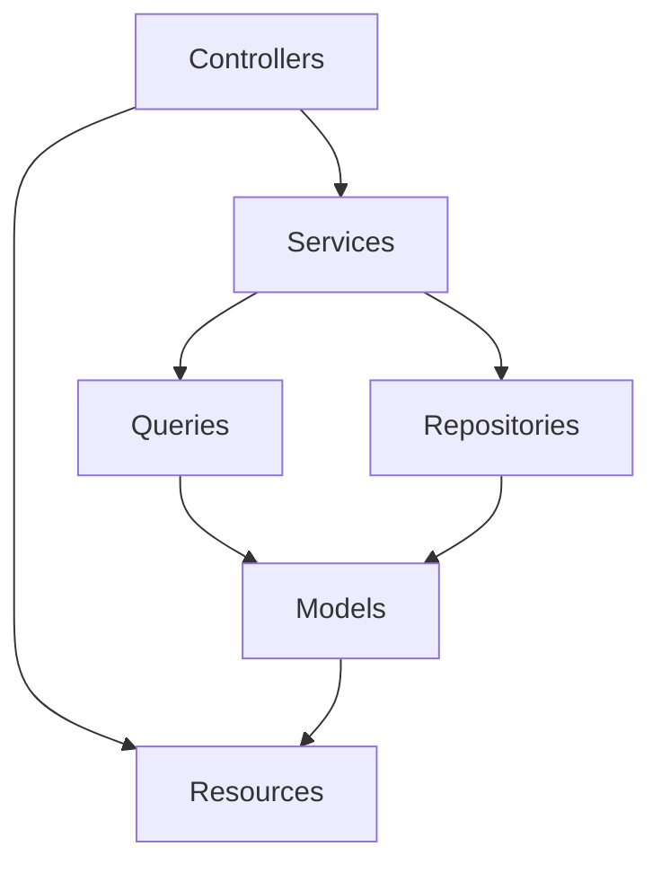
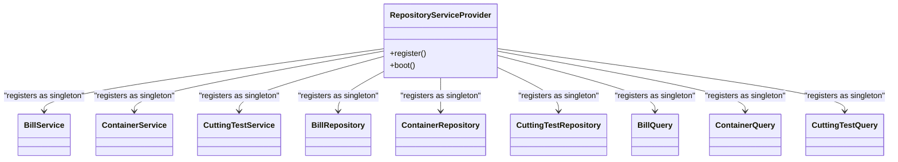
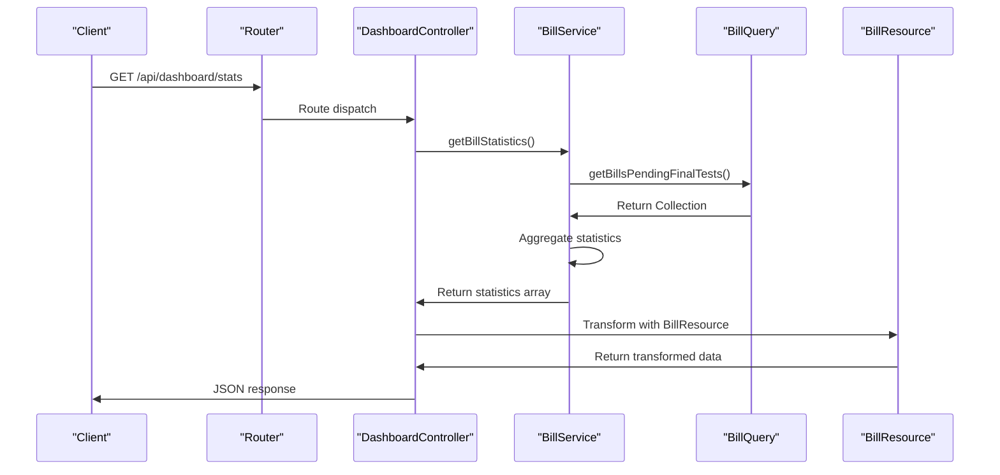

# Backend Architecture

<cite>
**Referenced Files in This Document**   
- [ARCHITECTURE.md](file://ARCHITECTURE.md)
- [RepositoryServiceProvider.php](file://app/Providers/RepositoryServiceProvider.php)
- [DashboardController.php](file://app/Http/Controllers/Api/DashboardController.php)
- [BillService.php](file://app/Services/BillService.php)
- [BillRepository.php](file://app/Repositories/BillRepository.php)
- [BillQuery.php](file://app/Queries/BillQuery.php)
- [StoreBillRequest.php](file://app/Http/Requests/StoreBillRequest.php)
- [BillResource.php](file://app/Http/Resources/BillResource.php)
- [api.php](file://routes/api.php)
</cite>

## Table of Contents
1. [Introduction](#introduction)
2. [Layered Architecture Overview](#layered-architecture-overview)
3. [Core Layers and Their Responsibilities](#core-layers-and-their-responsibilities)
4. [Dependency Injection and Service Registration](#dependency-injection-and-service-registration)
5. [Form Request Validation Pattern](#form-request-validation-pattern)
6. [Request Lifecycle and API Flow](#request-lifecycle-and-api-flow)
7. [Separation of Read and Write Operations](#separation-of-read-and-write-operations)
8. [API Resource Transformation](#api-resource-transformation)
9. [Error Handling and Response Strategy](#error-handling-and-response-strategy)
10. [Business Logic Orchestration Example](#business-logic-orchestration-example)

## Introduction

The CFCCashew backend implements a clean, layered architecture based on the Controller-Service-Query-Repository-Resource pattern. This architecture ensures separation of concerns, enhances testability, and promotes maintainability across the application. The system is built on Laravel and follows strict design principles to encapsulate responsibilities within well-defined layers. This document provides a comprehensive overview of the backend architecture, detailing each layer's role, interaction patterns, and implementation examples.

## Layered Architecture Overview

The CFCCashew backend follows a strict layered architecture that separates concerns across five primary layers: Controllers, Services, Queries/Repositories, Models, and Resources. This structure ensures that business logic, data access, and presentation concerns are cleanly separated.



**Diagram sources**
- [ARCHITECTURE.md](file://ARCHITECTURE.md#L0-L45)

**Section sources**
- [ARCHITECTURE.md](file://ARCHITECTURE.md#L0-L45)

## Core Layers and Their Responsibilities

### Controllers (`app/Http/Controllers/`)
Controllers serve as the entry point for HTTP requests and are designed to be thin, focusing solely on request handling and response generation. They do not contain business logic.

**Responsibilities:**
- Route handling and request coordination
- Dependency injection of service classes
- Request validation via Form Requests
- Response formatting using Resources
- HTTP status code management

**Section sources**
- [ARCHITECTURE.md](file://ARCHITECTURE.md#L0-L45)
- [DashboardController.php](file://app/Http/Controllers/Api/DashboardController.php#L1-L118)

### Services (`app/Services/`)
The Service layer contains all business logic and acts as the orchestrator between data access layers and controllers. Each service class encapsulates domain-specific logic and coordinates operations.

**Responsibilities:**
- Business rule enforcement and validation
- Orchestration of Repository and Query operations
- Complex calculations and data transformations
- Transaction management
- Aggregation of data from multiple sources

**Examples:**
- `BillService`: Calculates average outturn rates and manages bill statistics
- `ContainerService`: Handles weight calculations and moisture alerts
- `CuttingTestService`: Validates test types and calculates ratios

**Section sources**
- [ARCHITECTURE.md](file://ARCHITECTURE.md#L0-L45)
- [BillService.php](file://app/Services/BillService.php#L1-L91)

### Repositories (`app/Repositories/`)
Repositories encapsulate database write operations and simple read operations by ID. They focus on data persistence and CRUD operations.

**Responsibilities:**
- Create, Update, Delete operations
- Simple queries by ID or basic conditions
- Data persistence logic
- Direct interaction with Eloquent models

**Rules:**
- One repository per main model
- Focus on write operations
- Use Eloquent models for data access

**Section sources**
- [ARCHITECTURE.md](file://ARCHITECTURE.md#L47-L99)
- [BillRepository.php](file://app/Repositories/BillRepository.php#L1-L86)

### Queries (`app/Queries/`)
Queries handle complex read operations, reporting, and data retrieval with filtering, sorting, and pagination. This separation ensures that read and write concerns are isolated.

**Responsibilities:**
- Complex queries with filters and search
- Pagination and sorting
- Aggregations and statistics
- Reporting functionality

**Rules:**
- Focus on read operations only
- Return Eloquent Collections or Query Builders
- Handle filtering, sorting, and search parameters

**Section sources**
- [ARCHITECTURE.md](file://ARCHITECTURE.md#L47-L99)
- [BillQuery.php](file://app/Queries/BillQuery.php#L1-L95)

### Resources (`app/Http/Resources/`)
Resources transform Eloquent models into API responses, ensuring consistent data formatting and conditional field inclusion.

**Responsibilities:**
- Data transformation for API responses
- Conditional field inclusion based on loaded relationships
- Relationship loading and formatting
- Consistent API response structure

**Section sources**
- [ARCHITECTURE.md](file://ARCHITECTURE.md#L47-L99)
- [BillResource.php](file://app/Http/Resources/BillResource.php#L1-L41)

## Dependency Injection and Service Registration

The CFCCashew application uses Laravel's service container for dependency injection, with all services, repositories, and queries registered as singletons in the `RepositoryServiceProvider`.



**Diagram sources**
- [RepositoryServiceProvider.php](file://app/Providers/RepositoryServiceProvider.php#L1-L47)

**Section sources**
- [RepositoryServiceProvider.php](file://app/Providers/RepositoryServiceProvider.php#L1-L47)
- [ARCHITECTURE.md](file://ARCHITECTURE.md#L101-L141)

## Form Request Validation Pattern

Form Requests are used to handle input validation, providing a clean separation between validation logic and controller code.

**Responsibilities:**
- Define validation rules for incoming requests
- Provide custom error messages
- Handle authorization checks
- Centralize validation logic for specific operations

**Example:**
The `StoreBillRequest` class defines validation rules for creating a new bill, including uniqueness constraints and field length limits.

**Section sources**
- [ARCHITECTURE.md](file://ARCHITECTURE.md#L47-L99)
- [StoreBillRequest.php](file://app/Http/Requests/StoreBillRequest.php#L1-L43)

## Request Lifecycle and API Flow

The request lifecycle follows a clear path from route to response, with each layer playing a specific role in processing the request.



**Diagram sources**
- [api.php](file://routes/api.php#L1-L19)
- [DashboardController.php](file://app/Http/Controllers/Api/DashboardController.php#L1-L118)

**Section sources**
- [api.php](file://routes/api.php#L1-L19)
- [DashboardController.php](file://app/Http/Controllers/Api/DashboardController.php#L1-L118)

## Separation of Read and Write Operations

The architecture enforces a clear separation between read operations (handled by Queries) and write operations (handled by Repositories).

**Write Operations (Repositories):**
- Create, Update, Delete operations
- Simple queries by ID
- Data persistence logic
- Direct model manipulation

**Read Operations (Queries):**
- Complex filtering and search
- Pagination and sorting
- Aggregations and statistics
- Reporting and dashboard data

This separation improves performance, maintainability, and allows for optimization of read and write paths independently.

**Section sources**
- [ARCHITECTURE.md](file://ARCHITECTURE.md#L47-L99)
- [BillRepository.php](file://app/Repositories/BillRepository.php#L1-L86)
- [BillQuery.php](file://app/Queries/BillQuery.php#L1-L95)

## API Resource Transformation

Resources transform Eloquent models into consistent API responses, handling conditional field inclusion and relationship formatting.

**Key Features:**
- Conditional field inclusion using `whenLoaded` and `whenCounted`
- Relationship transformation via nested resources
- Computed field calculation (e.g., average outturn rate)
- Date formatting in ISO format
- Consistent response structure across endpoints

**Example:**
The `BillResource` includes computed fields like `average_outurn` that are calculated based on related final samples, while conditionally including relationships like containers and cutting tests.

**Section sources**
- [ARCHITECTURE.md](file://ARCHITECTURE.md#L47-L99)
- [BillResource.php](file://app/Http/Resources/BillResource.php#L1-L41)

## Error Handling and Response Strategy

The backend follows Laravel's standard error handling patterns, with validation errors automatically returned in a consistent JSON format. Controllers return explicit JSON responses for API endpoints, ensuring predictable response structures.

**Response Patterns:**
- Successful operations return 200 OK with data payload
- Validation errors return 422 Unprocessable Entity with detailed error messages
- Authentication required endpoints return 401 Unauthorized
- Not found resources return 404 Not Found
- Server errors return appropriate 5xx status codes

**Section sources**
- [DashboardController.php](file://app/Http/Controllers/Api/DashboardController.php#L1-L118)
- [StoreBillRequest.php](file://app/Http/Requests/StoreBillRequest.php#L1-L43)

## Business Logic Orchestration Example

The `BillService` class demonstrates how business logic is orchestrated through service classes, coordinating between repositories and queries to provide domain-specific functionality.

```mermaid
flowchart TD
A[getBillStatistics] --> B[getTotalBills]
A --> C[getRecentBills]
A --> D[getBillsPendingFinalTests]
A --> E[getBillsMissingFinalSamples]
B --> F[BillRepository.getAll().count()]
C --> G[BillQuery.getRecentBills()]
D --> H[BillQuery.getBillsPendingFinalTests()]
E --> I[BillQuery.getBillsMissingFinalSamples()]
F --> J[Aggregate Statistics]
G --> J
H --> J
I --> J
J --> K[Return Statistics Array]
```

**Diagram sources**
- [BillService.php](file://app/Services/BillService.php#L1-L91)
- [BillRepository.php](file://app/Repositories/BillRepository.php#L1-L86)
- [BillQuery.php](file://app/Queries/BillQuery.php#L1-L95)

**Section sources**
- [BillService.php](file://app/Services/BillService.php#L1-L91)
- [BillRepository.php](file://app/Repositories/BillRepository.php#L1-L86)
- [BillQuery.php](file://app/Queries/BillQuery.php#L1-L95)