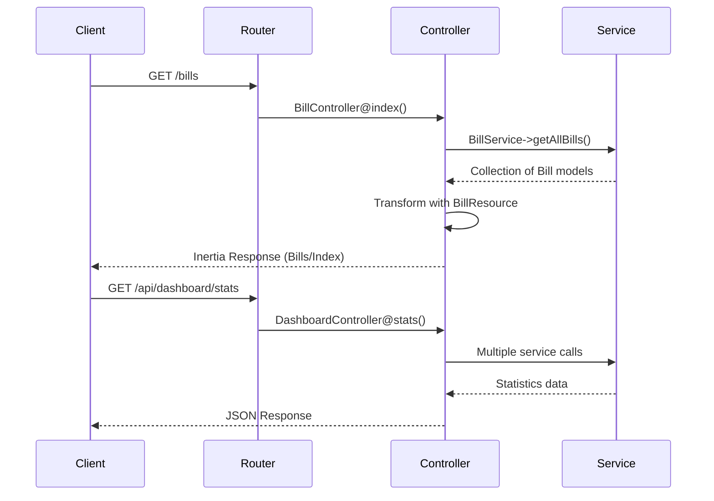
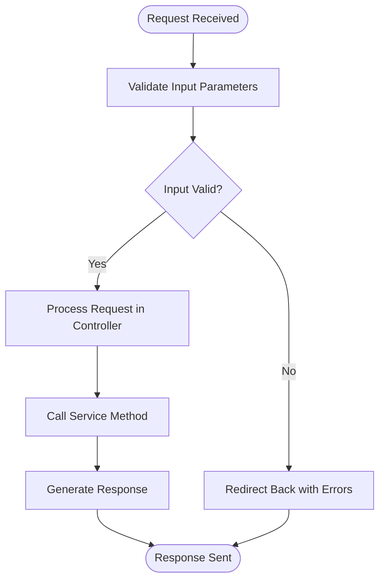
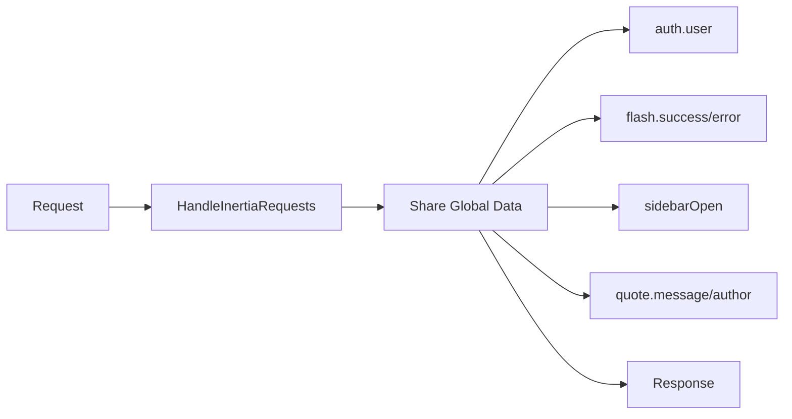

# Controller Layer

<cite>
**Referenced Files in This Document**   
- [Controller.php](file://app/Http/Controllers/Controller.php)
- [BillController.php](file://app/Http/Controllers/BillController.php)
- [ContainerController.php](file://app/Http/Controllers/ContainerController.php)
- [CuttingTestController.php](file://app/Http/Controllers/CuttingTestController.php)
- [DashboardController.php](file://app/Http/Controllers/Api/DashboardController.php)
- [HandleInertiaRequests.php](file://app/Http/Middleware/HandleInertiaRequests.php)
- [StoreBillRequest.php](file://app/Http/Requests/StoreBillRequest.php)
- [web.php](file://routes/web.php)
- [api.php](file://routes/api.php)
</cite>

## Table of Contents
1. [Introduction](#introduction)
2. [Base Controller and Inheritance](#base-controller-and-inheritance)
3. [Request Handling and Routing](#request-handling-and-routing)
4. [Form Request Validation](#form-request-validation)
5. [Response Generation with Inertia.js](#response-generation-with-inertiajs)
6. [API Controllers and JSON Responses](#api-controllers-and-json-responses)
7. [Middleware Integration](#middleware-integration)
8. [Request Lifecycle and Service Orchestration](#request-lifecycle-and-service-orchestration)
9. [Error Handling and Flash Messaging](#error-handling-and-flash-messaging)
10. [Redirection Patterns](#redirection-patterns)

## Introduction
The Controller Layer in the CFCCashew application serves as the intermediary between HTTP requests and business logic. It handles incoming web and API requests, validates input data, orchestrates service operations, and generates appropriate responses using Inertia.js for server-side rendering or JSON for API endpoints. Controllers follow a consistent pattern of inheritance, dependency injection, and separation of concerns to maintain clean and maintainable code.

**Section sources**
- [Controller.php](file://app/Http/Controllers/Controller.php)
- [web.php](file://routes/web.php)
- [api.php](file://routes/api.php)

## Base Controller and Inheritance
All controllers in the application extend the abstract `Controller` class located in `app/Http/Controllers/Controller.php`. This base class provides a foundation for all controller implementations, enabling consistent behavior across the application. While currently minimal, this class can be extended to include shared functionality such as common response formats, authorization checks, or logging.

```mermaid
classDiagram
class Controller {
<<abstract>>
}
class BillController {
+__construct(BillService $billService)
+index(Request $request) Response
+create() Response
+store(StoreBillRequest $request) RedirectResponse
+show(Bill $bill) Response
+edit(Bill $bill) Response
+update(UpdateBillRequest $request, Bill $bill) RedirectResponse
+destroy(Bill $bill) RedirectResponse
}
class ContainerController {
+__construct(ContainerService $containerService)
+index(Request $request) Response
+create(Request $request) Response
+store(StoreContainerRequest $request) RedirectResponse
+show(Container $container) Response
+edit(Container $container) Response
+update(UpdateContainerRequest $request, Container $container) RedirectResponse
+destroy(Container $container) RedirectResponse
}
class CuttingTestController {
+__construct(CuttingTestService $cuttingTestService)
+index(Request $request) Response
+create(Request $request) Response
+store(StoreCuttingTestRequest $request) RedirectResponse
+show(CuttingTest $cuttingTest) Response
+edit(CuttingTest $cuttingTest) Response
+update(StoreCuttingTestRequest $request, CuttingTest $cuttingTest) RedirectResponse
+destroy(CuttingTest $cuttingTest) RedirectResponse
}
class DashboardController {
+__construct(BillService $billService, ContainerService $containerService, CuttingTestService $cuttingTestService)
+stats() JsonResponse
+recentBills() JsonResponse
+billsPendingFinalTests() JsonResponse
+billsMissingFinalSamples() JsonResponse
+containersHighMoisture() JsonResponse
+cuttingTestsHighMoisture() JsonResponse
+moistureDistribution() JsonResponse
}
Controller <|-- BillController
Controller <|-- ContainerController
Controller <|-- CuttingTestController
Controller <|-- DashboardController
```

**Diagram sources**
- [Controller.php](file://app/Http/Controllers/Controller.php)
- [BillController.php](file://app/Http/Controllers/BillController.php)
- [ContainerController.php](file://app/Http/Controllers/ContainerController.php)
- [CuttingTestController.php](file://app/Http/Controllers/CuttingTestController.php)
- [DashboardController.php](file://app/Http/Controllers/Api/DashboardController.php)

**Section sources**
- [Controller.php](file://app/Http/Controllers/Controller.php)
- [BillController.php](file://app/Http/Controllers/BillController.php)

## Request Handling and Routing
Controllers are invoked through route definitions in `routes/web.php` and `routes/api.php`. Web routes use Inertia responses for server-side rendering of Vue components, while API routes return JSON data. The routing system maps HTTP verbs and URLs to specific controller methods, with resource routes automatically generating CRUD endpoints.

**Diagram sources**
- [web.php](file://routes/web.php)
- [api.php](file://routes/api.php)
- [BillController.php](file://app/Http/Controllers/BillController.php)
- [DashboardController.php](file://app/Http/Controllers/Api/DashboardController.php)

**Section sources**
- [web.php](file://routes/web.php)
- [api.php](file://routes/api.php)

## Form Request Validation
Form validation is handled through dedicated Form Request classes such as `StoreBillRequest.php`, which extend Laravel's `FormRequest`. These classes define validation rules, custom error messages, and authorization logic separate from controllers. When a request is type-hinted in a controller method, Laravel automatically validates the input and redirects back with errors if validation fails.

**Diagram sources**
- [StoreBillRequest.php](file://app/Http/Requests/StoreBillRequest.php)
- [BillController.php](file://app/Http/Controllers/BillController.php)

**Section sources**
- [StoreBillRequest.php](file://app/Http/Requests/StoreBillRequest.php)

## Response Generation with Inertia.js
Web controllers return `Inertia\Response` objects that render Vue components on the server-side. Controllers pass data to Inertia using `Inertia::render()`, specifying the component name and props. Data is often transformed using Laravel Resources to control the JSON structure sent to the frontend. This enables a seamless integration between Laravel backend and Vue frontend while maintaining server-side rendering benefits.

**Section sources**
- [BillController.php](file://app/Http/Controllers/BillController.php)
- [ContainerController.php](file://app/Http/Controllers/ContainerController.php)

## API Controllers and JSON Responses
API controllers in the `Api` namespace return `JsonResponse` objects for AJAX requests. The `DashboardController.php` provides various endpoints that aggregate statistics from multiple services and return structured JSON data. These endpoints are protected by authentication middleware and are consumed by frontend components to display real-time dashboard information without full page reloads.

**Section sources**
- [DashboardController.php](file://app/Http/Controllers/Api/DashboardController.php)
- [api.php](file://routes/api.php)

## Middleware Integration
Controllers integrate with middleware for authentication, authorization, and request handling. The `HandleInertiaRequests` middleware shares global data such as authentication state, flash messages, and sidebar preferences with all Inertia responses. Web routes are protected by `auth` and `verified` middleware to ensure only authenticated and email-verified users can access them.

**Diagram sources**
- [HandleInertiaRequests.php](file://app/Http/Middleware/HandleInertiaRequests.php)

**Section sources**
- [HandleInertiaRequests.php](file://app/Http/Middleware/HandleInertiaRequests.php)

## Request Lifecycle and Service Orchestration
The request lifecycle follows a consistent pattern: route dispatch → controller invocation → service orchestration → response generation. Controllers act as thin orchestrators, injecting service dependencies and delegating business logic. This separation ensures controllers remain focused on HTTP concerns while services handle domain logic, improving testability and maintainability.

**Section sources**
- [BillController.php](file://app/Http/Controllers/BillController.php)
- [DashboardController.php](file://app/Http/Controllers/Api/DashboardController.php)

## Error Handling and Flash Messaging
Error handling is implemented through Laravel's validation system and session-based flash messaging. When form validation fails, users are redirected back with input preserved and error messages displayed. Successful operations set flash messages in the session, which are then displayed as temporary notifications. The `HandleInertiaRequests` middleware automatically shares flash messages with all Inertia responses.

**Section sources**
- [HandleInertiaRequests.php](file://app/Http/Middleware/HandleInertiaRequests.php)
- [BillController.php](file://app/Http/Controllers/BillController.php)

## Redirection Patterns
Controllers use redirection to navigate users after state-changing operations. After creating, updating, or deleting resources, controllers redirect to relevant pages using named routes. This follows the Post-Redirect-Get pattern, preventing form resubmission and providing a better user experience. Redirection targets are typically show or index pages, with success messages passed via session flash data.

**Section sources**
- [BillController.php](file://app/Http/Controllers/BillController.php)
- [ContainerController.php](file://app/Http/Controllers/ContainerController.php)
- [CuttingTestController.php](file://app/Http/Controllers/CuttingTestController.php)