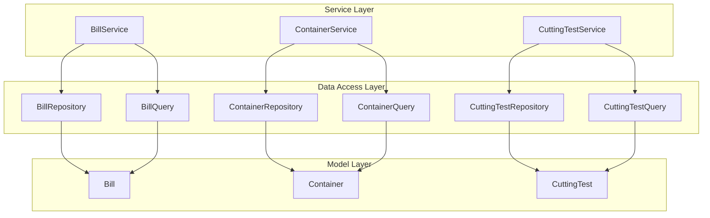
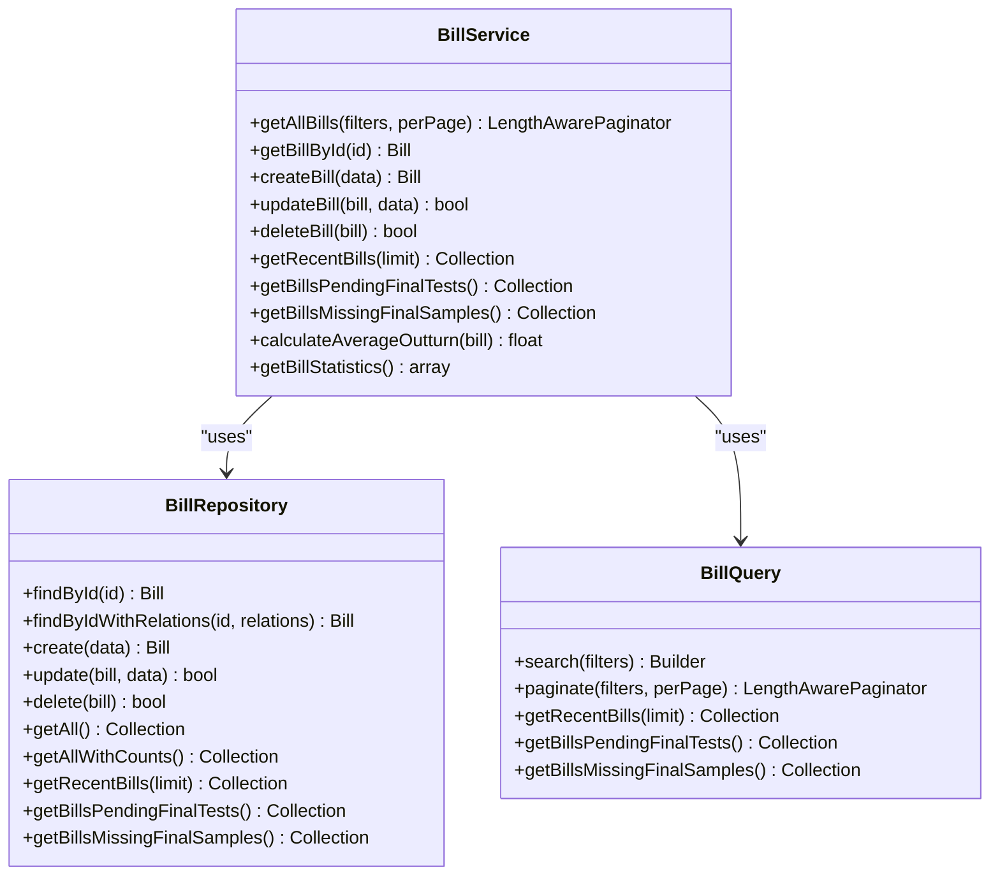
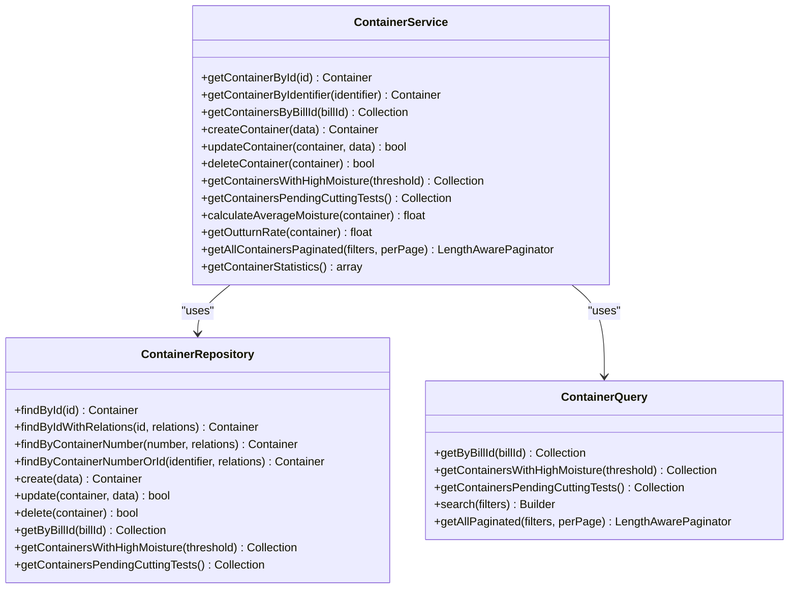
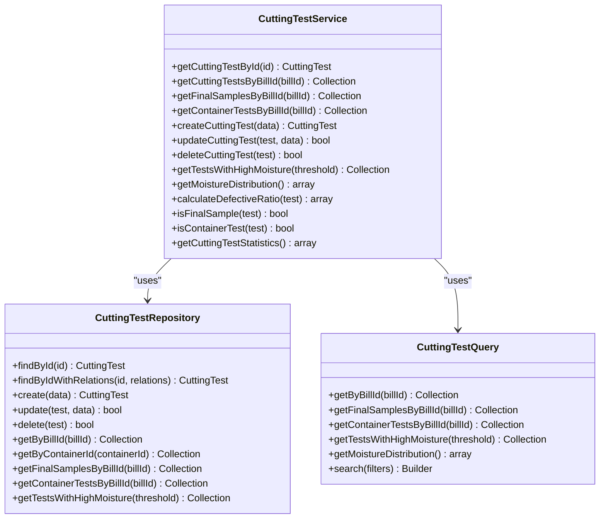

# Service Layer

<cite>
**Referenced Files in This Document**   
- [BillService.php](file://app/Services/BillService.php)
- [ContainerService.php](file://app/Services/ContainerService.php)
- [CuttingTestService.php](file://app/Services/CuttingTestService.php)
- [BillRepository.php](file://app/Repositories/BillRepository.php)
- [ContainerRepository.php](file://app/Repositories/ContainerRepository.php)
- [CuttingTestRepository.php](file://app/Repositories/CuttingTestRepository.php)
- [BillQuery.php](file://app/Queries/BillQuery.php)
- [ContainerQuery.php](file://app/Queries/ContainerQuery.php)
- [CuttingTestQuery.php](file://app/Queries/CuttingTestQuery.php)
- [Bill.php](file://app/Models/Bill.php)
- [Container.php](file://app/Models/Container.php)
- [CuttingTest.php](file://app/Models/CuttingTest.php)
- [CuttingTestType.php](file://app/Enums/CuttingTestType.php)
- [BillController.php](file://app/Http/Controllers/BillController.php)
- [ContainerController.php](file://app/Http/Controllers/ContainerController.php)
</cite>

## Table of Contents
1. [Introduction](#introduction)
2. [Service Layer Architecture](#service-layer-architecture)
3. [Core Service Classes](#core-service-classes)
4. [Business Logic Implementation](#business-logic-implementation)
5. [Transaction Management and Data Coordination](#transaction-management-and-data-coordination)
6. [Dependency Injection and Service Instantiation](#dependency-injection-and-service-instantiation)
7. [Error Handling and Validation](#error-handling-and-validation)
8. [Integration with Laravel Components](#integration-with-laravel-components)
9. [Usage Patterns and Reusability](#usage-patterns-and-reusability)
10. [Conclusion](#conclusion)

## Introduction
The Service Layer in the CFCCashew system serves as the central hub for business logic related to bills, containers, and cutting tests. This layer encapsulates complex operations, coordinates interactions between repositories and queries, and provides a clean interface for controllers and commands. The service classes follow the dependency injection pattern and are designed to maintain separation of concerns while enabling reusability across different parts of the application.

## Service Layer Architecture



**Diagram sources**
- [BillService.php](file://app/Services/BillService.php#L1-L91)
- [ContainerService.php](file://app/Services/ContainerService.php#L1-L119)
- [CuttingTestService.php](file://app/Services/CuttingTestService.php#L1-L126)
- [BillRepository.php](file://app/Repositories/BillRepository.php#L1-L86)
- [ContainerRepository.php](file://app/Repositories/ContainerRepository.php#L1-L87)
- [CuttingTestRepository.php](file://app/Repositories/CuttingTestRepository.php#L1-L90)
- [BillQuery.php](file://app/Queries/BillQuery.php#L1-L95)
- [ContainerQuery.php](file://app/Queries/ContainerQuery.php#L1-L94)
- [CuttingTestQuery.php](file://app/Queries/CuttingTestQuery.php#L1-L115)

**Section sources**
- [BillService.php](file://app/Services/BillService.php#L1-L91)
- [ContainerService.php](file://app/Services/ContainerService.php#L1-L119)
- [CuttingTestService.php](file://app/Services/CuttingTestService.php#L1-L126)

## Core Service Classes

### BillService
The BillService class manages all business operations related to bills, including retrieval, creation, updating, and deletion. It coordinates between the BillRepository and BillQuery to provide both simple CRUD operations and complex query-based functionality.



**Diagram sources**
- [BillService.php](file://app/Services/BillService.php#L1-L91)
- [BillRepository.php](file://app/Repositories/BillRepository.php#L1-L86)
- [BillQuery.php](file://app/Queries/BillQuery.php#L1-L95)

**Section sources**
- [BillService.php](file://app/Services/BillService.php#L1-L91)

### ContainerService
The ContainerService class handles container-related business logic, including weight calculations, moisture analysis, and association management with bills. It ensures data integrity through derived weight calculations and provides statistical insights.



**Diagram sources**
- [ContainerService.php](file://app/Services/ContainerService.php#L1-L119)
- [ContainerRepository.php](file://app/Repositories/ContainerRepository.php#L1-L87)
- [ContainerQuery.php](file://app/Queries/ContainerQuery.php#L1-L94)

**Section sources**
- [ContainerService.php](file://app/Services/ContainerService.php#L1-L119)

### CuttingTestService
The CuttingTestService class manages cutting test operations with strict validation rules based on test type and container association. It provides specialized methods for different test categories and calculates derived metrics like defective ratios.



**Diagram sources**
- [CuttingTestService.php](file://app/Services/CuttingTestService.php#L1-L126)
- [CuttingTestRepository.php](file://app/Repositories/CuttingTestRepository.php#L1-L90)
- [CuttingTestQuery.php](file://app/Queries/CuttingTestQuery.php#L1-L115)

**Section sources**
- [CuttingTestService.php](file://app/Services/CuttingTestService.php#L1-L126)

## Business Logic Implementation

### Average Outturn Rate Calculation
The BillService implements a key business operation for calculating the average outturn rate across final samples. This method demonstrates how service classes encapsulate complex logic that would otherwise be duplicated across controllers.

```mermaid
flowchart TD
    Start([calculateAverageOutturn]) --> GetFinalSamples["Get final samples with outturn_rate"]
    GetFinalSamples --> CheckEmpty{"Samples empty?"}
    CheckEmpty -->|Yes| ReturnNull["Return null"]
    Check