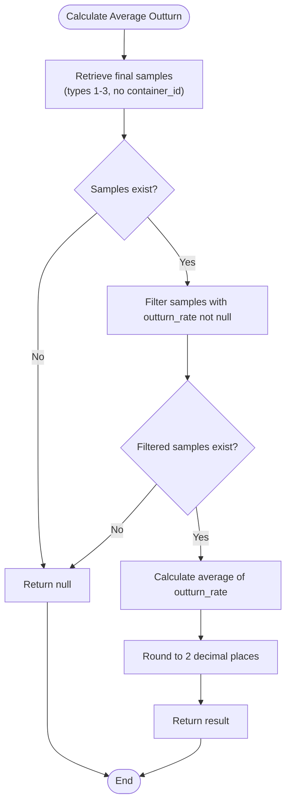
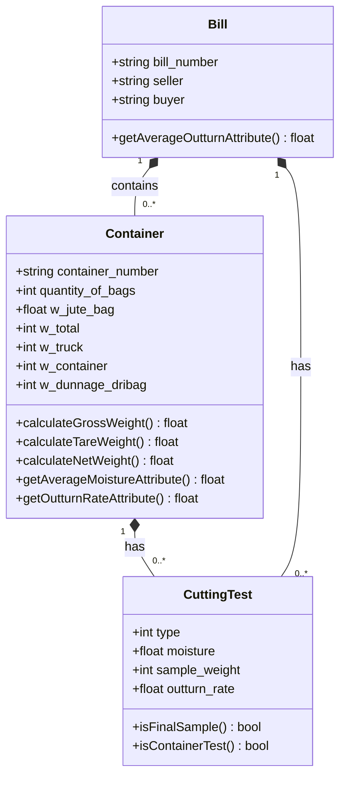
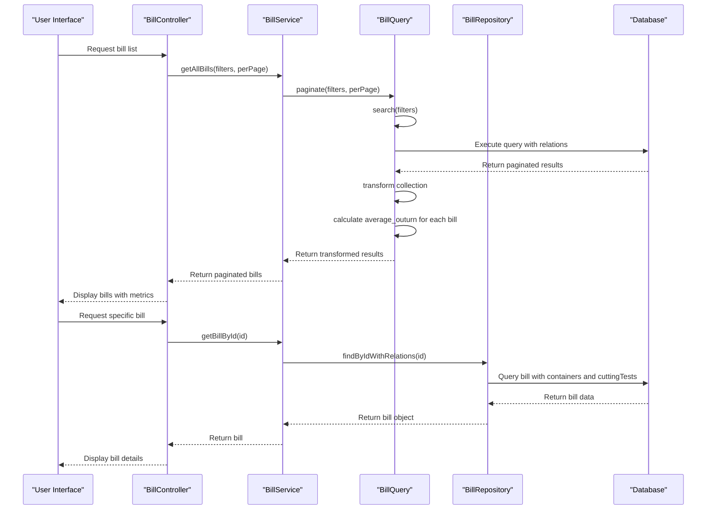
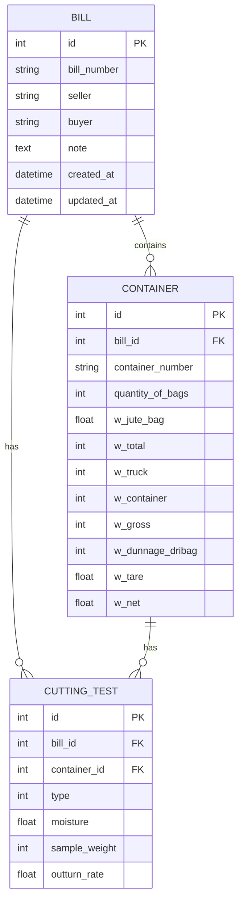

# Bill Calculations

<cite>
**Referenced Files in This Document**   
- [BillService.php](file://app/Services/BillService.php)
- [BillRepository.php](file://app/Repositories/BillRepository.php)
- [BillQuery.php](file://app/Queries/BillQuery.php)
- [Bill.php](file://app/Models/Bill.php)
- [Container.php](file://app/Models/Container.php)
- [CuttingTest.php](file://app/Models/CuttingTest.php)
- [CuttingTestType.php](file://app/Enums/CuttingTestType.php)
</cite>

## Table of Contents
1. [Introduction](#introduction)
2. [Core Components](#core-components)
3. [Average Outturn Rate Calculations](#average-outturn-rate-calculations)
4. [Total Weight Aggregations](#total-weight-aggregations)
5. [Financial Metrics and Data Flow](#financial-metrics-and-data-flow)
6. [Domain Model Interactions](#domain-model-interactions)
7. [Validation and Data Integrity](#validation-and-data-integrity)
8. [Error Conditions and Edge Cases](#error-conditions-and-edge-cases)
9. [Troubleshooting Guide](#troubleshooting-guide)
10. [Performance Optimization](#performance-optimization)

## Introduction
The Bill Calculations sub-feature in the CFCCashew application provides critical financial and quality metrics for cashew processing bills. This document details the implementation of average outturn rate calculations, total weight aggregations, and derived financial metrics based on container and cutting test data. The system orchestrates calculations through the BillService, which coordinates with repositories and queries to fetch and process data from related models. The calculations support business decisions by providing accurate quality assessments and financial valuations based on physical measurements and laboratory tests.

## Core Components

The bill calculation system consists of several interconnected components that work together to provide accurate financial and quality metrics. The BillService acts as the primary orchestrator, coordinating data retrieval and calculation logic. It works with the BillRepository for direct model operations and the BillQuery for complex data retrieval with filtering and pagination. The domain models (Bill, Container, and CuttingTest) contain business logic for weight calculations and attribute accessors. The system follows a clean architecture pattern with clear separation of concerns between service, repository, query, and model layers.

**Section sources**
- [BillService.php](file://app/Services/BillService.php#L1-L92)
- [BillRepository.php](file://app/Repositories/BillRepository.php#L1-L87)
- [BillQuery.php](file://app/Queries/BillQuery.php#L1-L96)

## Average Outturn Rate Calculations

The average outturn rate calculation is a key quality metric that measures the efficiency of cashew processing. The system calculates this metric by aggregating final sample cutting tests associated with a bill. Final samples are defined as cutting tests of types 1, 2, and 3 (FinalFirstCut, FinalSecondCut, FinalThirdCut) that are not associated with any specific container (container_id is null). The BillService provides the `calculateAverageOutturn` method which retrieves these final samples and computes their average outturn rate, rounded to two decimal places. If no valid final samples exist with outturn_rate values, the method returns null to indicate insufficient data for calculation.

**Diagram sources**
- [BillService.php](file://app/Services/BillService.php#L78-L91)
- [Bill.php](file://app/Models/Bill.php#L58-L72)

**Section sources**
- [BillService.php](file://app/Services/BillService.php#L78-L91)
- [Bill.php](file://app/Models/Bill.php#L58-L72)
- [CuttingTestType.php](file://app/Enums/CuttingTestType.php#L5-L37)

## Total Weight Aggregations

Total weight aggregations are calculated at both the container and bill levels, providing essential data for financial calculations. At the container level, the system calculates gross weight (w_gross = w_total - w_truck - w_container), tare weight (w_tare = quantity_of_bags * w_jute_bag), and net weight (w_net = w_gross - w_dunnage_dribag - w_tare). These calculations are implemented as methods in the Container model and are automatically applied when container data is processed. At the bill level, total weights are aggregated across all containers associated with the bill. The system ensures data integrity by validating that all required weight components are present before performing calculations and by using max(0, value) to prevent negative weights.

**Diagram sources**
- [Container.php](file://app/Models/Container.php#L48-L93)
- [Bill.php](file://app/Models/Bill.php#L30-L47)

**Section sources**
- [Container.php](file://app/Models/Container.php#L65-L93)
- [Bill.php](file://app/Models/Bill.php#L30-L47)

## Financial Metrics and Data Flow

Financial metrics in the CFCCashew application are derived from the aggregation of container and cutting test data. The primary financial metric is the average outturn rate, which directly impacts the valuation of cashew batches. The data flow begins with the BillService receiving a request to calculate metrics for a specific bill. The service then uses the BillRepository to retrieve the bill with its associated containers and cutting tests. The BillQuery is used for paginated lists of bills with pre-calculated metrics. When retrieving a list of bills, the query automatically calculates the average outturn rate for each bill by transforming the collection and adding the average_outurn attribute. This approach optimizes performance by calculating metrics at the query level rather than for each individual bill in a loop.

**Diagram sources**
- [BillService.php](file://app/Services/BillService.php#L15-L24)
- [BillQuery.php](file://app/Queries/BillQuery.php#L15-L65)
- [BillRepository.php](file://app/Repositories/BillRepository.php#L20-L28)

**Section sources**
- [BillService.php](file://app/Services/BillService.php#L15-L24)
- [BillQuery.php](file://app/Queries/BillQuery.php#L15-L65)

## Domain Model Interactions

The domain model interactions during bill calculations involve a coordinated relationship between the Bill, Container, and CuttingTest models. The Bill serves as the aggregate root, containing multiple containers, each of which can have multiple cutting tests. Final sample cutting tests are directly associated with the bill but not with any specific container. When calculating metrics, the system navigates these relationships to gather all relevant data. The Bill model defines a finalSamples relationship that filters cutting tests by type (1-3) and null container_id. The Container model provides accessors for average moisture and outturn rate by querying its associated cutting tests. These domain model methods encapsulate the business logic for data retrieval and calculation, ensuring consistency across the application.

**Diagram sources**
- [Bill.php](file://app/Models/Bill.php#L30-L72)
- [Container.php](file://app/Models/Container.php#L48-L63)
- [CuttingTest.php](file://app/Models/CuttingTest.php#L30-L45)

**Section sources**
- [Bill.php](file://app/Models/Bill.php#L30-L72)
- [Container.php](file://app/Models/Container.php#L48-L63)
- [CuttingTest.php](file://app/Models/CuttingTest.php#L30-L45)

## Validation and Data Integrity

Data integrity is maintained through multiple layers of validation in the bill calculation system. At the database level, constraints ensure that moisture values are between 0-100 and outturn_rate values are between 0-60. The CuttingTest model includes methods to validate the relationship between test type and container association: final sample tests (types 1-3) must have null container_id, while container tests (type 4) must have a non-null container_id. The Container model includes calculation methods that check for null values before performing arithmetic operations, returning null if required data is missing. The frontend also implements validation rules to prevent invalid weight combinations, such as total weight being less than or equal to truck plus container weight, or negative net weights.

**Section sources**
- [CuttingTest.php](file://app/Models/CuttingTest.php#L55-L70)
- [Container.php](file://app/Models/Container.php#L65-L93)
- [database/seeders/cfccashew.sql](file://database/seeders/cfccashew.sql#L79-L97)

## Error Conditions and Edge Cases

The bill calculation system handles several error conditions and edge cases to ensure robust operation. The most common edge case is the absence of final sample cutting tests, which results in a null average outturn rate rather than an error. Zero-weight scenarios are handled by using max(0, value) in weight calculations to prevent negative weights, which could indicate data entry errors. When calculating averages, the system checks for empty collections before attempting aggregation to avoid division by zero. The system also handles partial data scenarios, such as containers with some but not all weight components, by returning null for derived weights when insufficient data is available. Bills with containers but missing final samples are flagged in the system statistics for follow-up.

**Section sources**
- [BillService.php](file://app/Services/BillService.php#L78-L91)
- [Container.php](file://app/Models/Container.php#L65-L93)
- [Bill.php](file://app/Models/Bill.php#L58-L72)

## Troubleshooting Guide

When troubleshooting inaccurate totals or calculation issues, follow these steps:

1. **Verify data completeness**: Ensure all required weight components are present for containers (w_total, w_truck, w_container, w_dunnage_dribag, quantity_of_bags, w_jute_bag).
2. **Check final samples**: Confirm that three final sample cutting tests (types 1-3) with outturn_rate values exist for the bill.
3. **Validate container associations**: Ensure final sample tests have null container_id and container tests have valid container_id.
4. **Review weight calculations**: Verify that w_gross = w_total - w_truck - w_container and w_tare = quantity_of_bags * w_jute_bag.
5. **Check for data entry errors**: Look for inconsistent values, such as total weight less than truck plus container weight.

For performance issues when processing large bills:
1. Use the paginated endpoints rather than retrieving all bills at once.
2. Apply filters to limit the dataset when possible.
3. Monitor database query performance and ensure proper indexing.
4. Consider implementing caching for frequently accessed bill statistics.

**Section sources**
- [BillService.php](file://app/Services/BillService.php#L78-L91)
- [Container.php](file://app/Models/Container.php#L65-L93)
- [BillQuery.php](file://app/Queries/BillQuery.php#L15-L65)

## Performance Optimization

To optimize performance in the bill calculation system, several strategies can be implemented:

1. **Query optimization**: The current implementation already optimizes by calculating average outturn rates at the query level during pagination, reducing the need for individual calculations.
2. **Caching**: Implement caching for bill statistics that don't change frequently, such as getBillStatistics().
3. **Database indexing**: Ensure proper indexes on frequently queried fields like bill_id, container_id, and type in the cutting_tests table.
4. **Eager loading**: Use with() and withCount() to prevent N+1 query problems when retrieving bills with their relations.
5. **Pagination**: Always use paginated results for list views rather than retrieving all records at once.

The system could be further optimized by:
- Implementing Redis or another caching layer for frequently accessed bill calculations
- Adding database indexes on calculated fields used in filtering
- Using database-level aggregation for statistics rather than PHP-level collection methods
- Implementing background jobs for complex calculations on large datasets

**Section sources**
- [BillQuery.php](file://app/Queries/BillQuery.php#L45-L65)
- [BillRepository.php](file://app/Repositories/BillRepository.php#L45-L87)
- [BillService.php](file://app/Services/BillService.php#L78-L91)