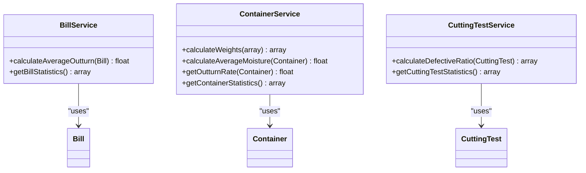
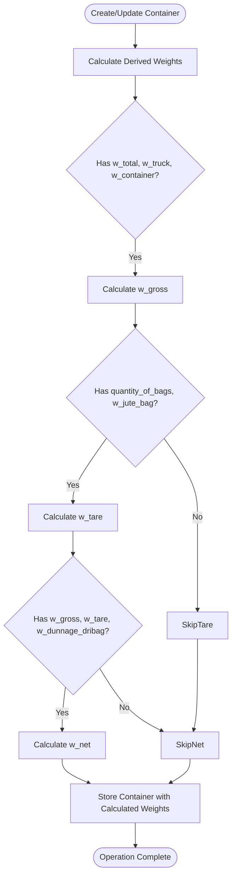
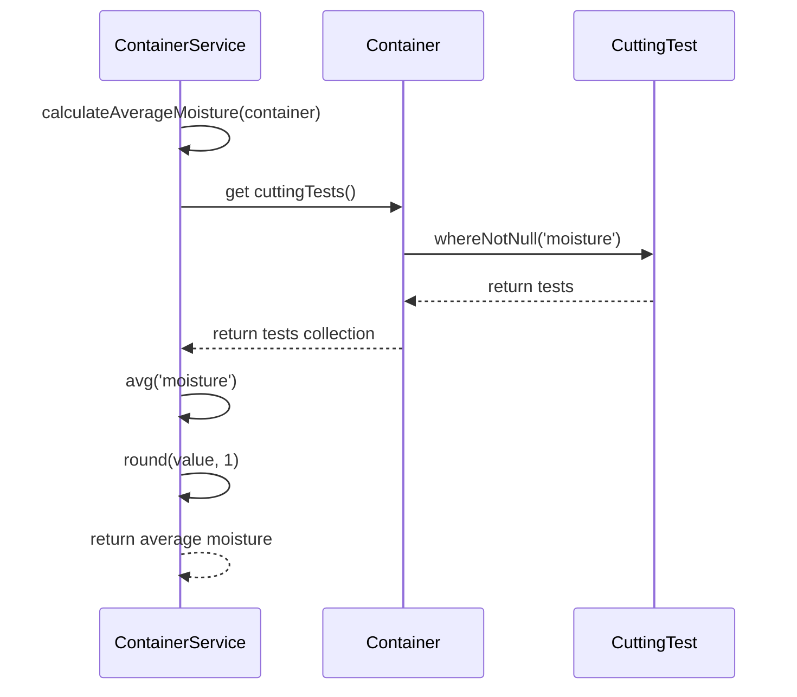
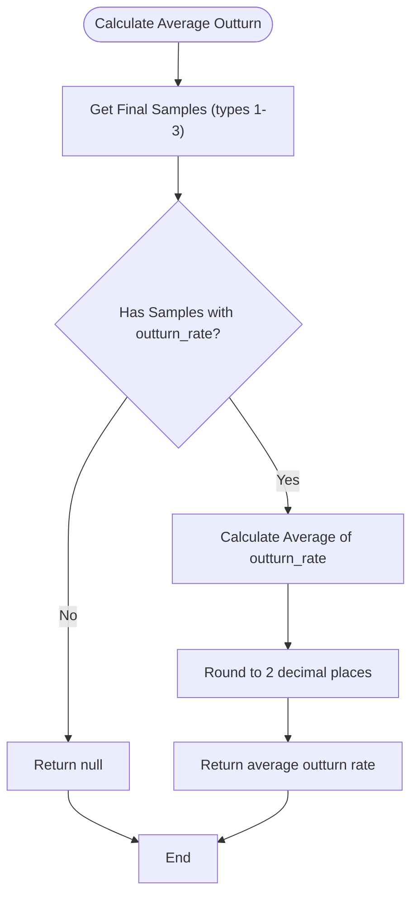
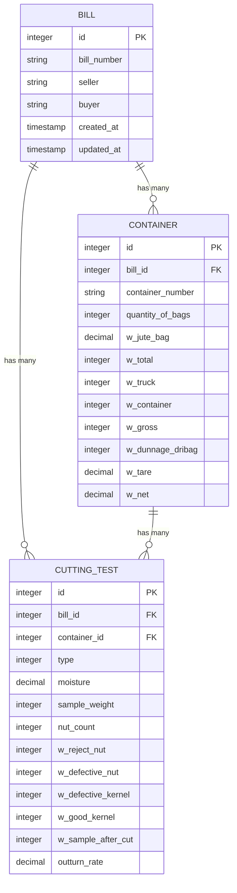
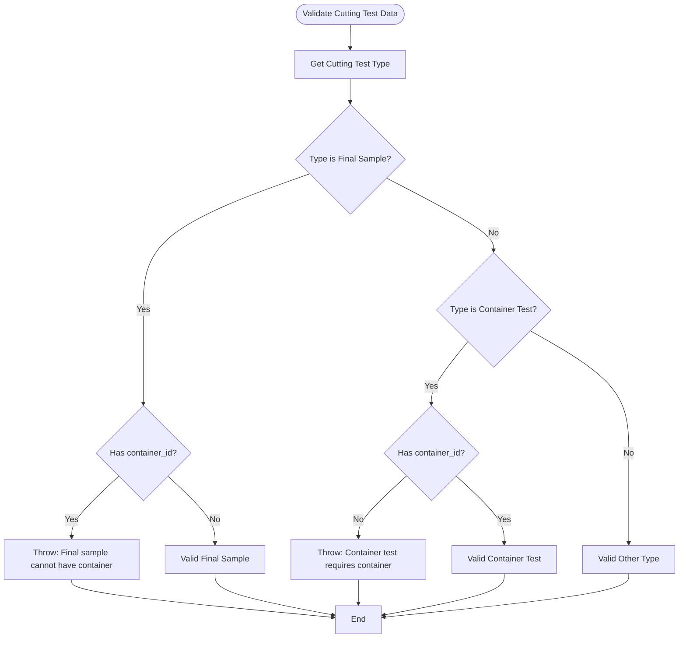
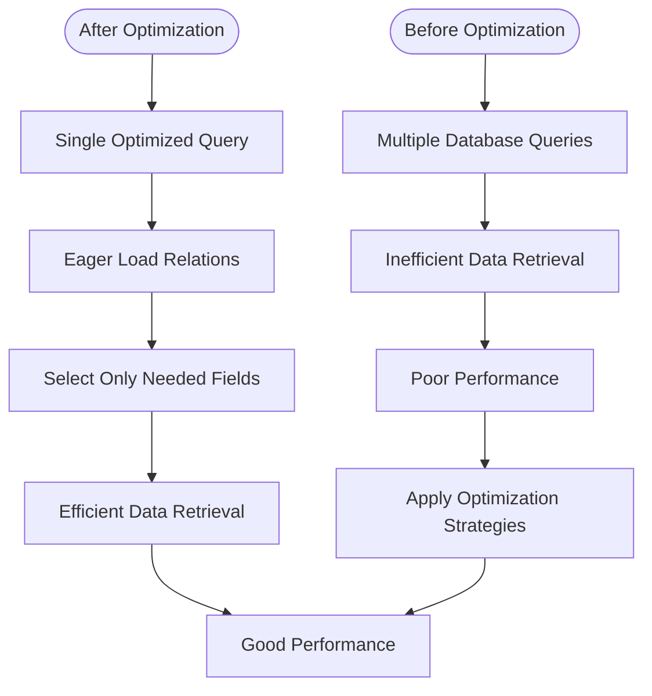

# Business Logic & Calculations

<cite>
**Referenced Files in This Document**   
- [BillService.php](file://app/Services/BillService.php)
- [ContainerService.php](file://app/Services/ContainerService.php)
- [CuttingTestService.php](file://app/Services/CuttingTestService.php)
- [Bill.php](file://app/Models/Bill.php)
- [Container.php](file://app/Models/Container.php)
- [CuttingTest.php](file://app/Models/CuttingTest.php)
- [CuttingTestType.php](file://app/Enums/CuttingTestType.php)
- [BillRepository.php](file://app/Repositories/BillRepository.php)
- [ContainerRepository.php](file://app/Repositories/ContainerRepository.php)
- [CuttingTestRepository.php](file://app/Repositories/CuttingTestRepository.php)
- [BillQuery.php](file://app/Queries/BillQuery.php)
- [ContainerQuery.php](file://app/Queries/ContainerQuery.php)
</cite>

## Table of Contents
1. [Introduction](#introduction)
2. [Core Calculation Methods](#core-calculation-methods)
3. [Weight Calculations](#weight-calculations)
4. [Moisture Level Computations](#moisture-level-computations)
5. [Average Outturn Rate Calculations](#average-outturn-rate-calculations)
6. [Domain Model Interactions](#domain-model-interactions)
7. [Validation Rules and Error Conditions](#validation-rules-and-error-conditions)
8. [Edge Cases in Calculations](#edge-cases-in-calculations)
9. [Troubleshooting Common Calculation Issues](#troubleshooting-common-calculation-issues)
10. [Performance Optimization Tips](#performance-optimization-tips)

## Introduction
The CFCCashew application implements a comprehensive business logic layer for cashew processing operations, with a focus on accurate calculation of key metrics including outturn rates, moisture levels, and container weights. This document details the implementation of these calculations across the service, model, and repository layers, explaining how domain entities interact during business operations. The system ensures data integrity through validation rules and handles edge cases gracefully while providing optimized performance for data-intensive operations.

## Core Calculation Methods
The business logic is orchestrated through service classes that coordinate calculations across domain models. The primary calculation methods are implemented in the service layer, which acts as an intermediary between controllers and data access layers.

**Diagram sources**
- [BillService.php](file://app/Services/BillService.php#L78-L90)
- [ContainerService.php](file://app/Services/ContainerService.php#L85-L117)
- [CuttingTestService.php](file://app/Services/CuttingTestService.php#L98-L114)

**Section sources**
- [BillService.php](file://app/Services/BillService.php#L78-L90)
- [ContainerService.php](file://app/Services/ContainerService.php#L85-L117)
- [CuttingTestService.php](file://app/Services/CuttingTestService.php#L98-L114)

## Weight Calculations
The system implements a comprehensive weight calculation system for containers, deriving key values from raw measurements. The weight calculations follow specific formulas to ensure consistency across operations.

### Weight Calculation Formulas
- **Gross Weight**: w_gross = w_total - w_truck - w_container
- **Tare Weight**: w_tare = quantity_of_bags × w_jute_bag
- **Net Weight**: w_net = w_gross - w_dunnage_dribag - w_tare

These calculations are performed both at the model level for individual container instances and at the service level when creating or updating container records.

**Diagram sources**
- [ContainerService.php](file://app/Services/ContainerService.php#L65-L83)
- [Container.php](file://app/Models/Container.php#L42-L74)

**Section sources**
- [ContainerService.php](file://app/Services/ContainerService.php#L65-L83)
- [Container.php](file://app/Models/Container.php#L42-L74)

## Moisture Level Computations
Moisture level calculations are critical for quality assessment in cashew processing. The system calculates average moisture levels from cutting tests associated with containers.

### Average Moisture Calculation
The average moisture level for a container is computed by taking the mean of all moisture values from its cutting tests, rounded to one decimal place. If no valid moisture readings exist, the calculation returns null.

**Diagram sources**
- [ContainerService.php](file://app/Services/ContainerService.php#L85-L93)
- [Container.php](file://app/Models/Container.php#L100-L110)

**Section sources**
- [ContainerService.php](file://app/Services/ContainerService.php#L85-L93)
- [Container.php](file://app/Models/Container.php#L100-L110)

## Average Outturn Rate Calculations
Outturn rate calculations are essential for determining the yield efficiency of cashew processing. The system calculates average outturn rates at both container and bill levels.

### Container-Level Outturn Rate
For containers, the outturn rate is taken directly from the first available cutting test with a valid outturn rate value. This represents the yield percentage for that specific container.

### Bill-Level Average Outturn Rate
For bills, the average outturn rate is calculated from final sample cutting tests (types 1-3) associated with the bill. The calculation takes the mean of all valid outturn rates and rounds to two decimal places.

**Diagram sources**
- [BillService.php](file://app/Services/BillService.php#L78-L90)
- [Bill.php](file://app/Models/Bill.php#L65-L77)
- [CuttingTestType.php](file://app/Enums/CuttingTestType.php#L5-L18)

**Section sources**
- [BillService.php](file://app/Services/BillService.php#L78-L90)
- [Bill.php](file://app/Models/Bill.php#L65-L77)

## Domain Model Interactions
The business logic relies on well-defined interactions between domain models, with clear relationships and responsibilities.

**Diagram sources**
- [Bill.php](file://app/Models/Bill.php#L25-L35)
- [Container.php](file://app/Models/Container.php#L25-L35)
- [CuttingTest.php](file://app/Models/CuttingTest.php#L25-L35)

**Section sources**
- [Bill.php](file://app/Models/Bill.php#L25-L35)
- [Container.php](file://app/Models/Container.php#L25-L35)
- [CuttingTest.php](file://app/Models/CuttingTest.php#L25-L35)

## Validation Rules and Error Conditions
The system implements strict validation rules to maintain data integrity, particularly for cutting test associations.

### Cutting Test Validation Rules
- **Final Sample Tests** (types 1-3): Must not have a container_id
- **Container Tests** (type 4): Must have a container_id
- Invalid associations trigger InvalidArgumentException

**Diagram sources**
- [CuttingTestService.php](file://app/Services/CuttingTestService.php#L108-L125)
- [CuttingTestType.php](file://app/Enums/CuttingTestType.php#L20-L35)

**Section sources**
- [CuttingTestService.php](file://app/Services/CuttingTestService.php#L108-L125)

## Edge Cases in Calculations
The system handles various edge cases to ensure robust calculations under incomplete or invalid data conditions.

### Weight Calculation Edge Cases
- Missing components for gross weight calculation return null
- Negative calculated weights are capped at zero using max(0, value)
- Missing tare weight components return null
- Net weight calculation requires all three components (gross, tare, dunnage)

### Average Calculation Edge Cases
- Empty collections return null instead of zero
- Null values are filtered out before averaging
- Division by zero is prevented in defective ratio calculations

**Section sources**
- [Container.php](file://app/Models/Container.php#L42-L74)
- [ContainerService.php](file://app/Services/ContainerService.php#L65-L83)
- [CuttingTestService.php](file://app/Services/CuttingTestService.php#L98-L106)

## Troubleshooting Common Calculation Issues
This section addresses common issues encountered with business logic calculations and their resolution strategies.

### Missing Average Outturn Rates
**Symptoms**: Average outturn rate displays as null or zero
**Causes**:
- No final sample cutting tests associated with the bill
- Final sample tests exist but lack outturn_rate values
- Incorrect cutting test types assigned

**Resolution**:
1. Verify the bill has final sample cutting tests (types 1-3)
2. Ensure outturn_rate values are populated for these tests
3. Check that container_id is null for final samples

### Incorrect Weight Values
**Symptoms**: Gross, tare, or net weights appear incorrect
**Causes**:
- Incomplete input data for weight components
- Data entry errors in raw measurements
- System not recalculating derived weights after updates

**Resolution**:
1. Verify all required input fields are populated
2. Check calculation formulas for accuracy
3. Ensure the system recalculates weights on update operations

### Unexpected Moisture Averages
**Symptoms**: Average moisture values seem inaccurate
**Causes**:
- Cutting tests with null moisture values included in calculation
- Only one test contributing to the average
- Data entry errors in moisture readings

**Resolution**:
1. Verify moisture values are present and reasonable
2. Check that only valid tests are included in the average
3. Confirm the container has multiple cutting tests for reliable averaging

**Section sources**
- [BillService.php](file://app/Services/BillService.php#L78-L90)
- [ContainerService.php](file://app/Services/ContainerService.php#L85-L93)
- [Container.php](file://app/Models/Container.php#L42-L74)

## Performance Optimization Tips
The system implements several optimizations for handling data-intensive operations efficiently.

### Query Optimization Strategies
- **Eager Loading**: Relations are pre-loaded to prevent N+1 query problems
- **Selective Field Loading**: Queries retrieve only necessary fields
- **Indexed Searches**: Database indexes support fast lookups on key fields

### Calculation Optimization
- **Caching**: Average calculations are performed once per request cycle
- **Batch Processing**: Statistics are retrieved in single queries
- **Conditional Execution**: Calculations only run when required data is present

### Service Layer Optimization
The service layer methods are designed to minimize database round-trips by:
- Combining related queries
- Using efficient collection operations
- Caching intermediate results when appropriate

**Diagram sources**
- [BillQuery.php](file://app/Queries/BillQuery.php#L50-L65)
- [ContainerQuery.php](file://app/Queries/ContainerQuery.php#L50-L75)
- [BillService.php](file://app/Services/BillService.php#L78-L90)

**Section sources**
- [BillQuery.php](file://app/Queries/BillQuery.php#L50-L65)
- [ContainerQuery.php](file://app/Queries/ContainerQuery.php#L50-L75)
- [BillService.php](file://app/Services/BillService.php#L78-L90)