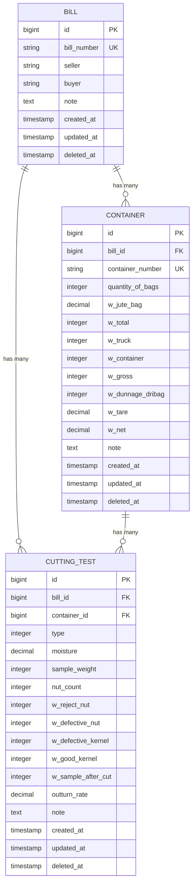
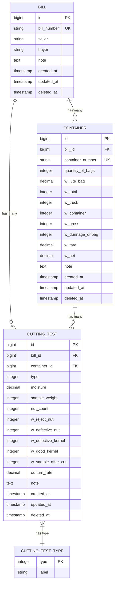

# Bill Model

<cite>
**Referenced Files in This Document**   
- [Bill.php](file://app/Models/Bill.php)
- [2025_09_19_112834_create_bills_table.php](file://database/migrations/2025_09_19_112834_create_bills_table.php)
- [BillQuery.php](file://app/Queries/BillQuery.php)
- [BillRepository.php](file://app/Repositories/BillRepository.php)
- [BillFactory.php](file://database/factories/BillFactory.php)
- [BillSeeder.php](file://database/seeders/BillSeeder.php)
- [Container.php](file://app/Models/Container.php)
- [CuttingTest.php](file://app/Models/CuttingTest.php)
- [CuttingTestType.php](file://app/Enums/CuttingTestType.php)
- [StoreBillRequest.php](file://app/Http/Requests/StoreBillRequest.php)
- [BillController.php](file://app/Http/Controllers/BillController.php)
- [BillService.php](file://app/Services/BillService.php)
- [BillResource.php](file://app/Http/Resources/BillResource.php)
</cite>

## Table of Contents
1. [Introduction](#introduction)
2. [Core Attributes](#core-attributes)
3. [Relationships](#relationships)
4. [Business Logic and Calculated Attributes](#business-logic-and-calculated-attributes)
5. [Data Integrity and Soft Delete](#data-integrity-and-soft-delete)
6. [Factory and Seeding Strategy](#factory-and-seeding-strategy)
7. [Query and Repository Usage](#query-and-repository-usage)
8. [API and Resource Layer](#api-and-resource-layer)
9. [Data Model Diagram](#data-model-diagram)
10. [Indexing and Performance](#indexing-and-performance)

## Introduction
The Bill model serves as the central entity in the CFCCashew application, representing a shipment or transaction of cashew nuts. It acts as the parent entity in the processing workflow, aggregating data from associated containers and cutting tests. This document provides comprehensive documentation of the Bill model, including its attributes, relationships, business rules, and integration points across the application stack.

**Section sources**
- [Bill.php](file://app/Models/Bill.php#L1-L101)

## Core Attributes
The Bill model contains the following core attributes:

| Attribute | Data Type | Constraints | Default Value | Description |
|---------|----------|------------|--------------|-------------|
| id | bigint unsigned | PRIMARY KEY, AUTO_INCREMENT | None | Unique identifier for the bill |
| bill_number | string(20) | nullable, unique | None | Optional bill reference number |
| seller | string(255) | nullable | None | Name of the seller entity |
| buyer | string(255) | nullable | None | Name of the buyer entity |
| note | text | nullable | None | Additional notes about the bill |
| created_at | timestamp | nullable | CURRENT_TIMESTAMP | Record creation timestamp |
| updated_at | timestamp | nullable | CURRENT_TIMESTAMP on update | Record modification timestamp |
| deleted_at | timestamp | nullable | NULL | Soft delete timestamp |

The model uses Laravel's Eloquent ORM with mass assignment protection via the `$fillable` array, which includes: bill_number, seller, buyer, and note.

**Section sources**
- [Bill.php](file://app/Models/Bill.php#L15-L25)
- [2025_09_19_112834_create_bills_table.php](file://database/migrations/2025_09_19_112834_create_bills_table.php#L10-L20)
- [StoreBillRequest.php](file://app/Http/Requests/StoreBillRequest.php#L25-L37)

## Relationships
The Bill model establishes the following relationships:

- **One-to-Many with Container**: A bill can have multiple containers, each representing a physical shipment unit.
- **One-to-Many with CuttingTest**: A bill can have multiple cutting tests, including both container-specific tests and final sample tests.

The model also defines a specialized relationship for final sample cutting tests (types 1-3), which are cutting tests not associated with any specific container and represent the final quality assessment of the entire bill.

**Diagram sources**
- [Bill.php](file://app/Models/Bill.php#L38-L61)
- [Container.php](file://app/Models/Container.php#L38-L50)
- [CuttingTest.php](file://app/Models/CuttingTest.php#L38-L50)

**Section sources**
- [Bill.php](file://app/Models/Bill.php#L38-L61)

## Business Logic and Calculated Attributes
The Bill model implements several business rules and calculated attributes:

### Slug Generation
The model automatically generates a URL-friendly slug using the pattern `{id}-{bill_number}` or `{id}-bill` if no bill number is provided. The slug is used as the route key for URL resolution.

### Average Outturn Calculation
The `average_outturn` attribute is calculated as the average of outturn rates from final sample cutting tests (types 1-3). The value is rounded to two decimal places and returns null if no valid final samples exist.

### Route Binding
The model implements custom route binding logic to resolve bills from URLs using the slug format, extracting the ID from the slug for database lookup.

**Section sources**
- [Bill.php](file://app/Models/Bill.php#L63-L101)

## Data Integrity and Soft Delete
The Bill model implements soft delete functionality through Laravel's SoftDeletes trait, allowing records to be marked as deleted without permanent removal from the database. This ensures data integrity and auditability. When a bill is deleted, the deleted_at timestamp is set, and the record remains in the database but is excluded from standard queries.

Related containers and cutting tests are not automatically deleted when a bill is soft-deleted, maintaining referential integrity while allowing for potential restoration of the bill record.

**Section sources**
- [Bill.php](file://app/Models/Bill.php#L10-L11)
- [2025_09_19_112834_create_bills_table.php](file://database/migrations/2025_09_19_112834_create_bills_table.php#L18)

## Factory and Seeding Strategy
The Bill model uses a dedicated factory for test data generation. The BillFactory generates realistic bill data with:
- Bill numbers in the format BL-{current_year}-{3_digit_sequence}
- Random company names for seller and buyer
- Optional notes

The BillSeeder demonstrates a comprehensive seeding strategy, creating sample bills and associating them with containers and cutting tests. Each bill is seeded with 1-4 containers, and each container may have a cutting test. Additionally, bills receive 1-3 final sample cutting tests that are not tied to any specific container.

**Section sources**
- [BillFactory.php](file://database/factories/BillFactory.php#L15-L26)
- [BillSeeder.php](file://database/seeders/BillSeeder.php#L15-L113)

## Query and Repository Usage
The Bill model is accessed through a layered architecture using BillQuery and BillRepository classes:

### BillQuery
Handles complex query logic with methods for:
- Searching and filtering bills
- Pagination with eager loading
- Retrieving recent bills
- Finding bills pending final tests
- Identifying bills missing final samples

### BillRepository
Provides basic CRUD operations:
- findById and findByIdWithRelations
- create, update, delete
- getAll and getAllWithCounts
- Specialized queries for recent bills and test status

The service layer (BillService) orchestrates these components, providing a clean API for controllers.

**Section sources**
- [BillQuery.php](file://app/Queries/BillQuery.php#L1-L95)
- [BillRepository.php](file://app/Repositories/BillRepository.php#L1-L86)
- [BillService.php](file://app/Services/BillService.php#L1-L91)

## API and Resource Layer
The Bill model is exposed through the API layer using BillResource, which transforms model data for JSON responses. The resource includes:
- Core bill attributes
- Relationship counts (containers, final samples)
- Calculated average outturn rate
- Eager-loaded relationships when available
- ISO-formatted timestamps

The BillController handles standard CRUD operations and integrates with Inertia.js for server-side rendering of Vue components.

**Section sources**
- [BillResource.php](file://app/Http/Resources/BillResource.php#L1-L41)
- [BillController.php](file://app/Http/Controllers/BillController.php#L1-L107)

## Data Model Diagram
The following diagram illustrates the complete data model for the Bill entity and its relationships:

**Diagram sources**
- [Bill.php](file://app/Models/Bill.php#L1-L101)
- [Container.php](file://app/Models/Container.php#L1-L146)
- [CuttingTest.php](file://app/Models/CuttingTest.php#L1-L86)
- [CuttingTestType.php](file://app/Enums/CuttingTestType.php#L1-L37)

## Indexing and Performance
The bills table includes a database index on the created_at column (idx_bills_created_at) to optimize queries that sort or filter by creation date. This index supports the common use case of retrieving recent bills and displaying them in chronological order.

The query layer implements additional performance optimizations through:
- Eager loading of relationship counts
- Selective loading of related data based on context
- Efficient pagination with query string preservation
- Caching of frequently accessed data patterns

**Section sources**
- [2025_09_19_112834_create_bills_table.php](file://database/migrations/2025_09_19_112834_create_bills_table.php#L19)
- [BillQuery.php](file://app/Queries/BillQuery.php#L1-L95)