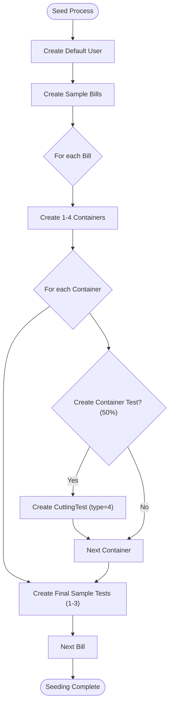

# Data Models & Database Schema

<cite>
**Referenced Files in This Document**   
- [Bill.php](file://app/Models/Bill.php)
- [Container.php](file://app/Models/Container.php)
- [CuttingTest.php](file://app/Models/CuttingTest.php)
- [User.php](file://app/Models/User.php)
- [CuttingTestType.php](file://app/Enums/CuttingTestType.php)
- [create_bills_table.php](file://database/migrations/2025_09_19_112834_create_bills_table.php)
- [create_containers_table.php](file://database/migrations/2025_09_19_112846_create_containers_table.php)
- [create_cutting_tests_table.php](file://database/migrations/2025_09_19_112901_create_cutting_tests_table.php)
- [BillSeeder.php](file://database/seeders/BillSeeder.php)
- [DefaultUserSeeder.php](file://database/seeders/DefaultUserSeeder.php)
- [DevelopmentSeeder.php](file://database/seeders/DevelopmentSeeder.php)
</cite>

## Table of Contents
1. [Introduction](#introduction)
2. [Core Data Models](#core-data-models)
3. [Database Schema](#database-schema)
4. [Entity Relationships](#entity-relationships)
5. [Data Validation and Lifecycle Events](#data-validation-and-lifecycle-events)
6. [Factory Patterns and Seeding Strategies](#factory-patterns-and-seeding-strategies)
7. [Data Integrity and Referential Integrity](#data-integrity-and-referential-integrity)
8. [Conclusion](#conclusion)

## Introduction
The CFCCashew application manages cashew processing and quality control through a structured data model centered on four primary entities: Bill, Container, CuttingTest, and User. This document provides comprehensive documentation of these models, their attributes, relationships, and business rules. It details the database schema, including field types, constraints, and indexes, and explains how data integrity is maintained across the system. The documentation also covers test data generation patterns and seeding strategies used in development and testing environments.

## Core Data Models

### Bill Model
The Bill model represents a commercial transaction for cashew goods. It contains transaction metadata such as bill number, seller, buyer, and notes. Bills serve as the top-level container for related containers and cutting tests. The model includes soft delete functionality and calculates derived attributes like average outturn rate from associated final sample cutting tests.

**Section sources**
- [Bill.php](file://app/Models/Bill.php#L1-L101)

### Container Model
The Container model represents a physical container of cashews associated with a bill. It captures detailed weight measurements including truck, container, gross, tare, and net weights. The model provides methods to calculate derived weight values based on standard formulas. Containers are linked to bills and may have associated cutting tests. The model uses soft deletes and includes average moisture and outturn rate calculations from related cutting tests.

**Section sources**
- [Container.php](file://app/Models/Container.php#L1-L146)

### CuttingTest Model
The CuttingTest model represents quality control tests performed on cashew samples. Tests can be either final sample tests (types 1-3) or container tests (type 4). The model uses an enum to define test types and includes methods to determine test classification. It captures detailed measurements including moisture content, sample weights, nut counts, and outturn rates. Cutting tests are associated with bills and optionally with containers.

**Section sources**
- [CuttingTest.php](file://app/Models/CuttingTest.php#L1-L86)
- [CuttingTestType.php](file://app/Enums/CuttingTestType.php#L1-L37)

### User Model
The User model represents application users with authentication capabilities. It extends Laravel's Authenticatable class and includes two-factor authentication support. The model handles user authentication, password hashing, and email verification. User data is minimal, storing only name, email, and password, with password fields hidden during serialization.

**Section sources**
- [User.php](file://app/Models/User.php#L1-L49)

## Database Schema

### Bills Table Schema
The bills table stores transaction records with the following structure:

| Field | Type | Null | Default | Constraints | Index |
|-------|------|------|---------|-------------|-------|
| id | BIGINT UNSIGNED | NO | AUTO_INCREMENT | PRIMARY KEY | PRIMARY |
| bill_number | VARCHAR(20) | YES | NULL | - | - |
| seller | VARCHAR(255) | YES | NULL | - | - |
| buyer | VARCHAR(255) | YES | NULL | - | - |
| note | TEXT | YES | NULL | - | - |
| created_at | TIMESTAMP | YES | NULL | - | idx_bills_created_at |
| updated_at | TIMESTAMP | YES | NULL | - | - |
| deleted_at | TIMESTAMP | YES | NULL | - | - |

**Section sources**
- [create_bills_table.php](file://database/migrations/2025_09_19_112834_create_bills_table.php#L1-L34)

### Containers Table Schema
The containers table stores container records with the following structure:

| Field | Type | Null | Default | Constraints | Index |
|-------|------|------|---------|-------------|-------|
| id | BIGINT UNSIGNED | NO | AUTO_INCREMENT | PRIMARY KEY | PRIMARY |
| bill_id | BIGINT UNSIGNED | NO | - | FOREIGN KEY (bills.id), ON DELETE CASCADE | - |
| truck | VARCHAR(20) | YES | NULL | - | - |
| container_number | VARCHAR(11) | YES | NULL | - | idx_containers_container_number |
| quantity_of_bags | INT UNSIGNED | YES | NULL | - | - |
| w_jute_bag | DECIMAL(4,2) | NO | 1.00 | - | - |
| w_total | INT UNSIGNED | YES | NULL | - | - |
| w_truck | INT UNSIGNED | YES | NULL | - | - |
| w_container | INT UNSIGNED | YES | NULL | - | - |
| w_gross | INT UNSIGNED | YES | NULL | - | - |
| w_dunnage_dribag | INT UNSIGNED | YES | NULL | - | - |
| w_tare | DECIMAL(10,2) | YES | NULL | - | - |
| w_net | DECIMAL(10,2) | YES | NULL | - | - |
| note | TEXT | YES | NULL | - | - |
| created_at | TIMESTAMP | YES | NULL | - | idx_containers_created_at |
| updated_at | TIMESTAMP | YES | NULL | - | - |
| deleted_at | TIMESTAMP | YES | NULL | - | - |

**Section sources**
- [create_containers_table.php](file://database/migrations/2025_09_19_112846_create_containers_table.php#L1-L44)

### Cutting Tests Table Schema
The cutting_tests table stores quality control test records with the following structure:

| Field | Type | Null | Default | Constraints | Index |
|-------|------|------|---------|-------------|-------|
| id | BIGINT UNSIGNED | NO | AUTO_INCREMENT | PRIMARY KEY | PRIMARY |
| bill_id | BIGINT UNSIGNED | NO | - | FOREIGN KEY (bills.id), ON DELETE CASCADE | - |
| container_id | BIGINT UNSIGNED | YES | NULL | FOREIGN KEY (containers.id), ON DELETE CASCADE | - |
| type | SMALLINT | NO | - | - | - |
| moisture | DECIMAL(4,2) | YES | NULL | 0-100% | - |
| sample_weight | SMALLINT UNSIGNED | NO | 1000 | grams | - |
| nut_count | SMALLINT UNSIGNED | YES | NULL | - | - |
| w_reject_nut | SMALLINT UNSIGNED | YES | NULL | - | - |
| w_defective_nut | SMALLINT UNSIGNED | YES | NULL | - | - |
| w_defective_kernel | SMALLINT UNSIGNED | YES | NULL | - | - |
| w_good_kernel | SMALLINT UNSIGNED | YES | NULL | - | - |
| w_sample_after_cut | SMALLINT UNSIGNED | YES | NULL | - | - |
| outturn_rate | DECIMAL(5,2) | YES | NULL | 0-60 lbs/80kg | - |
| note | TEXT | YES | NULL | - | - |
| created_at | TIMESTAMP | YES | NULL | - | idx_cutting_tests_created_at |
| updated_at | TIMESTAMP | YES | NULL | - | - |
| deleted_at | TIMESTAMP | YES | NULL | - | - |

**Section sources**
- [create_cutting_tests_table.php](file://database/migrations/2025_09_19_112901_create_cutting_tests_table.php#L1-L43)

## Entity Relationships

```mermaid
erDiagram
BILL {
bigint id PK
varchar(20) bill_number
varchar(255) seller
varchar(255) buyer
text note
timestamp created_at
timestamp updated_at
timestamp deleted_at
}
CONTAINER {
bigint id PK
bigint bill_id FK
varchar(20) truck
varchar(11) container_number
int quantity_of_bags
decimal(4,2) w_jute_bag
int w_total
int w_truck
int w_container
int w_gross
int w_dunnage_dribag
decimal(10,2) w_tare
decimal(10,2) w_net
text note
timestamp created_at
timestamp updated_at
timestamp deleted_at
}
CUTTING_TEST {
bigint id PK
bigint bill_id FK
bigint container_id FK
smallint type
decimal(4,2) moisture
smallint sample_weight
smallint nut_count
smallint w_reject_nut
smallint w_defective_nut
smallint w_defective_kernel
smallint w_good_kernel
smallint w_sample_after_cut
decimal(5,2) outturn_rate
text note
timestamp created_at
timestamp updated_at
timestamp deleted_at
}
USER {
bigint id PK
varchar(255) name
varchar(255) email UK
varchar(255) password
timestamp email_verified_at
timestamp two_factor_confirmed_at
text two_factor_recovery_codes
text two_factor_secret
timestamp created_at
timestamp updated_at
timestamp deleted_at
}
BILL ||--o{ CONTAINER : "has many"
BILL ||--o{ CUTTING_TEST : "has many"
CONTAINER ||--o{ CUTTING_TEST : "has many"
USER ||--o{ BILL : "creates"
```

**Diagram sources**
- [Bill.php](file://app/Models/Bill.php#L1-L101)
- [Container.php](file://app/Models/Container.php#L1-L146)
- [CuttingTest.php](file://app/Models/CuttingTest.php#L1-L86)
- [User.php](file://app/Models/User.php#L1-L49)

## Data Validation and Lifecycle Events

### Bill Model Validation
The Bill model accepts the following fillable attributes: bill_number, seller, buyer, and note. All fields are nullable, allowing flexible data entry. The model automatically manages created_at, updated_at, and deleted_at timestamps through Laravel's built-in timestamp handling. Soft deletes are implemented, preserving record history while allowing logical deletion.

### Container Model Validation
The Container model validates weight measurements and quantity fields with appropriate data types. The w_jute_bag field has a default value of 1.00. All weight fields are unsigned integers except w_tare and w_net, which are decimal values with two decimal places for precision. The model includes calculated attributes for gross weight, tare weight, and net weight based on standard formulas.

### CuttingTest Model Validation
The CuttingTest model enforces data integrity through field constraints. Moisture is stored as a decimal with two decimal places (0-100%). Sample weight has a default of 1000 grams. The outturn_rate field is a decimal with two decimal places, supporting values up to 99.99. The type field uses integer values corresponding to the CuttingTestType enum (1-4).

### Lifecycle Events
All models implement soft deletes through the SoftDeletes trait, preserving data integrity while allowing records to be logically removed. The Bill model includes a custom route key implementation using a slug format (id-billnumber) for SEO-friendly URLs. The Container model uses the container_number as its route key, with fallback to ID for backward compatibility.

**Section sources**
- [Bill.php](file://app/Models/Bill.php#L1-L101)
- [Container.php](file://app/Models/Container.php#L1-L146)
- [CuttingTest.php](file://app/Models/CuttingTest.php#L1-L86)

## Factory Patterns and Seeding Strategies

### Factory Patterns
The application uses Laravel's factory pattern for test data generation. Factories exist for all primary models (BillFactory, ContainerFactory, CuttingTestFactory, UserFactory), enabling consistent test data creation. The factories define realistic data ranges and relationships, ensuring test data reflects production scenarios.

### Seeding Strategies
The application implements multiple seeding strategies for different environments:

- **DefaultUserSeeder**: Creates a default admin user with predefined credentials for initial access
- **BillSeeder**: Generates sample bills with associated containers and cutting tests
- **DevelopmentSeeder**: Orchestrates the seeding process, creating default users and importing real data
- **ImportDataSeeder**: Handles import of real-world data for development and testing

The BillSeeder creates five sample bills with randomized container counts (1-4) and final sample tests (1-3). Each container may have an associated cutting test (50% probability). The seeding process maintains referential integrity by properly linking related records.



**Diagram sources**
- [BillSeeder.php](file://database/seeders/BillSeeder.php#L1-L113)
- [DefaultUserSeeder.php](file://database/seeders/DefaultUserSeeder.php#L1-L28)
- [DevelopmentSeeder.php](file://database/seeders/DevelopmentSeeder.php#L1-L30)

**Section sources**
- [BillSeeder.php](file://database/seeders/BillSeeder.php#L1-L113)
- [DefaultUserSeeder.php](file://database/seeders/DefaultUserSeeder.php#L1-L28)
- [DevelopmentSeeder.php](file://database/seeders/DevelopmentSeeder.php#L1-L30)

## Data Integrity and Referential Integrity

### Foreign Key Constraints
The database enforces referential integrity through foreign key constraints:
- containers.bill_id references bills.id with ON DELETE CASCADE
- cutting_tests.bill_id references bills.id with ON DELETE CASCADE  
- cutting_tests.container_id references containers.id with ON DELETE CASCADE

These constraints ensure that when a bill is deleted, all associated containers and cutting tests are automatically removed. Similarly, deleting a container removes its associated cutting tests.

### Data Integrity Rules
The application maintains data integrity through several mechanisms:
- Soft deletes preserve record history while allowing logical deletion
- Calculated fields (average outturn, average moisture) are derived from related records
- Business rules are enforced through model methods and validation
- Enum types ensure valid test type values (1-4)

### Referential Integrity
The hierarchical relationship between entities ensures data consistency:
- Bills are the root entity, with containers and cutting tests as children
- Containers belong to bills and may have associated cutting tests
- Cutting tests belong to bills and optionally to containers
- Final sample tests (types 1-3) are bill-level tests with no container association
- Container tests (type 4) are associated with specific containers

This structure prevents orphaned records and maintains the logical hierarchy of cashew processing data.

**Section sources**
- [Bill.php](file://app/Models/Bill.php#L1-L101)
- [Container.php](file://app/Models/Container.php#L1-L146)
- [CuttingTest.php](file://app/Models/CuttingTest.php#L1-L86)
- [create_bills_table.php](file://database/migrations/2025_09_19_112834_create_bills_table.php#L1-L34)
- [create_containers_table.php](file://database/migrations/2025_09_19_112846_create_containers_table.php#L1-L44)
- [create_cutting_tests_table.php](file://database/migrations/2025_09_19_112901_create_cutting_tests_table.php#L1-L43)

## Conclusion
The CFCCashew application's data model effectively captures the complex relationships between commercial transactions (Bills), physical shipments (Containers), and quality control processes (CuttingTests). The schema design balances flexibility with data integrity, using foreign key constraints and soft deletes to maintain referential integrity while allowing for data evolution. The model includes calculated attributes and business logic that reflect real-world cashew processing workflows. Factory patterns and seeding strategies enable consistent test data generation, supporting development and quality assurance. The overall architecture provides a robust foundation for managing cashew processing operations with accurate data tracking and reporting capabilities.