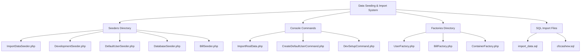
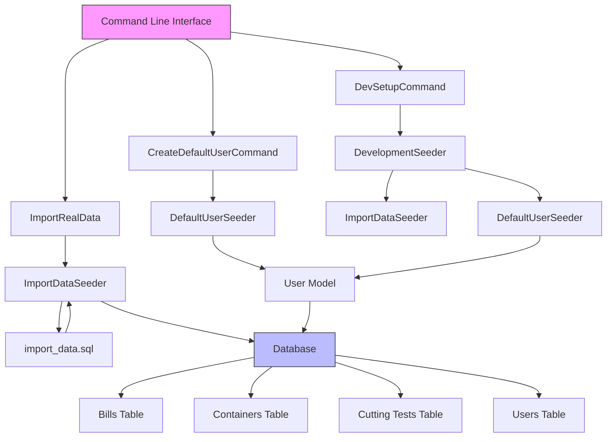
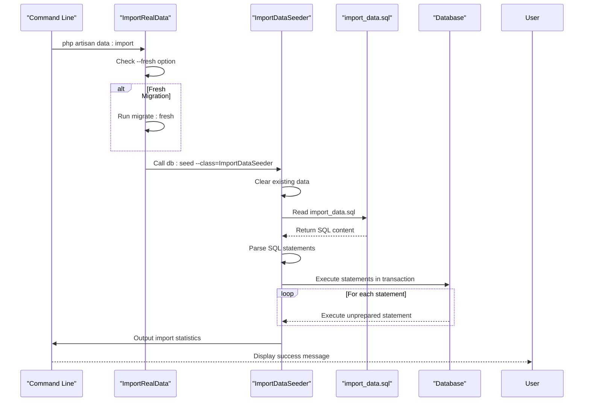
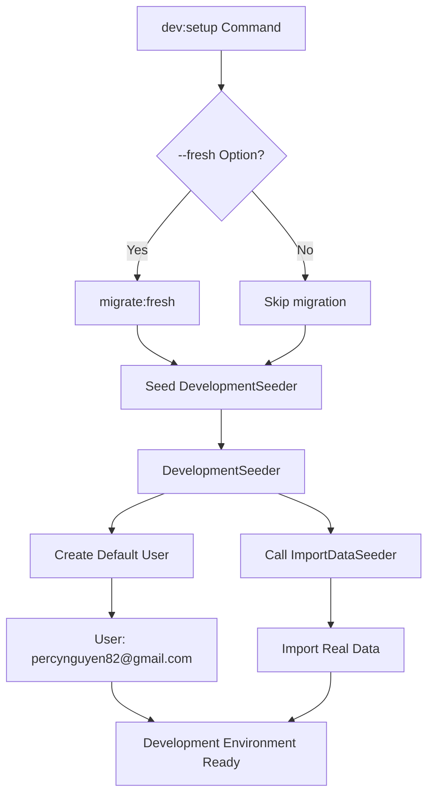
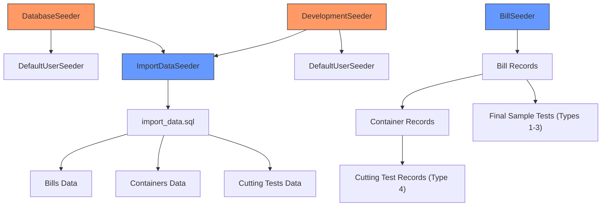
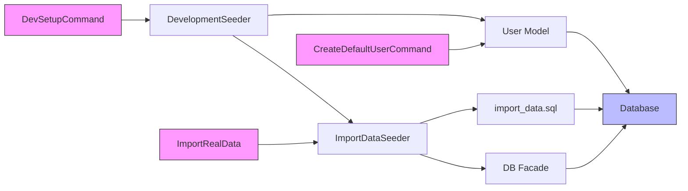

# Data Seeding & Import

<cite>
**Referenced Files in This Document**   
- [ImportDataSeeder.php](file://database/seeders/ImportDataSeeder.php)
- [DevelopmentSeeder.php](file://database/seeders/DevelopmentSeeder.php)
- [DefaultUserSeeder.php](file://database/seeders/DefaultUserSeeder.php)
- [DatabaseSeeder.php](file://database/seeders/DatabaseSeeder.php)
- [BillSeeder.php](file://database/seeders/BillSeeder.php)
- [ImportRealData.php](file://app/Console/Commands/ImportRealData.php)
- [CreateDefaultUserCommand.php](file://app/Console/Commands/CreateDefaultUserCommand.php)
- [DevSetupCommand.php](file://app/Console/Commands/DevSetupCommand.php)
- [UserFactory.php](file://database/factories/UserFactory.php)
- [BillFactory.php](file://database/factories/BillFactory.php)
- [ContainerFactory.php](file://database/factories/ContainerFactory.php)
- [import_data.sql](file://database/seeders/import_data.sql)
- [cfccashew.sql](file://database/seeders/cfccashew.sql)
</cite>

## Table of Contents
1. [Introduction](#introduction)
2. [Project Structure](#project-structure)
3. [Core Components](#core-components)
4. [Architecture Overview](#architecture-overview)
5. [Detailed Component Analysis](#detailed-component-analysis)
6. [Dependency Analysis](#dependency-analysis)
7. [Performance Considerations](#performance-considerations)
8. [Troubleshooting Guide](#troubleshooting-guide)
9. [Conclusion](#conclusion)

## Introduction
The CFCCashew application implements a comprehensive data seeding and import system to support development, testing, and production data initialization. This document details the mechanisms for database seeding, default user creation, and real-world data import operations. The system supports both synthetic data generation through Laravel factories and seeder classes, as well as direct SQL-based data import for real production data. The command-line interface provides developers with tools to set up environments, import data, and maintain data consistency across different deployment stages.

## Project Structure



**Diagram sources**
- [database/seeders](file://database/seeders)
- [app/Console/Commands](file://app/Console/Commands)
- [database/factories](file://database/factories)

**Section sources**
- [database/seeders](file://database/seeders)
- [app/Console/Commands](file://app/Console/Commands)

## Core Components

The data seeding and import functionality in CFCCashew is built around several core components that work together to initialize the database with appropriate data for different environments. The system distinguishes between development seeders that create synthetic data and import seeders that load real production data. The architecture follows Laravel's standard seeding patterns while extending them with custom commands and workflows tailored to the application's specific requirements.

**Section sources**
- [ImportDataSeeder.php](file://database/seeders/ImportDataSeeder.php)
- [DevelopmentSeeder.php](file://database/seeders/DevelopmentSeeder.php)
- [ImportRealData.php](file://app/Console/Commands/ImportRealData.php)

## Architecture Overview



**Diagram sources**
- [app/Console/Commands/DevSetupCommand.php](file://app/Console/Commands/DevSetupCommand.php)
- [app/Console/Commands/ImportRealData.php](file://app/Console/Commands/ImportRealData.php)
- [app/Console/Commands/CreateDefaultUserCommand.php](file://app/Console/Commands/CreateDefaultUserCommand.php)
- [database/seeders/DevelopmentSeeder.php](file://database/seeders/DevelopmentSeeder.php)
- [database/seeders/ImportDataSeeder.php](file://database/seeders/ImportDataSeeder.php)
- [database/seeders/DefaultUserSeeder.php](file://database/seeders/DefaultUserSeeder.php)

## Detailed Component Analysis

### Data Import Process Analysis

The data import process in CFCCashew is designed to handle real production data through a structured SQL import mechanism. The system ensures data integrity by truncating existing tables before importing new data and maintaining referential integrity throughout the process.



**Diagram sources**
- [app/Console/Commands/ImportRealData.php](file://app/Console/Commands/ImportRealData.php#L25-L45)
- [database/seeders/ImportDataSeeder.php](file://database/seeders/ImportDataSeeder.php#L15-L50)

**Section sources**
- [app/Console/Commands/ImportRealData.php](file://app/Console/Commands/ImportRealData.php)
- [database/seeders/ImportDataSeeder.php](file://database/seeders/ImportDataSeeder.php)

### Development Setup Analysis

The development environment setup process orchestrates multiple seeding operations to create a fully functional development environment with sample data and a default user account.



**Diagram sources**
- [app/Console/Commands/DevSetupCommand.php](file://app/Console/Commands/DevSetupCommand.php#L25-L45)
- [database/seeders/DevelopmentSeeder.php](file://database/seeders/DevelopmentSeeder.php#L15-L25)

**Section sources**
- [app/Console/Commands/DevSetupCommand.php](file://app/Console/Commands/DevSetupCommand.php)
- [database/seeders/DevelopmentSeeder.php](file://database/seeders/DevelopmentSeeder.php)

### Default User Creation Analysis

The default user creation functionality is implemented through multiple pathways to ensure consistent user availability across different seeding scenarios.

```mermaid
classDiagram
class DefaultUserSeeder {
+run()
-email : string
-name : string
-password : string
}
class CreateDefaultUserCommand {
+handle()
+signature : string
+description : string
}
class User {
+id : int
+name : string
+email : string
+password : string
+email_verified_at : datetime
}
DefaultUserSeeder --> User : "creates"
CreateDefaultUserCommand --> User : "creates"
DevelopmentSeeder --> DefaultUserSeeder : "calls"
DatabaseSeeder --> DefaultUserSeeder : "calls"
note right of DefaultUserSeeder
Uses firstOrCreate to prevent
duplicate users across multiple
seeding operations
end note
note right of CreateDefaultUserCommand
Provides CLI interface for
creating default user with
clear success/failure feedback
end note
```

**Diagram sources**
- [database/seeders/DefaultUserSeeder.php](file://database/seeders/DefaultUserSeeder.php#L15-L25)
- [app/Console/Commands/CreateDefaultUserCommand.php](file://app/Console/Commands/CreateDefaultUserCommand.php#L25-L45)
- [app/Models/User.php](file://app/Models/User.php)

**Section sources**
- [database/seeders/DefaultUserSeeder.php](file://database/seeders/DefaultUserSeeder.php)
- [app/Console/Commands/CreateDefaultUserCommand.php](file://app/Console/Commands/CreateDefaultUserCommand.php)

### Seeder Implementation Analysis

The seeder implementations demonstrate a hierarchical approach to data population, with different seeders responsible for specific data domains and relationships.



**Diagram sources**
- [database/seeders/DatabaseSeeder.php](file://database/seeders/DatabaseSeeder.php#L15-L20)
- [database/seeders/DevelopmentSeeder.php](file://database/seeders/DevelopmentSeeder.php#L15-L25)
- [database/seeders/ImportDataSeeder.php](file://database/seeders/ImportDataSeeder.php#L15-L25)
- [database/seeders/BillSeeder.php](file://database/seeders/BillSeeder.php#L15-L110)

**Section sources**
- [database/seeders/DatabaseSeeder.php](file://database/seeders/DatabaseSeeder.php)
- [database/seeders/BillSeeder.php](file://database/seeders/BillSeeder.php)

## Dependency Analysis



**Diagram sources**
- [app/Console/Commands/DevSetupCommand.php](file://app/Console/Commands/DevSetupCommand.php)
- [app/Console/Commands/ImportRealData.php](file://app/Console/Commands/ImportRealData.php)
- [app/Console/Commands/CreateDefaultUserCommand.php](file://app/Console/Commands/CreateDefaultUserCommand.php)
- [database/seeders/DevelopmentSeeder.php](file://database/seeders/DevelopmentSeeder.php)
- [database/seeders/ImportDataSeeder.php](file://database/seeders/ImportDataSeeder.php)
- [app/Models/User.php](file://app/Models/User.php)

**Section sources**
- [app/Console/Commands](file://app/Console/Commands)
- [database/seeders](file://database/seeders)

## Performance Considerations

When importing large datasets, the CFCCashew application employs several performance optimization strategies. The ImportDataSeeder wraps SQL execution in a database transaction to ensure atomicity and improve performance by reducing the overhead of individual statement commits. The system disables foreign key checks during the truncation phase to allow efficient clearing of related tables without constraint violations. For very large SQL files, the import process reads the entire file into memory and processes it in chunks, which is efficient for moderately sized datasets but may need adjustment for extremely large files. The use of DB::unprepared() for executing SQL statements bypasses Laravel's query builder overhead, providing direct and efficient execution of raw SQL.

**Section sources**
- [database/seeders/ImportDataSeeder.php](file://database/seeders/ImportDataSeeder.php#L15-L50)

## Troubleshooting Guide

Common issues with data seeding and import operations in CFCCashew typically fall into several categories. Missing SQL files can occur if the import_data.sql file is not present in the seeders directory, resulting in a "file not found" error. Database connection issues may prevent the import process from executing, particularly when foreign key constraints interfere with table truncation. Data integrity problems can arise if the SQL file contains malformed statements or violates database constraints. To troubleshoot these issues, verify the presence and path of the import_data.sql file, ensure the database is accessible and properly configured, and validate the SQL syntax in the import file. The system provides informative console output to help diagnose these issues, including explicit error messages when files are missing and success indicators when operations complete.

**Section sources**
- [database/seeders/ImportDataSeeder.php](file://database/seeders/ImportDataSeeder.php#L20-L30)
- [app/Console/Commands/ImportRealData.php](file://app/Console/Commands/ImportRealData.php#L25-L40)

## Conclusion

The data seeding and import system in CFCCashew provides a robust framework for initializing the application database with both synthetic development data and real production data. The architecture leverages Laravel's built-in seeding capabilities while extending them with custom commands and workflows tailored to the application's specific requirements. The system ensures data consistency and referential integrity through careful management of foreign key constraints and transactional operations. Multiple entry points provide flexibility for different use cases, from full development environment setup to targeted data imports. The implementation demonstrates best practices in data initialization, including idempotent operations, clear feedback mechanisms, and separation of concerns between different seeding responsibilities.