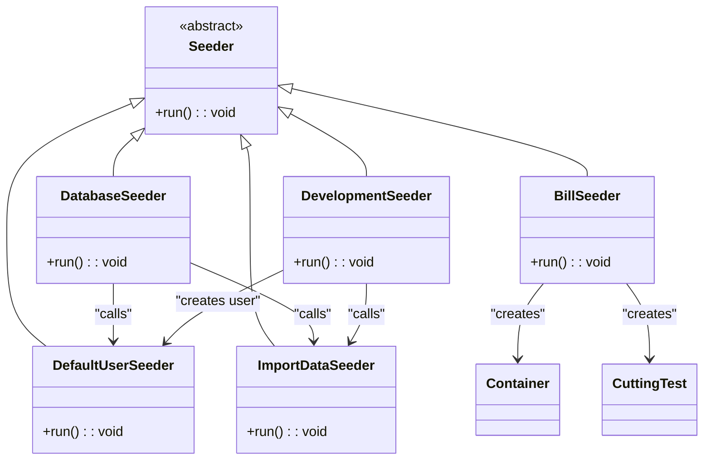
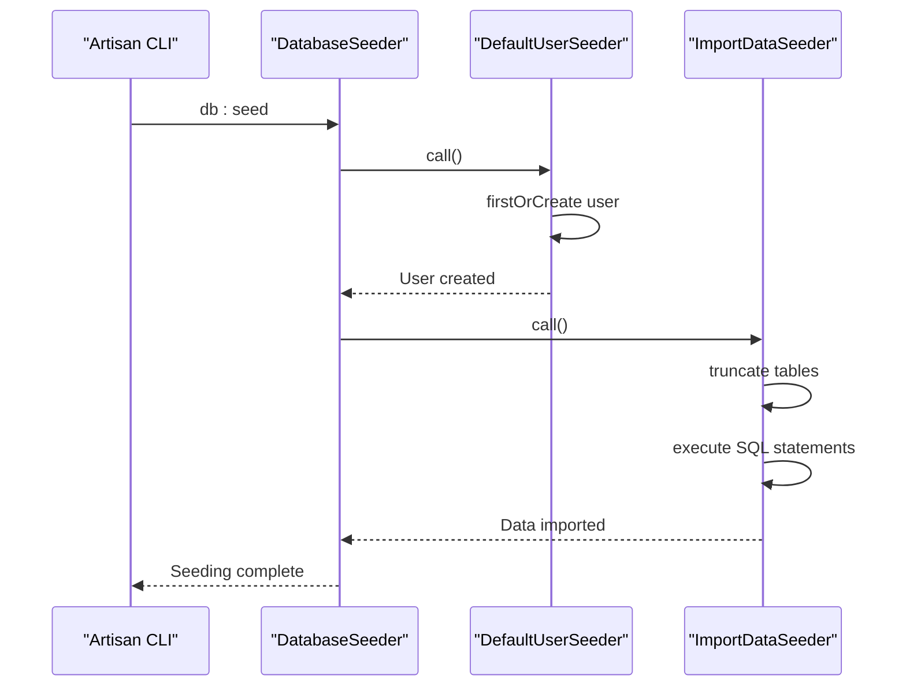
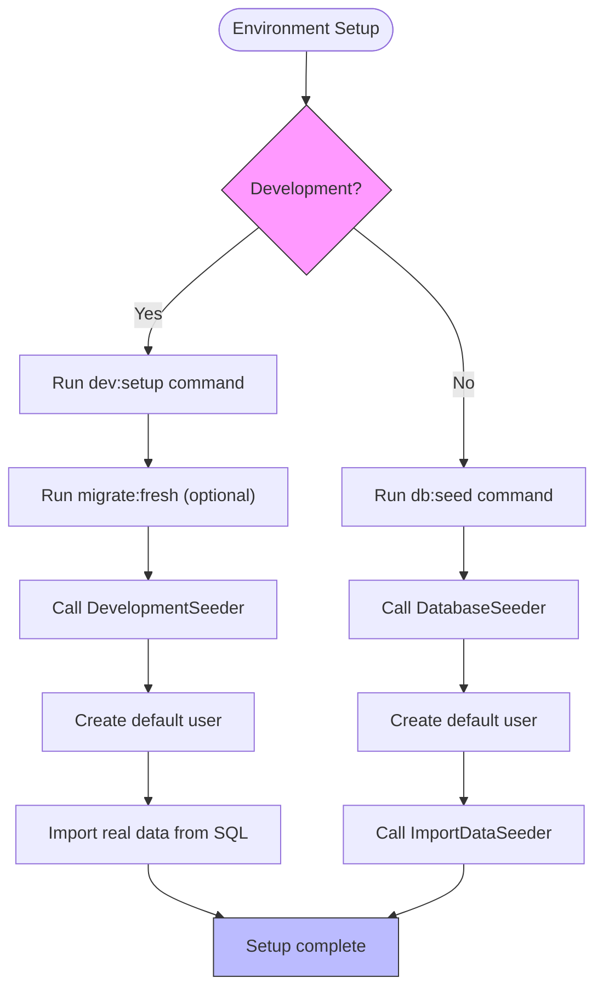
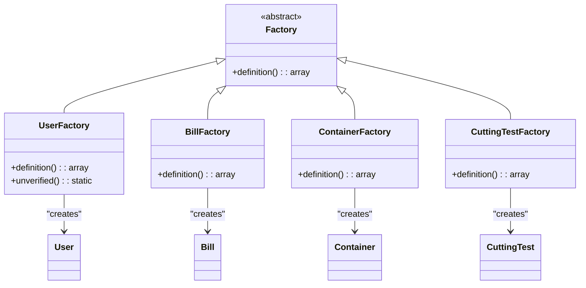
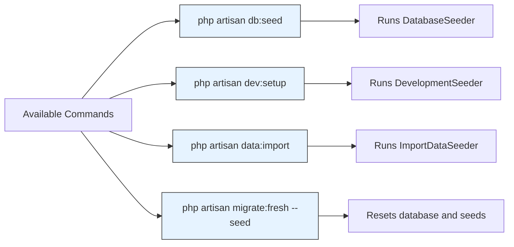

# Database Seeding

<cite>
**Referenced Files in This Document**   
- [DatabaseSeeder.php](file://database/seeders/DatabaseSeeder.php)
- [DevelopmentSeeder.php](file://database/seeders/DevelopmentSeeder.php)
- [DefaultUserSeeder.php](file://database/seeders/DefaultUserSeeder.php)
- [BillSeeder.php](file://database/seeders/BillSeeder.php)
- [ImportDataSeeder.php](file://database/seeders/ImportDataSeeder.php)
- [UserFactory.php](file://database/factories/UserFactory.php)
- [BillFactory.php](file://database/factories/BillFactory.php)
- [ContainerFactory.php](file://database/factories/ContainerFactory.php)
- [CuttingTestFactory.php](file://database/factories/CuttingTestFactory.php)
- [ImportRealData.php](file://app/Console/Commands/ImportRealData.php)
- [DevSetupCommand.php](file://app/Console/Commands/DevSetupCommand.php)
- [DATABASE_SEEDING.md](file://DATABASE_SEEDING.md)
</cite>

## Table of Contents
1. [Introduction](#introduction)
2. [Core Components](#core-components)
3. [Hierarchical Seeder Execution Flow](#hierarchical-seeder-execution-flow)
4. [Environment-Specific Seeding Strategies](#environment-specific-seeding-strategies)
5. [Integration with Model Factories](#integration-with-model-factories)
6. [Running and Managing Seeders](#running-and-managing-seeders)
7. [Best Practices for Seeder Management](#best-practices-for-seeder-management)
8. [Troubleshooting Common Seeder Errors](#troubleshooting-common-seeder-errors)
9. [Conclusion](#conclusion)

## Introduction
The CFCCashew application utilizes Laravel's database seeding functionality to populate the database with initial and sample data required for development, testing, and demonstration purposes. The seeding system is designed to support multiple environments with different data requirements, including a minimal default setup, realistic production-like data, and comprehensive development datasets. This document details the architecture, implementation, and operational practices of the database seeding system within the CFCCashew application.

## Core Components

The database seeding system in CFCCashew consists of several key components that work together to provide flexible and reliable data population capabilities. These include the base `DatabaseSeeder`, environment-specific seeders like `DevelopmentSeeder`, entity-specific seeders such as `BillSeeder`, and the `ImportDataSeeder` for bulk data operations. The system also integrates with Laravel model factories to generate realistic test data programmatically.

**Diagram sources**
- [DatabaseSeeder.php](file://database/seeders/DatabaseSeeder.php#L1-L22)
- [DevelopmentSeeder.php](file://database/seeders/DevelopmentSeeder.php#L1-L30)
- [DefaultUserSeeder.php](file://database/seeders/DefaultUserSeeder.php#L1-L28)
- [ImportDataSeeder.php](file://database/seeders/ImportDataSeeder.php#L1-L53)
- [BillSeeder.php](file://database/seeders/BillSeeder.php#L1-L113)

**Section sources**
- [DatabaseSeeder.php](file://database/seeders/DatabaseSeeder.php#L1-L22)
- [DevelopmentSeeder.php](file://database/seeders/DevelopmentSeeder.php#L1-L30)
- [DefaultUserSeeder.php](file://database/seeders/DefaultUserSeeder.php#L1-L28)

## Hierarchical Seeder Execution Flow

The CFCCashew application implements a hierarchical seeder execution model where the main `DatabaseSeeder` orchestrates the execution of specialized seeders in a specific order. This approach ensures data integrity and proper dependency resolution. The execution flow begins with the creation of essential users, followed by the import of comprehensive business data.

When running `php artisan db:seed`, the `DatabaseSeeder` executes first, calling the `DefaultUserSeeder` to ensure a default user account exists, then invoking the `ImportDataSeeder` to populate the database with realistic business data from SQL files. The `DevelopmentSeeder` provides an alternative entry point that combines user creation with data import, optimized for development environment setup.

**Diagram sources**
- [DatabaseSeeder.php](file://database/seeders/DatabaseSeeder.php#L1-L22)
- [DefaultUserSeeder.php](file://database/seeders/DefaultUserSeeder.php#L1-L28)
- [ImportDataSeeder.php](file://database/seeders/ImportDataSeeder.php#L1-L53)

**Section sources**
- [DatabaseSeeder.php](file://database/seeders/DatabaseSeeder.php#L1-L22)
- [ImportDataSeeder.php](file://database/seeders/ImportDataSeeder.php#L1-L53)

## Environment-Specific Seeding Strategies

CFCCashew implements distinct seeding strategies for different environments through specialized seeder classes. The `DevelopmentSeeder` is designed specifically for development environments, creating a default user with known credentials and importing realistic business data. This seeder is typically invoked through the `dev:setup` Artisan command, which can optionally run migrations before seeding.

The `ImportDataSeeder` handles bulk data import from SQL files, clearing existing data before import to ensure a clean state. This seeder is used in both development and staging environments when a complete dataset refresh is required. The `DatabaseSeeder` serves as the default seeder for general use, focusing on essential data setup without the comprehensive data import performed in development environments.

**Diagram sources**
- [DevelopmentSeeder.php](file://database/seeders/DevelopmentSeeder.php#L1-L30)
- [ImportDataSeeder.php](file://database/seeders/ImportDataSeeder.php#L1-L53)
- [DevSetupCommand.php](file://app/Console/Commands/DevSetupCommand.php#L1-L50)
- [ImportRealData.php](file://app/Console/Commands/ImportRealData.php#L1-L46)

**Section sources**
- [DevelopmentSeeder.php](file://database/seeders/DevelopmentSeeder.php#L1-L30)
- [DevSetupCommand.php](file://app/Console/Commands/DevSetupCommand.php#L1-L50)
- [ImportRealData.php](file://app/Console/Commands/ImportRealData.php#L1-L46)

## Integration with Model Factories

While the current implementation primarily uses direct data insertion and SQL imports, CFCCashew includes model factories that can be integrated with seeders to generate realistic test data programmatically. The application provides factories for key entities including `User`, `Bill`, `Container`, and `CuttingTest`. These factories use Laravel's Faker library to generate plausible data values that maintain business logic constraints.

The `UserFactory` generates users with realistic names and email addresses, while the `BillFactory` creates bills with properly formatted bill numbers and company names. The `ContainerFactory` and `CuttingTestFactory` incorporate business rules for weight calculations and quality metrics, ensuring that generated data adheres to the application's domain logic. These factories can be used in custom seeders to create dynamic test datasets with specific characteristics.

**Diagram sources**
- [UserFactory.php](file://database/factories/UserFactory.php#L1-L44)
- [BillFactory.php](file://database/factories/BillFactory.php#L1-L26)
- [ContainerFactory.php](file://database/factories/ContainerFactory.php#L1-L46)
- [CuttingTestFactory.php](file://database/factories/CuttingTestFactory.php#L1-L33)

**Section sources**
- [UserFactory.php](file://database/factories/UserFactory.php#L1-L44)
- [BillFactory.php](file://database/factories/BillFactory.php#L1-L26)

## Running and Managing Seeders

The CFCCashew application provides multiple methods for running and managing database seeders across different environments. The primary method is through Artisan commands, with `php artisan db:seed` executing the default `DatabaseSeeder`. For development environments, the `php artisan dev:setup` command provides a comprehensive setup that includes migrations and development data seeding.

The `ImportRealData` command allows for the import of production-like data, with an option to run fresh migrations before import. This command is particularly useful for setting up staging environments or for developers who need to work with realistic datasets. The seeding system also supports selective seeder execution through the `--class` option, allowing developers to run specific seeders without affecting the entire dataset.

**Diagram sources**
- [DatabaseSeeder.php](file://database/seeders/DatabaseSeeder.php#L1-L22)
- [DevelopmentSeeder.php](file://database/seeders/DevelopmentSeeder.php#L1-L30)
- [ImportDataSeeder.php](file://database/seeders/ImportDataSeeder.php#L1-L53)
- [DevSetupCommand.php](file://app/Console/Commands/DevSetupCommand.php#L1-L50)
- [ImportRealData.php](file://app/Console/Commands/ImportRealData.php#L1-L46)

**Section sources**
- [DevSetupCommand.php](file://app/Console/Commands/DevSetupCommand.php#L1-L50)
- [ImportRealData.php](file://app/Console/Commands/ImportRealData.php#L1-L46)

## Best Practices for Seeder Management

The CFCCashew seeding system follows several best practices to ensure reliability, maintainability, and performance. The use of `firstOrCreate` in user seeders prevents duplicate entries while preserving existing data. The `ImportDataSeeder` disables foreign key checks during truncation to avoid constraint violations, then re-enables them before data insertion.

For large-scale seeding operations, the system uses database transactions to ensure atomicity and improve performance. The `ImportDataSeeder` wraps SQL statement execution in a transaction, ensuring that either all data is imported successfully or none is, maintaining database consistency. The separation of concerns between different seeder classes allows for targeted data operations without affecting unrelated data.

When managing seed data volume, the application balances between having sufficient data for realistic testing and avoiding excessive data that could slow down development workflows. The use of SQL imports for bulk data allows for efficient population of large datasets, while programmatic seeding is reserved for essential data that requires business logic processing.

**Section sources**
- [ImportDataSeeder.php](file://database/seeders/ImportDataSeeder.php#L1-L53)
- [DefaultUserSeeder.php](file://database/seeders/DefaultUserSeeder.php#L1-L28)
- [DATABASE_SEEDING.md](file://DATABASE_SEEDING.md#L67-L72)

## Troubleshooting Common Seeder Errors

Common seeder errors in the CFCCashew application typically involve constraint violations, duplicate entries, or missing files. Constraint violations can occur when foreign key relationships are not properly maintained during data import. The `ImportDataSeeder` addresses this by truncating tables in the correct order and disabling foreign key checks during the operation.

Duplicate entry errors may occur when attempting to create records that already exist. The use of `firstOrCreate` in the `DefaultUserSeeder` and `DevelopmentSeeder` prevents this issue for the default user account. For SQL imports, ensuring that the import file does not contain duplicate primary keys is essential.

File not found errors can occur when the `import_data.sql` file is missing from the seeders directory. The `ImportDataSeeder` includes error handling that checks for the file's existence and provides a descriptive error message if the file is not found. Database connection issues or insufficient privileges can also prevent seeding operations, which are typically indicated by database exception messages in the console output.

**Section sources**
- [ImportDataSeeder.php](file://database/seeders/ImportDataSeeder.php#L1-L53)
- [DefaultUserSeeder.php](file://database/seeders/DefaultUserSeeder.php#L1-L28)
- [DATABASE_SEEDING.md](file://DATABASE_SEEDING.md#L67-L72)

## Conclusion

The database seeding system in CFCCashew provides a robust and flexible solution for populating the application database with initial and test data. Through a hierarchical seeder architecture, environment-specific strategies, and integration with model factories, the system supports efficient development, testing, and deployment workflows. The implementation follows Laravel best practices while incorporating application-specific requirements for data integrity and performance. By understanding the seeder execution flow, management commands, and troubleshooting techniques, developers can effectively utilize this system to maintain consistent and reliable database states across different environments.