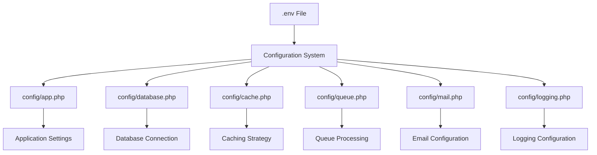
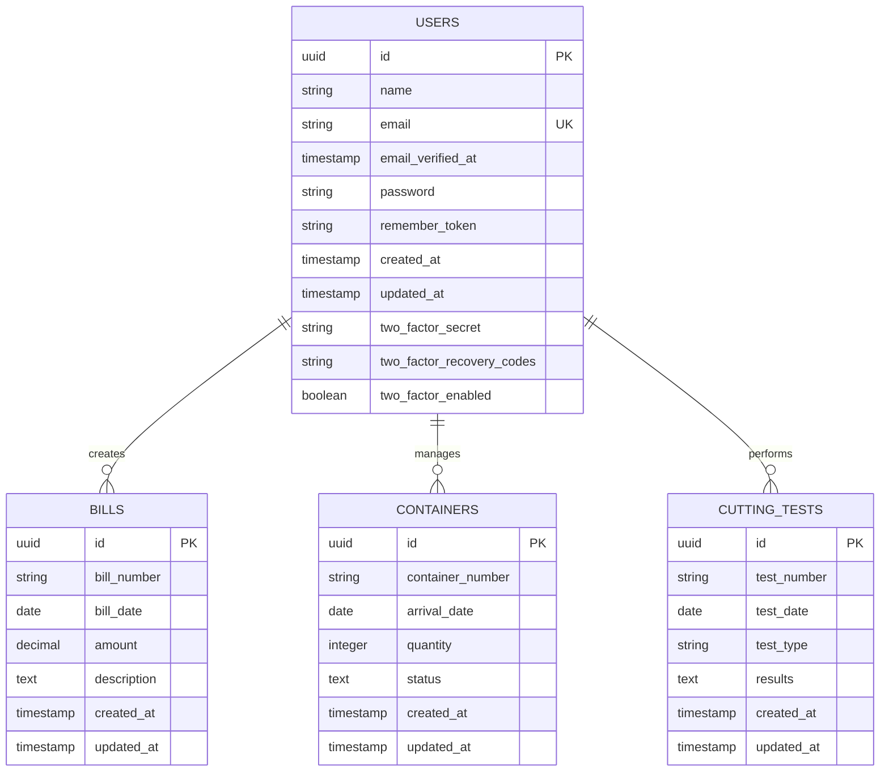
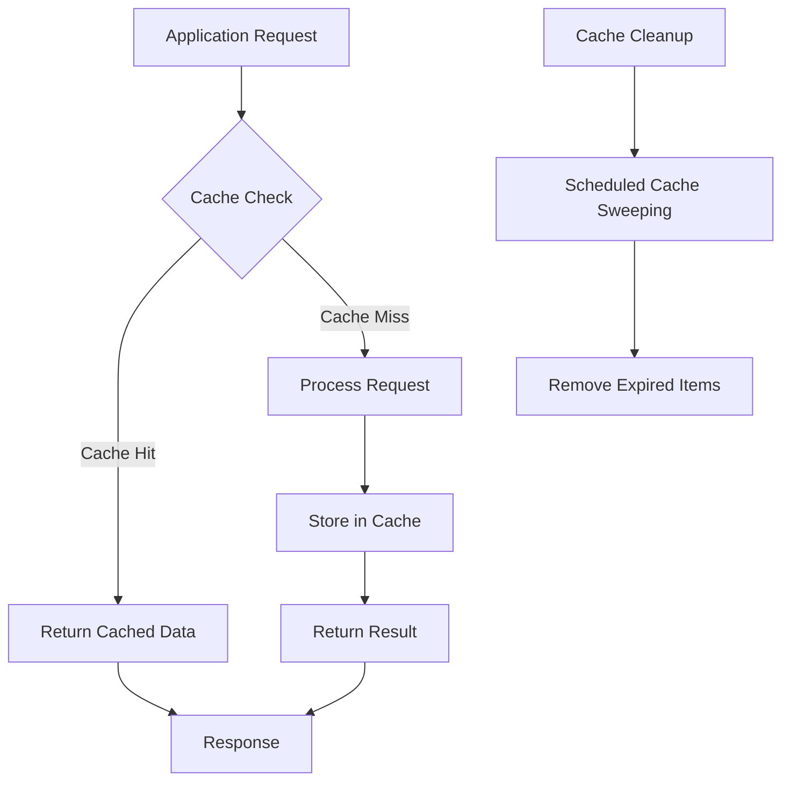
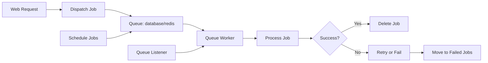
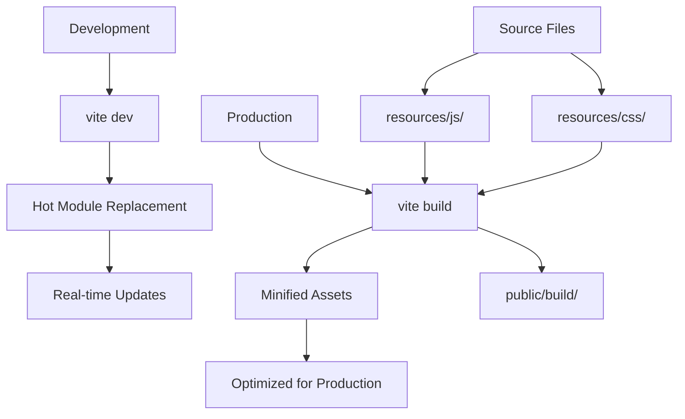
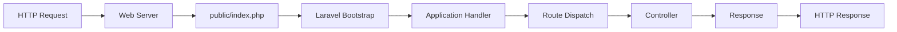
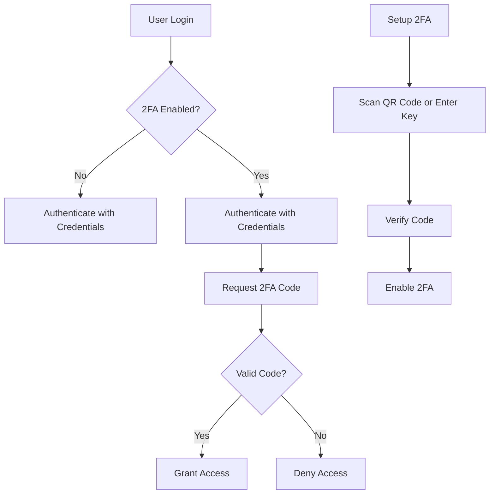
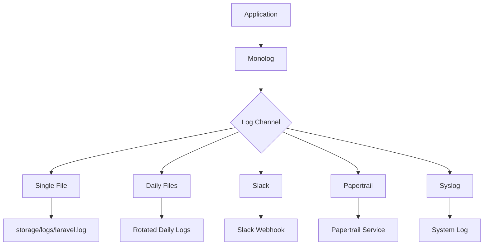

# Deployment Configuration

<cite>
**Referenced Files in This Document**   
- [composer.json](file://composer.json)
- [package.json](file://package.json)
- [vite.config.ts](file://vite.config.ts)
- [config/app.php](file://config/app.php)
- [config/database.php](file://config/database.php)
- [config/cache.php](file://config/cache.php)
- [config/queue.php](file://config/queue.php)
- [config/mail.php](file://config/mail.php)
- [config/logging.php](file://config/logging.php)
- [config/session.php](file://config/session.php)
- [public/index.php](file://public/index.php)
- [database/migrations/0001_01_01_000001_create_cache_table.php](file://database/migrations/0001_01_01_000001_create_cache_table.php)
- [database/migrations/0001_01_01_000002_create_jobs_table.php](file://database/migrations/0001_01_01_000002_create_jobs_table.php)
</cite>

## Table of Contents
1. [Introduction](#introduction)
2. [Server Requirements](#server-requirements)
3. [Environment Configuration](#environment-configuration)
4. [Database Configuration](#database-configuration)
5. [Caching Strategy](#caching-strategy)
6. [Queue Processing](#queue-processing)
7. [Asset Compilation with Vite](#asset-compilation-with-vite)
8. [Web Server Configuration](#web-server-configuration)
9. [Security Hardening](#security-hardening)
10. [Deployment Workflows](#deployment-workflows)
11. [Troubleshooting Guide](#troubleshooting-guide)
12. [Performance Optimization](#performance-optimization)

## Introduction
This document provides comprehensive deployment configuration guidance for the CFCCashew application, a Laravel-based web application with Vue.js frontend. The document covers all aspects of production deployment including server specifications, environment management, database setup, caching, queue processing, asset compilation, web server configuration, and security considerations. The application follows modern full-stack development practices with Inertia.js for frontend integration and Vite for asset building.

## Server Requirements

The CFCCashew application has specific server requirements to ensure optimal performance and security in production environments.

### PHP Requirements
- **PHP Version**: 8.2 or higher (as specified in `composer.json`)
- **Extensions**: Required extensions include PDO, OpenSSL, Mbstring, Tokenizer, XML, Ctype, JSON, and BCMath
- **Configuration**: Ensure `post_max_size`, `upload_max_filesize`, and `memory_limit` are appropriately configured for application needs

### Node.js Requirements
- **Node.js Version**: Compatible with the installed Vite and related packages (package.json indicates modern versions)
- **npm/yarn**: Required for frontend asset compilation
- **Vite**: Used as the build tool for frontend assets

### Server Specifications
For production deployment, the following server specifications are recommended:
- **CPU**: Minimum 2 cores, recommended 4+ cores
- **RAM**: Minimum 4GB, recommended 8GB+
- **Storage**: SSD storage with sufficient space for application code, logs, and database
- **Network**: Stable internet connection for package installation and external service communication

**Section sources**
- [composer.json](file://composer.json#L10-L15)
- [package.json](file://package.json#L1-L52)

## Environment Configuration

The CFCCashew application uses environment-specific configuration through `.env` files for secure and flexible deployment.

### Environment File Management
The application follows Laravel's standard environment configuration pattern:
- Create a `.env` file from the `.env.example` template
- The `post-root-package-install` script automatically creates `.env` if it doesn't exist
- Environment variables control all configurable aspects of the application

### Key Environment Variables
The following environment variables are essential for production deployment:

```env
APP_NAME=CFCCashew
APP_ENV=production
APP_KEY=your-application-key
APP_DEBUG=false
APP_URL=https://your-domain.com
```

### Configuration Files
The application uses Laravel's configuration system with multiple configuration files in the `config/` directory:



**Diagram sources**
- [config/app.php](file://config/app.php#L41-L80)
- [config/database.php](file://config/database.php)
- [config/cache.php](file://config/cache.php)
- [config/queue.php](file://config/queue.php)
- [config/mail.php](file://config/mail.php)
- [config/logging.php](file://config/logging.php)

**Section sources**
- [config/app.php](file://config/app.php#L41-L80)
- [composer.json](file://composer.json#L70-L74)

## Database Configuration

The CFCCashew application supports multiple database systems with flexible configuration options.

### Supported Database Drivers
The application configuration supports the following database drivers:
- MySQL/MariaDB
- PostgreSQL
- SQL Server
- SQLite

### Database Configuration
Database settings are managed through environment variables in the `.env` file:

```env
DB_CONNECTION=mysql
DB_HOST=127.0.0.1
DB_PORT=3306
DB_DATABASE=cfccashew
DB_USERNAME=root
DB_PASSWORD=
```

The database configuration is defined in `config/database.php` with support for multiple connections and advanced options like SSL configuration.

### Database Migrations
The application includes database migrations for all required tables:
- Users table
- Cache table
- Jobs table (for queue processing)
- Bills table
- Containers table
- Cutting tests table
- Telescope entries table



**Diagram sources**
- [config/database.php](file://config/database.php#L44-L97)
- [database/migrations/0001_01_01_000000_create_users_table.php](file://database/migrations/0001_01_01_000000_create_users_table.php)
- [database/migrations/0001_01_01_000001_create_cache_table.php](file://database/migrations/0001_01_01_000001_create_cache_table.php)
- [database/migrations/0001_01_01_000002_create_jobs_table.php](file://database/migrations/0001_01_01_000002_create_jobs_table.php)
- [database/migrations/2025_09_19_112834_create_bills_table.php](file://database/migrations/2025_09_19_112834_create_bills_table.php)
- [database/migrations/2025_09_19_112846_create_containers_table.php](file://database/migrations/2025_09_19_112846_create_containers_table.php)
- [database/migrations/2025_09_19_112901_create_cutting_tests_table.php](file://database/migrations/2025_09_19_112901_create_cutting_tests_table.php)

**Section sources**
- [config/database.php](file://config/database.php#L44-L130)
- [database/migrations/](file://database/migrations/)

## Caching Strategy

The CFCCashew application implements a comprehensive caching strategy to improve performance and reduce database load.

### Cache Configuration
The application supports multiple cache drivers with the default set to database caching:

```env
CACHE_STORE=database
CACHE_PREFIX=cfccashew_cache_
```

The cache configuration in `config/cache.php` supports the following drivers:
- Database
- File
- Memcached
- Redis
- DynamoDB

### Cache Stores
The application is configured to use database caching by default, with the cache table created by a dedicated migration. The cache table structure includes:
- Key (primary key)
- Value (medium text)
- Expiration (integer timestamp)

For production environments, Redis is recommended for better performance:

```env
CACHE_STORE=redis
REDIS_HOST=127.0.0.1
REDIS_PORT=6379
REDIS_CACHE_DB=1
```



**Diagram sources**
- [config/cache.php](file://config/cache.php#L0-L107)
- [database/migrations/0001_01_01_000001_create_cache_table.php](file://database/migrations/0001_01_01_000001_create_cache_table.php)

**Section sources**
- [config/cache.php](file://config/cache.php#L0-L107)
- [database/migrations/0001_01_01_000001_create_cache_table.php](file://database/migrations/0001_01_01_000001_create_cache_table.php)

## Queue Processing

The CFCCashew application uses Laravel's queue system for background job processing to improve application responsiveness.

### Queue Configuration
The queue system is configured in `config/queue.php` with the following key settings:
- Default connection: database
- Failed job storage: database with UUIDs
- Job batching: supported with dedicated table

```env
QUEUE_CONNECTION=database
```

### Queue Drivers
The application supports multiple queue drivers:
- Database (default)
- Redis
- Beanstalkd
- Amazon SQS

For production environments, Redis is recommended for better performance and reliability:

```env
QUEUE_CONNECTION=redis
REDIS_QUEUE_CONNECTION=default
REDIS_QUEUE=default
REDIS_QUEUE_RETRY_AFTER=90
```

### Queue Tables
The database queue driver requires a jobs table, which is created by a migration:
- Jobs table for storing queued jobs
- Job batches table for batch processing
- Failed jobs table for storing failed jobs



**Diagram sources**
- [config/queue.php](file://config/queue.php#L0-L111)
- [database/migrations/0001_01_01_000002_create_jobs_table.php](file://database/migrations/0001_01_01_000002_create_jobs_table.php)

**Section sources**
- [config/queue.php](file://config/queue.php#L0-L111)
- [database/migrations/0001_01_01_000002_create_jobs_table.php](file://database/migrations/0001_01_01_000002_create_jobs_table.php)

## Asset Compilation with Vite

The CFCCashew application uses Vite for frontend asset compilation and management.

### Vite Configuration
The Vite configuration is defined in `vite.config.ts` with the following key components:
- Laravel Vite plugin for integration
- Tailwind CSS integration
- Wayfinder plugin for route management
- Vue 3 plugin for Vue.js support

```typescript
import { defineConfig } from 'vite';
import laravel from 'laravel-vite-plugin';
import tailwindcss from '@tailwindcss/vite';
import wayfinder from '@laravel/vite-plugin-wayfinder';
import vue from '@vitejs/plugin-vue';

export default defineConfig({
    plugins: [
        laravel({
            input: ['resources/js/app.ts'],
            ssr: 'resources/js/ssr.ts',
            refresh: true,
        }),
        tailwindcss(),
        wayfinder({
            formVariants: true,
        }),
        vue({
            template: {
                transformAssetUrls: {
                    base: null,
                    includeAbsolute: false,
                },
            },
        }),
    ],
});
```

### Build Scripts
The package.json defines the following build scripts:
- `build`: Compile assets for production
- `dev`: Run Vite in development mode
- `build:ssr`: Build assets for server-side rendering



**Diagram sources**
- [vite.config.ts](file://vite.config.ts#L0-L27)
- [package.json](file://package.json#L6-L11)

**Section sources**
- [vite.config.ts](file://vite.config.ts#L0-L27)
- [package.json](file://package.json#L6-L11)

## Web Server Configuration

Proper web server configuration is essential for serving the CFCCashew application in production.

### Apache Configuration
For Apache servers, use the following configuration:

```apache
<VirtualHost *:80>
    ServerName your-domain.com
    DocumentRoot /path/to/cfccashew/public

    <Directory /path/to/cfccashew/public>
        AllowOverride All
        Require all granted
    </Directory>

    ErrorLog ${APACHE_LOG_DIR}/cfccashew_error.log
    CustomLog ${APACHE_LOG_DIR}/cfccashew_access.log combined
</VirtualHost>
```

### Nginx Configuration
For Nginx servers, use the following configuration:

```nginx
server {
    listen 80;
    server_name your-domain.com;
    root /path/to/cfccashew/public;

    index index.php;

    location / {
        try_files $uri $uri/ /index.php?$query_string;
    }

    location ~ \.php$ {
        fastcgi_pass unix:/var/run/php/php8.2-fpm.sock;
        fastcgi_index index.php;
        fastcgi_param SCRIPT_FILENAME $realpath_root$fastcgi_script_name;
        include fastcgi_params;
    }

    location ~ /\.(?!well-known).* {
        deny all;
    }
}
```

### Entry Point
The application entry point is `public/index.php`, which bootstraps the Laravel application and handles all incoming requests.



**Diagram sources**
- [public/index.php](file://public/index.php#L0-L20)

**Section sources**
- [public/index.php](file://public/index.php#L0-L20)

## Security Hardening

The CFCCashew application includes several security features that should be properly configured for production.

### Environment Security
- Set `APP_ENV=production`
- Set `APP_DEBUG=false` to prevent sensitive information disclosure
- Generate a strong `APP_KEY` using `php artisan key:generate`

### HTTPS and SSL
- Configure SSL termination at the web server or load balancer level
- Set `APP_URL` to use HTTPS
- Ensure all assets are loaded over HTTPS

### Security Headers
Implement security headers in the web server configuration:
- Content Security Policy (CSP)
- X-Content-Type-Options: nosniff
- X-Frame-Options: DENY
- X-XSS-Protection: 1; mode=block

### Authentication Security
The application includes two-factor authentication (2FA) functionality:
- Users can enable 2FA in settings
- QR code and manual setup key provided
- Recovery codes generated for account recovery



**Diagram sources**
- [config/app.php](file://config/app.php#L41-L80)
- [resources/js/pages/settings/TwoFactor.vue](file://resources/js/pages/settings/TwoFactor.vue)
- [resources/js/components/TwoFactorSetupModal.vue](file://resources/js/components/TwoFactorSetupModal.vue)

**Section sources**
- [config/app.php](file://config/app.php#L41-L80)
- [resources/js/pages/settings/TwoFactor.vue](file://resources/js/pages/settings/TwoFactor.vue#L63-L120)
- [resources/js/components/TwoFactorSetupModal.vue](file://resources/js/components/TwoFactorSetupModal.vue#L0-L300)

## Deployment Workflows

The CFCCashew application supports standardized deployment workflows for consistent production deployments.

### Deployment Steps
1. Clone the repository or transfer files to the server
2. Install PHP dependencies: `composer install --optimize-autoloader --no-dev`
3. Install Node.js dependencies: `npm install --production`
4. Create `.env` file from `.env.example` and configure environment variables
5. Generate application key: `php artisan key:generate`
6. Run database migrations: `php artisan migrate --force`
7. Compile assets: `npm run build`
8. Clear configuration cache: `php artisan config:clear`
9. Restart queue workers if using queue processing

### Environment-Specific Configuration
Use different `.env` files for different environments:
- `.env.production` for production
- `.env.staging` for staging
- `.env.testing` for testing

### Deployment Scripts
The application includes helpful scripts in `composer.json`:
- `dev`: Run development server with Vite and queue listener
- `test`: Run tests with configuration clearing
- `fresh`: Reset database with fresh migrations and seeding

## Troubleshooting Guide

This section provides guidance for common deployment issues and their solutions.

### Common Issues and Solutions
- **White screen after deployment**: Clear configuration cache with `php artisan config:clear`
- **Asset loading issues**: Recompile assets with `npm run build`
- **Database connection errors**: Verify database credentials in `.env` file
- **Queue worker not processing jobs**: Ensure queue worker is running with `php artisan queue:work`
- **Migration errors**: Check database user permissions and connection settings

### Log Management
The application supports multiple logging channels:
- Single file logging (default)
- Daily log files
- Slack notifications for critical errors
- Papertrail integration
- System log (syslog)

Configure logging in `config/logging.php` and set appropriate log levels for production.



**Diagram sources**
- [config/logging.php](file://config/logging.php#L33-L112)

**Section sources**
- [config/logging.php](file://config/logging.php#L33-L112)

## Performance Optimization

Optimize the CFCCashew application for better performance in production environments.

### Caching Optimization
- Use Redis instead of database caching for better performance
- Implement route caching with `php artisan route:cache`
- Cache configuration with `php artisan config:cache`
- Cache views with `php artisan view:cache`

### Database Optimization
- Use database indexing for frequently queried columns
- Optimize queries in repositories and services
- Consider database read/write splitting for high-traffic applications
- Use query caching where appropriate

### Frontend Optimization
- Ensure assets are compiled for production
- Implement lazy loading for components and routes
- Optimize images and other media assets
- Use browser caching for static assets

### Server-Level Optimization
- Use OPcache for PHP
- Configure web server for optimal performance
- Use a reverse proxy cache like Varnish if appropriate
- Consider using Laravel Octane for improved performance with Swoole or RoadRunner