# Component Architecture

<cite>
**Referenced Files in This Document**   
- [Button.vue](file://resources/js/components/ui/button/Button.vue)
- [Card.vue](file://resources/js/components/ui/card/Card.vue)
- [Input.vue](file://resources/js/components/ui/input/Input.vue)
- [Table.vue](file://resources/js/components/ui/table/Table.vue)
- [AppShell.vue](file://resources/js/components/AppShell.vue)
- [AppSidebar.vue](file://resources/js/components/AppSidebar.vue)
- [AppHeader.vue](file://resources/js/components/AppHeader.vue)
- [BillForm.vue](file://resources/js/components/bills/BillForm.vue)
- [ContainerForm.vue](file://resources/js/components/containers/ContainerForm.vue)
- [AppearanceTabs.vue](file://resources/js/components/AppearanceTabs.vue)
- [useAppearance.ts](file://resources/js/composables/useAppearance.ts)
- [index.ts](file://resources/js/components/ui/button/index.ts)
</cite>

## Table of Contents
1. [Introduction](#introduction)
2. [Project Structure](#project-structure)
3. [Core Components](#core-components)
4. [Architecture Overview](#architecture-overview)
5. [Detailed Component Analysis](#detailed-component-analysis)
6. [Dependency Analysis](#dependency-analysis)
7. [Performance Considerations](#performance-considerations)
8. [Troubleshooting Guide](#troubleshooting-guide)
9. [Conclusion](#conclusion)

## Introduction
The CFCCashew application implements a modern UI component architecture using Vue 3 with TypeScript and Tailwind CSS. This documentation details the design system, component structure, and integration patterns used throughout the application. The architecture follows atomic design principles with reusable UI primitives, higher-order layout components, and feature-specific forms integrated with Inertia.js for seamless page transitions.

## Project Structure

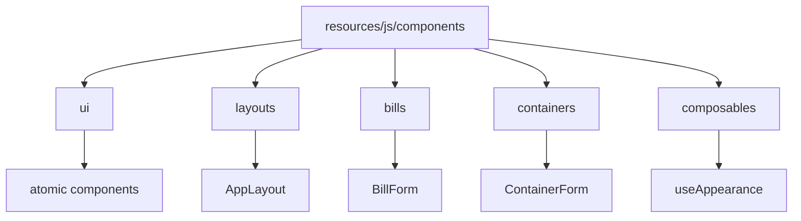

**Diagram sources**
- [resources/js/components](file://resources/js/components)
- [resources/js/components/ui](file://resources/js/components/ui)

**Section sources**
- [resources/js/components](file://resources/js/components)

## Core Components

The CFCCashew application's UI architecture is built around reusable Vue 3 components that follow atomic design principles. The core components are organized in the `ui` directory and include atomic elements like buttons, cards, inputs, and tables. These components are designed with TypeScript for type safety and use Tailwind CSS for styling, enabling consistent theming and responsive behavior across the application.

**Section sources**
- [Button.vue](file://resources/js/components/ui/button/Button.vue)
- [Card.vue](file://resources/js/components/ui/card/Card.vue)
- [Input.vue](file://resources/js/components/ui/input/Input.vue)
- [Table.vue](file://resources/js/components/ui/table/Table.vue)

## Architecture Overview

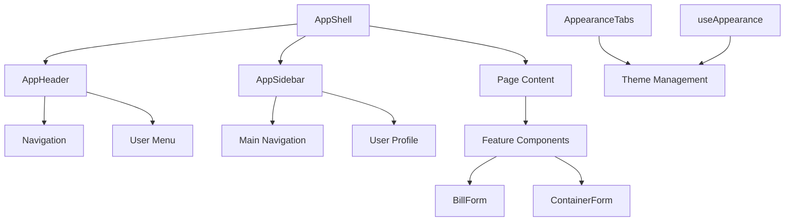

**Diagram sources**
- [AppShell.vue](file://resources/js/components/AppShell.vue)
- [AppHeader.vue](file://resources/js/components/AppHeader.vue)
- [AppSidebar.vue](file://resources/js/components/AppSidebar.vue)
- [AppearanceTabs.vue](file://resources/js/components/AppearanceTabs.vue)
- [useAppearance.ts](file://resources/js/composables/useAppearance.ts)

## Detailed Component Analysis

### Atomic UI Components

The atomic UI components in CFCCashew follow a consistent pattern of composition and export. Each component in the `ui` directory is implemented as a standalone Vue 3 component with TypeScript support and is exported through an `index.ts` file that also provides utility functions and type definitions.

#### Button Component Analysis
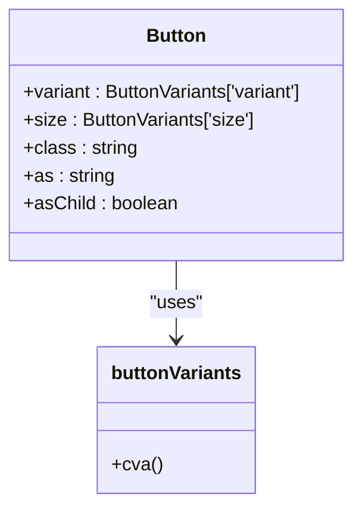

**Diagram sources**
- [Button.vue](file://resources/js/components/ui/button/Button.vue)
- [index.ts](file://resources/js/components/ui/button/index.ts)

**Section sources**
- [Button.vue](file://resources/js/components/ui/button/Button.vue)
- [index.ts](file://resources/js/components/ui/button/index.ts)

#### Card Component Analysis
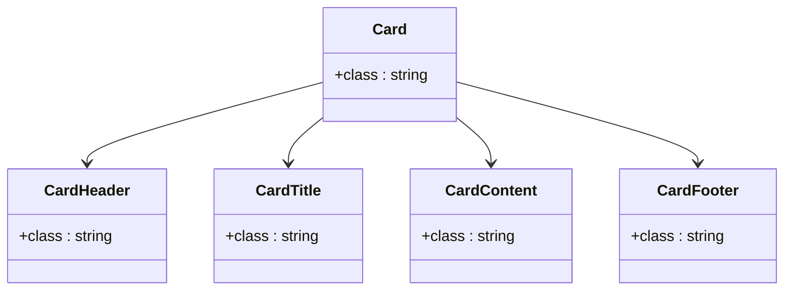

**Diagram sources**
- [Card.vue](file://resources/js/components/ui/card/Card.vue)

**Section sources**
- [Card.vue](file://resources/js/components/ui/card/Card.vue)

#### Input Component Analysis
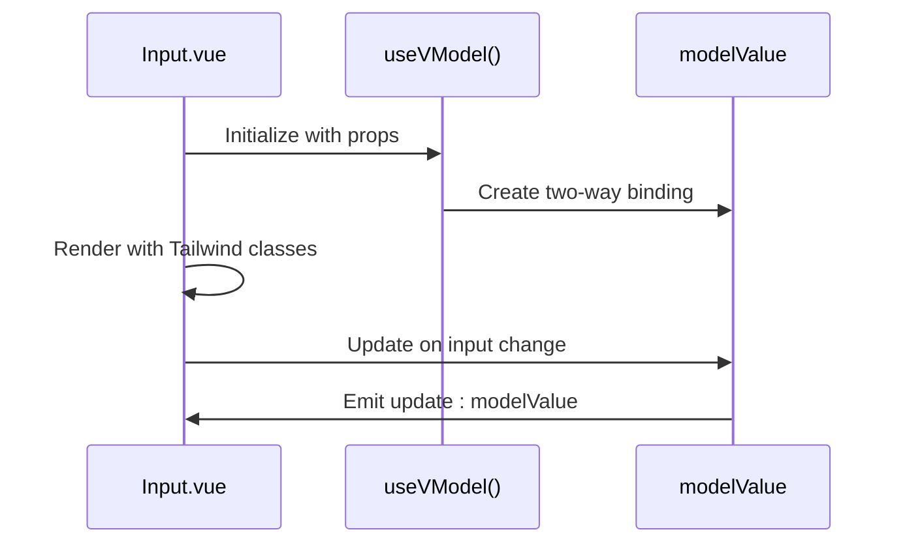

**Diagram sources**
- [Input.vue](file://resources/js/components/ui/input/Input.vue)

**Section sources**
- [Input.vue](file://resources/js/components/ui/input/Input.vue)

#### Table Component Analysis
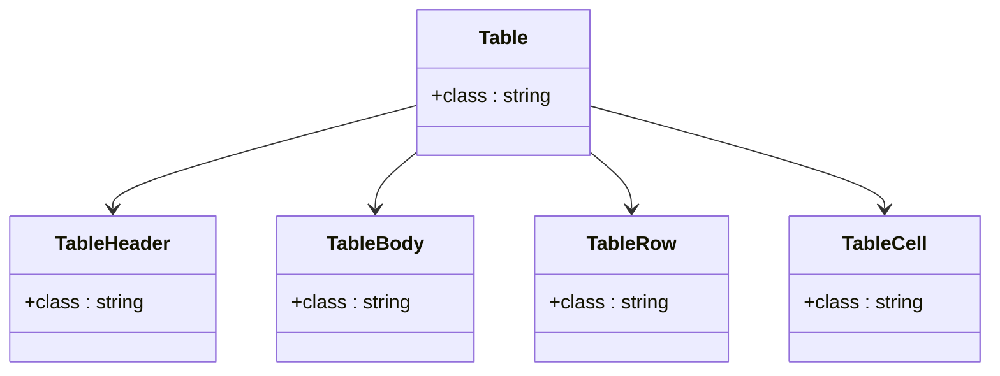

**Diagram sources**
- [Table.vue](file://resources/js/components/ui/table/Table.vue)

**Section sources**
- [Table.vue](file://resources/js/components/ui/table/Table.vue)

### Layout Components

The layout components in CFCCashew form the application shell and provide consistent navigation and structure across all pages.

#### AppShell Component Analysis
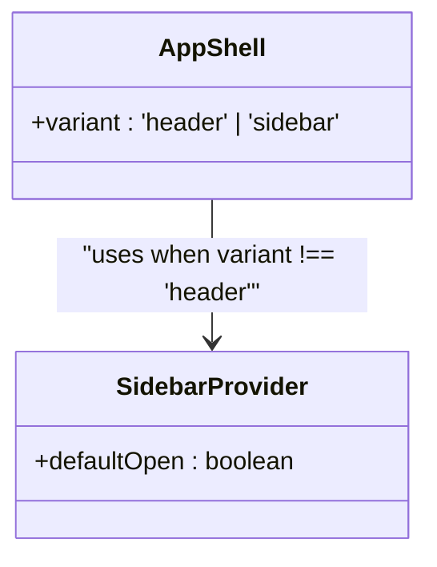

**Diagram sources**
- [AppShell.vue](file://resources/js/components/AppShell.vue)

**Section sources**
- [AppShell.vue](file://resources/js/components/AppShell.vue)

#### AppSidebar Component Analysis
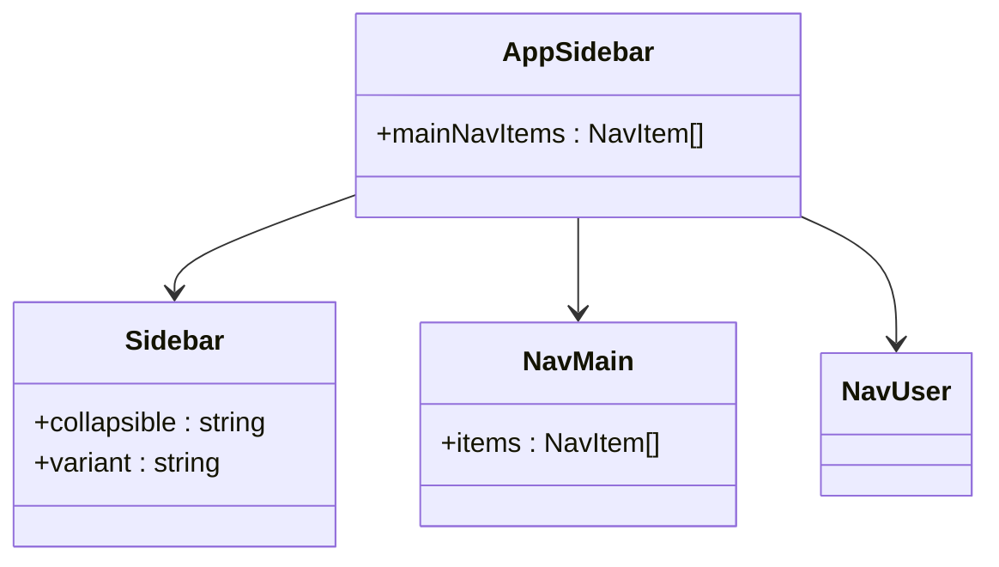

**Diagram sources**
- [AppSidebar.vue](file://resources/js/components/AppSidebar.vue)

**Section sources**
- [AppSidebar.vue](file://resources/js/components/AppSidebar.vue)

#### AppHeader Component Analysis
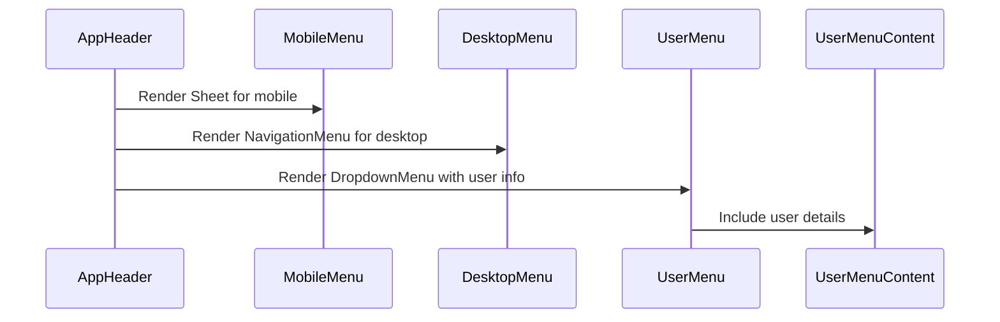

**Diagram sources**
- [AppHeader.vue](file://resources/js/components/AppHeader.vue)

**Section sources**
- [AppHeader.vue](file://resources/js/components/AppHeader.vue)

### Feature-Specific Form Components

The feature-specific form components in CFCCashew demonstrate advanced composition patterns and integration with the Inertia.js framework.

#### BillForm Component Analysis
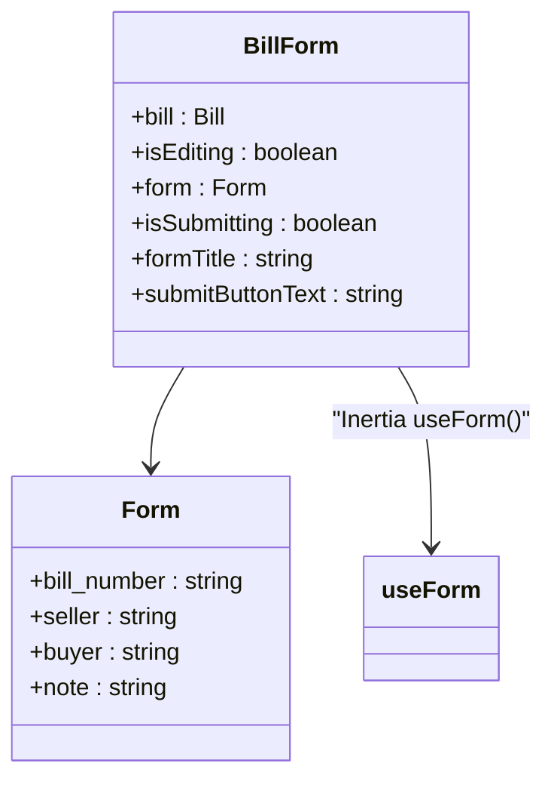

**Diagram sources**
- [BillForm.vue](file://resources/js/components/bills/BillForm.vue)

**Section sources**
- [BillForm.vue](file://resources/js/components/bills/BillForm.vue)

#### ContainerForm Component Analysis
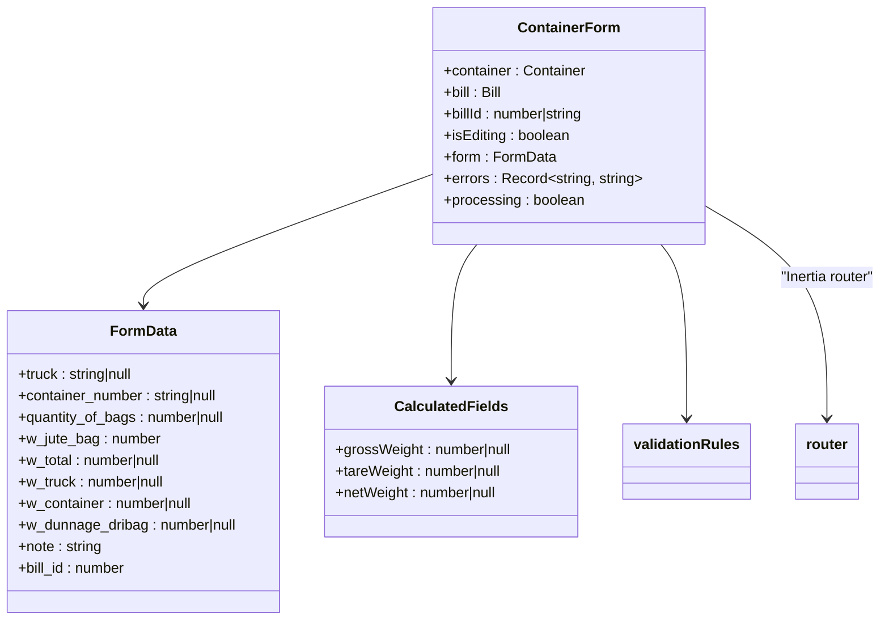

**Diagram sources**
- [ContainerForm.vue](file://resources/js/components/containers/ContainerForm.vue)

**Section sources**
- [ContainerForm.vue](file://resources/js/components/containers/ContainerForm.vue)

### Theming and Appearance Management

The theming system in CFCCashew provides users with light, dark, and system theme options through a composable-based architecture.

#### AppearanceTabs Component Analysis
```mermaid
classDiagram
class AppearanceTabs {
+tabs : Array{value, Icon, label}
+appearance : Appearance
}
class useAppearance {
+appearance : Ref<Appearance>
+updateAppearance(value : Appearance)
}
AppearanceTabs --> useAppearance : "uses composition"
```

**Diagram sources**
- [AppearanceTabs.vue](file://resources/js/components/AppearanceTabs.vue)
- [useAppearance.ts](file://resources/js/composables/useAppearance.ts)

**Section sources**
- [AppearanceTabs.vue](file://resources/js/components/AppearanceTabs.vue)
- [useAppearance.ts](file://resources/js/composables/useAppearance.ts)

## Dependency Analysis

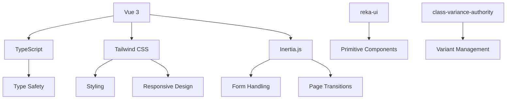

**Diagram sources**
- [package.json](file://package.json)
- [tsconfig.json](file://tsconfig.json)
- [vite.config.ts](file://vite.config.ts)

**Section sources**
- [package.json](file://package.json)

## Performance Considerations
The CFCCashew UI architecture is optimized for performance through several key patterns:
- Computed properties are used extensively for derived data (e.g., form validation states, calculated weights)
- Reactive state management minimizes unnecessary re-renders
- Two-way binding with useVModel reduces boilerplate code
- Component lazy loading is supported through Vue's asynchronous component loading
- Efficient event handling prevents memory leaks
- Form state is managed locally within components to reduce global state complexity

## Troubleshooting Guide

Common issues and solutions for the CFCCashew component architecture:

**Section sources**
- [AppShell.vue](file://resources/js/components/AppShell.vue)
- [AppHeader.vue](file://resources/js/components/AppHeader.vue)
- [AppSidebar.vue](file://resources/js/components/AppSidebar.vue)

## Conclusion
The CFCCashew application demonstrates a robust UI component architecture built on Vue 3, TypeScript, and Tailwind CSS. The design system follows atomic principles with well-structured UI primitives in the `ui` directory, exported through index.ts files for easy consumption. Layout components like AppShell, AppSidebar, and AppHeader create a consistent application shell, while feature-specific forms like BillForm and ContainerForm showcase advanced composition patterns with Inertia.js integration. The theming system with AppearanceTabs and useAppearance provides flexible appearance options with both client and server-side persistence. This architecture enables consistent, maintainable, and scalable UI development across the application.