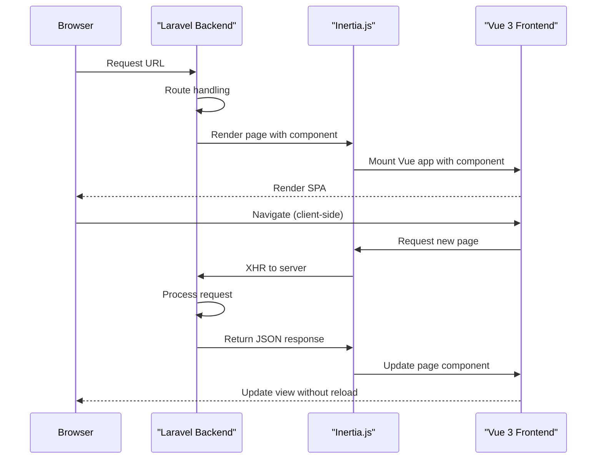
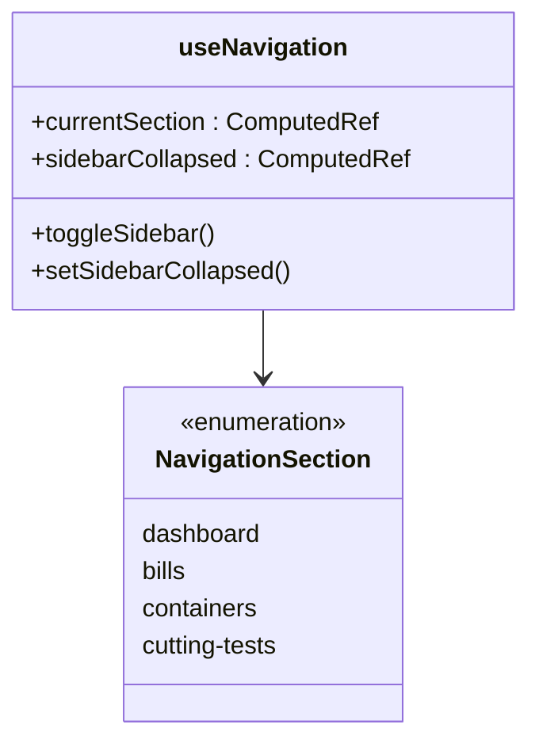

# Routing & Navigation

<cite>
**Referenced Files in This Document**   
- [useNavigation.ts](file://resources/js/composables/useNavigation.ts)
- [useBreadcrumbs.ts](file://resources/js/composables/useBreadcrumbs.ts)
- [NavMain.vue](file://resources/js/components/NavMain.vue)
- [NavUser.vue](file://resources/js/components/NavUser.vue)
- [Breadcrumbs.vue](file://resources/js/components/Breadcrumbs.vue)
- [web.php](file://routes/web.php)
- [HandleInertiaRequests.php](file://app/Http/Middleware/HandleInertiaRequests.php)
- [app.blade.php](file://resources/views/app.blade.php)
- [lib/utils.ts](file://resources/js/lib/utils.ts)
- [AppHeader.vue](file://resources/js/components/AppHeader.vue)
</cite>

## Table of Contents
1. [Introduction](#introduction)
2. [Inertia.js Integration](#inertiajs-integration)
3. [Page Structure and Routing](#page-structure-and-routing)
4. [Navigation Components](#navigation-components)
5. [Breadcrumb System](#breadcrumb-system)
6. [Navigation State Management](#navigation-state-management)
7. [Accessibility and Responsiveness](#accessibility-and-responsiveness)
8. [Adding New Routes](#adding-new-routes)
9. [Conclusion](#conclusion)

## Introduction
The CFCCashew frontend implements a modern, single-page application (SPA) navigation system using Vue 3 in conjunction with Inertia.js. This architecture enables seamless page transitions without full browser reloads, providing a fluid user experience while maintaining the simplicity of server-side routing. The navigation system includes a sidebar menu (NavMain), user profile menu (NavUser), breadcrumb trails, and responsive layout components that adapt to different screen sizes.

**Section sources**
- [useNavigation.ts](file://resources/js/composables/useNavigation.ts#L1-L48)
- [useBreadcrumbs.ts](file://resources/js/composables/useBreadcrumbs.ts#L1-L81)

## Inertia.js Integration
Inertia.js serves as the bridge between the Laravel backend and Vue 3 frontend, allowing server-side routes to render Vue components without traditional page reloads. The integration is configured through Laravel's middleware and Inertia's SSR (Server-Side Rendering) capabilities.

The `HandleInertiaRequests` middleware in Laravel shares essential data with the frontend, including authentication state and sidebar persistence. Inertia is initialized in the main application layout (`app.blade.php`), which mounts the Vue application and passes the current page component and props.



**Diagram sources**
- [HandleInertiaRequests.php](file://app/Http/Middleware/HandleInertiaRequests.php#L1-L54)
- [app.blade.php](file://resources/views/app.blade.php#L41-L48)
- [config/inertia.php](file://config/inertia.php#L1-L51)

## Page Structure and Routing
The frontend pages are organized under `resources/js/pages`, with directories corresponding to major application sections: Bills, Containers, CuttingTests, authentication, and settings. Each Vue component in this directory maps to a backend route defined in `routes/web.php`.

The route configuration uses Laravel's resource routing pattern, with Inertia rendering the appropriate Vue component for each route. The root route redirects authenticated users to the dashboard, while unauthenticated users are directed to the login page.

```mermaid
flowchart TD
A[/] --> B{Authenticated?}
B --> |Yes| C[dashboard → Dashboard.vue]
B --> |No| D[login → Login.vue]
C --> E[bills → Bills/Index.vue]
E --> F[bills/create → Bills/Create.vue]
E --> G[bills/{id} → Bills/Show.vue]
E --> H[bills/{id}/edit → Bills/Edit.vue]
C --> I[containers → Containers/Index.vue]
I --> J[containers/create → Containers/Create.vue]
I --> K[containers/{container} → Containers/Show.vue]
I --> L[containers/{id}/edit → Containers/Edit.vue]
C --> M[cutting-tests → CuttingTests/Index.vue]
C --> N[settings → Settings pages]
C --> O[auth → Authentication pages]
```

**Diagram sources**
- [web.php](file://routes/web.php#L1-L35)
- [resources/js/pages](file://resources/js/pages)

## Navigation Components
The navigation system consists of two primary components: `NavMain` for main application navigation and `NavUser` for user profile and authentication actions.

### NavMain Component
The `NavMain` component renders the primary navigation menu in the sidebar, displaying links to major application sections. It uses Inertia's `Link` component for navigation and determines active routes using the `urlIsActive` utility function.

```mermaid
classDiagram
class NavMain {
+items : NavItem[]
-page : Page
+render()
}
class NavItem {
+title : string
+href : string
+icon : Component
}
NavMain --> NavItem : "displays"
NavMain --> "Link" : "uses"
NavMain --> "Sidebar components" : "uses"
```

**Diagram sources**
- [NavMain.vue](file://resources/js/components/NavMain.vue#L1-L38)
- [lib/utils.ts](file://resources/js/lib/utils.ts#L1-L18)

### NavUser Component
The `NavUser` component displays the currently authenticated user's information and provides access to user settings and logout functionality through a dropdown menu. It retrieves user data from Inertia's shared props.

```mermaid
classDiagram
class NavUser {
-user : User
-isMobile : boolean
-sidebarState : string
+render()
}
class User {
+id : number
+name : string
+email : string
}
NavUser --> User : "displays"
NavUser --> "DropdownMenu" : "uses"
NavUser --> "UserInfo" : "uses"
NavUser --> "UserMenuContent" : "uses"
```

**Diagram sources**
- [NavUser.vue](file://resources/js/components/NavUser.vue#L1-L53)
- [HandleInertiaRequests.php](file://app/Http/Middleware/HandleInertiaRequests.php#L45-L50)

## Breadcrumb System
The breadcrumb system provides contextual navigation and location awareness through the `useBreadcrumbs` composable and `Breadcrumbs` component. Breadcrumbs are dynamically generated based on the current route and display a hierarchical path from the dashboard to the current page.

### Dynamic Breadcrumb Generation
The `useBreadcrumbs` composable analyzes the current URL to determine the appropriate breadcrumb trail. It supports dynamic segments for entities like bills and containers, extracting identifiers from the URL to create meaningful labels.

```mermaid
flowchart TD
A[Current URL] --> B{URL starts with?}
B --> |/bills| C[Add Bills breadcrumb]
C --> D{URL pattern?}
D --> |/bills/create| E[Add "Create Bill"]
D --> |/bills/{id}| F[Add "Bill #{id}"]
D --> |/bills/{slug}| G[Add "Bill {number}"]
B --> |/containers| H[Add Containers breadcrumb]
H --> I{URL pattern?}
I --> |/containers/{number}| J[Add "Container {number}"]
I --> |/containers/{id}| K[Add "Container #{id}"]
B --> |/cutting-tests| L[Add Cutting Tests breadcrumb]
M[Always add Dashboard] --> B
```

**Diagram sources**
- [useBreadcrumbs.ts](file://resources/js/composables/useBreadcrumbs.ts#L1-L81)
- [Breadcrumbs.vue](file://resources/js/components/Breadcrumbs.vue#L1-L42)

### Breadcrumb Component
The `Breadcrumbs` component renders the breadcrumb trail using UI components from the design system. It distinguishes between clickable links (for parent pages) and the current page (displayed as plain text).

**Section sources**
- [Breadcrumbs.vue](file://resources/js/components/Breadcrumbs.vue#L1-L42)

## Navigation State Management
Navigation state is managed through composable functions that provide reactive state for the current section and sidebar collapse state.

### useNavigation Composable
The `useNavigation` composable determines the current navigation section based on the URL path and manages the sidebar collapse state, which is persisted via cookies.



**Diagram sources**
- [useNavigation.ts](file://resources/js/composables/useNavigation.ts#L1-L48)
- [HandleInertiaRequests.php](file://app/Http/Middleware/HandleInertiaRequests.php#L52-L53)

## Accessibility and Responsiveness
The navigation system incorporates several accessibility and responsiveness features:

- **Keyboard Navigation**: All interactive elements are accessible via keyboard, with proper focus management
- **Screen Reader Support**: Semantic HTML and ARIA attributes enhance accessibility
- **Responsive Design**: Navigation adapts to mobile devices with collapsible sidebar and touch-friendly targets
- **Visual Feedback**: Active route highlighting provides clear visual indication of the current location

The `AppHeader.vue` component implements active route highlighting with a bottom border indicator, while the sidebar navigation uses visual contrast to distinguish active items.

**Section sources**
- [AppHeader.vue](file://resources/js/components/AppHeader.vue#L154-L199)
- [NavMain.vue](file://resources/js/components/NavMain.vue#L25-L35)

## Adding New Routes
To add a new route to the navigation system:

1. **Define the Backend Route**: Add the route in `routes/web.php` using Inertia to render a Vue component
2. **Create the Vue Component**: Add a new `.vue` file in the appropriate subdirectory under `resources/js/pages`
3. **Update Navigation Items**: If the route should appear in the main navigation, add it to the navigation items array in the relevant layout
4. **Update Breadcrumb Logic**: If needed, extend the `useBreadcrumbs` composable to handle the new route pattern
5. **Test Navigation**: Verify the route works with both direct access and client-side navigation

The Inertia and Laravel integration ensures that new routes automatically benefit from the existing navigation infrastructure, including seamless transitions, state management, and accessibility features.

**Section sources**
- [web.php](file://routes/web.php#L1-L35)
- [useBreadcrumbs.ts](file://resources/js/composables/useBreadcrumbs.ts#L1-L81)
- [resources/js/pages](file://resources/js/pages)

## Conclusion
The CFCCashew routing and navigation system effectively combines Laravel's server-side routing with Vue 3's reactive frontend through Inertia.js. This approach delivers a seamless single-page application experience while maintaining the simplicity and security of traditional server-rendered applications. The modular composable functions for navigation and breadcrumbs provide a flexible foundation that can be easily extended for new features, while the responsive design ensures usability across device sizes. The system demonstrates a well-architected approach to modern web application navigation that balances performance, usability, and maintainability.