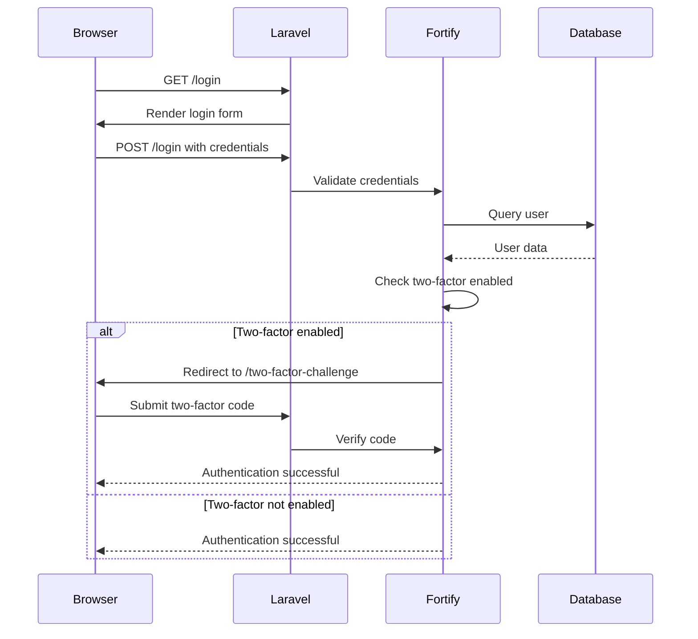

# Getting Started

<cite>
**Referenced Files in This Document**   
- [composer.json](file://composer.json)
- [package.json](file://package.json)
- [.env.example](file://.env.example)
- [FortifyServiceProvider.php](file://app/Providers/FortifyServiceProvider.php)
- [fortify.php](file://config/fortify.php)
- [add_two_factor_columns_to_users_table.php](file://database/migrations/2025_08_14_170933_add_two_factor_columns_to_users_table.php)
- [DevSetupCommand.php](file://app/Console/Commands/DevSetupCommand.php)
- [CreateDefaultUserCommand.php](file://app/Console/Commands/CreateDefaultUserCommand.php)
- [AGENTS.md](file://AGENTS.md)
- [DATABASE_SEEDING.md](file://DATABASE_SEEDING.md)
</cite>

## Table of Contents
1. [Introduction](#introduction)
2. [Prerequisites](#prerequisites)
3. [Environment Setup](#environment-setup)
4. [Dependency Installation](#dependency-installation)
5. [Database Configuration and Migration](#database-configuration-and-migration)
6. [Running Development Servers](#running-development-servers)
7. [Authentication and Two-Factor Setup](#authentication-and-two-factor-setup)
8. [Troubleshooting Common Issues](#troubleshooting-common-issues)
9. [Key Concepts for Beginners](#key-concepts-for-beginners)

## Introduction
This guide provides a comprehensive walkthrough for setting up the CFCCashew development environment. It covers all essential steps from installing prerequisites to running the application with full authentication capabilities. The CFCCashew system is a Laravel-based inspection platform that manages bills, containers, and cutting tests with real-world agricultural data. By following this guide, you'll have a fully functional development environment with sample data and authentication features enabled.

## Prerequisites
Before setting up the CFCCashew development environment, ensure your system meets the following requirements:

- **PHP 8.2 or higher**: Required for Laravel 12 framework compatibility
- **Node.js 18 or higher**: Required for frontend asset compilation via Vite
- **Composer**: PHP dependency manager
- **NPM or Yarn**: Node.js package manager
- **SQLite or MySQL**: Database system (SQLite is default)
- **Git**: Version control system for code management

The application uses Laravel 12 with Inertia.js for frontend rendering, Vue 3 for components, and Tailwind CSS for styling. These dependencies are managed through Composer and NPM as specified in the project configuration files.

**Section sources**
- [composer.json](file://composer.json#L10-L15)
- [package.json](file://package.json#L1-L10)

## Environment Setup
To configure the CFCCashew development environment, follow these steps:

1. Clone the repository to your local machine
2. Copy the example environment file to create your local configuration:
```bash
cp .env.example .env
```
3. The default configuration uses SQLite for simplicity. If you prefer MySQL, update the `.env` file with your database credentials:
```
DB_CONNECTION=mysql
DB_HOST=127.0.0.1
DB_PORT=3306
DB_DATABASE=cfccashew
DB_USERNAME=root
DB_PASSWORD=
```
4. Generate the application key:
```bash
php artisan key:generate
```

The environment file contains essential configuration options including application name, debug mode, locale settings, and service integrations. The default setup is optimized for development with debugging enabled and uses SQLite as the database driver for zero-configuration setup.

**Section sources**
- [.env.example](file://.env.example#L1-L65)

## Dependency Installation
Install all required dependencies for both backend and frontend components:

1. Install PHP dependencies using Composer:
```bash
composer install
```
This command installs Laravel framework, Fortify for authentication, Telescope for debugging, and other essential packages defined in `composer.json`.

2. Install JavaScript dependencies using NPM:
```bash
npm install
```
This installs Vue 3, Inertia.js, Tailwind CSS, Vite for asset building, and various UI components.

The dependency installation process also triggers post-install scripts that automatically discover packages and publish Laravel assets. These scripts ensure that all vendor components are properly configured and available to the application.

**Section sources**
- [composer.json](file://composer.json#L16-L55)
- [package.json](file://package.json#L11-L22)

## Database Configuration and Migration
Configure and populate the database with the necessary schema and sample data:

1. Run database migrations to create all required tables:
```bash
php artisan migrate
```
This command executes all migration files in `database/migrations/`, creating tables for users, bills, containers, cutting tests, and system functionality.

2. Seed the database with development data:
```bash
php artisan db:seed
```
This populates the database with sample records for testing and development purposes.

3. For a complete fresh setup (drop all tables, recreate, and seed):
```bash
php artisan migrate:fresh --seed
```

The database schema includes specific migrations for two-factor authentication, adding columns to the users table for storing two-factor secrets and recovery codes. The seeding process includes both development data and real inspection data from CFCCashew operations.

**Section sources**
- [add_two_factor_columns_to_users_table.php](file://database/migrations/2025_08_14_170933_add_two_factor_columns_to_users_table.php#L1-L34)
- [DATABASE_SEEDING.md](file://DATABASE_SEEDING.md#L1-L72)

## Running Development Servers
Start the development servers to access the CFCCashew application:

1. Run the Laravel development server and Vite asset compiler simultaneously:
```bash
npm run dev
```
This command starts three processes concurrently:
- PHP development server on port 8000
- Vite development server for hot module replacement
- Queue listener for background jobs

2. Alternatively, use the Composer script to start all services:
```bash
composer run dev
```

3. Access the application by navigating to `http://localhost:8000` in your web browser.

For production builds, compile the frontend assets with:
```bash
npm run build
```

The development environment is configured to provide real-time updates to both PHP and Vue components, allowing for rapid development and testing of new features.

**Section sources**
- [package.json](file://package.json#L5-L10)
- [composer.json](file://composer.json#L85-L90)

## Authentication and Two-Factor Setup
The CFCCashew application uses Laravel Fortify for authentication with two-factor authentication enabled:

1. **Fortify Configuration**: Authentication is managed through FortifyServiceProvider and the fortify.php configuration file. Two-factor authentication is enabled by default with password confirmation required.

2. **Two-Factor Database Schema**: The migration `add_two_factor_columns_to_users_table.php` adds three columns to the users table:
   - `two_factor_secret`: Stores the encrypted TOTP secret
   - `two_factor_recovery_codes`: Stores encrypted recovery codes
   - `two_factor_confirmed_at`: Timestamp when two-factor was confirmed

3. **Setup Development User**: Create a default user for development:
```bash
php artisan user:create-default
```
This creates a user with email `percynguyen82@gmail.com` and password `Qt_3DKP:XnKbs6Z`.

4. **Complete Setup with Sample Data**: Run the development setup command:
```bash
php artisan dev:setup --fresh
```
This performs a fresh migration, seeds development data, and creates the default user.

5. **Authentication Flow**: The application uses Inertia.js to render authentication views. When a user with two-factor authentication enabled logs in, they are redirected to the two-factor challenge page.



**Diagram sources**
- [FortifyServiceProvider.php](file://app/Providers/FortifyServiceProvider.php#L1-L34)
- [fortify.php](file://config/fortify.php#L1-L159)
- [AuthenticatedSessionController.php](file://app/Http/Controllers/Auth/AuthenticatedSessionController.php#L1-L63)

**Section sources**
- [FortifyServiceProvider.php](file://app/Providers/FortifyServiceProvider.php#L1-L34)
- [fortify.php](file://config/fortify.php#L1-L159)
- [add_two_factor_columns_to_users_table.php](file://database/migrations/2025_08_14_170933_add_two_factor_columns_to_users_table.php#L1-L34)
- [DevSetupCommand.php](file://app/Console/Commands/DevSetupCommand.php#L1-L50)
- [CreateDefaultUserCommand.php](file://app/Console/Commands/CreateDefaultUserCommand.php#L1-L52)

## Troubleshooting Common Issues
Address common setup problems with these solutions:

1. **Composer Install Fails**
   - Ensure PHP 8.2+ is installed and in your PATH
   - Run `composer clear-cache` and retry
   - Check that `allow-plugins` in composer.json is properly configured

2. **NPM Install Errors**
   - Use Node.js 18+ as specified in package.json
   - Clear npm cache with `npm cache clean --force`
   - Delete `node_modules` and `package-lock.json`, then reinstall

3. **Migration Errors**
   - Ensure database connection settings in `.env` are correct
   - For SQLite, verify the `database/database.sqlite` file exists
   - Run `php artisan config:clear` to clear configuration cache

4. **Vite Development Server Not Connecting**
   - Check that port 5173 is available
   - Verify vite.config.ts has correct host settings
   - Restart both PHP and Vite servers

5. **Authentication Not Working**
   - Ensure `php artisan key:generate` was run
   - Verify the users table has records
   - Check that Fortify features are properly enabled in config

6. **Two-Factor Authentication Issues**
   - Clear browser cookies and session data
   - Ensure the users table has the two-factor columns
   - Verify the two-factor challenge view exists at `resources/js/pages/auth/TwoFactorChallenge.vue`

Refer to the AGENTS.md document for additional troubleshooting tips and development commands.

**Section sources**
- [AGENTS.md](file://AGENTS.md#L1-L22)

## Key Concepts for Beginners
Understand these fundamental concepts when working with the CFCCashew application:

### Environment Variables
Environment variables are configuration values stored in the `.env` file that control application behavior without changing code. Key variables include:
- `APP_ENV`: Application environment (local, production)
- `APP_DEBUG`: Enables detailed error messages
- `DB_CONNECTION`: Database driver to use
- `APP_URL`: Base URL for the application

These variables are loaded into the application configuration and can be accessed using Laravel's `config()` helper or `env()` function.

### Service Providers
Service providers are the central place to configure Laravel application services. They handle:
- Registering dependency injection bindings
- Bootstrapping services and middleware
- Publishing configuration files
- Setting up event listeners

The CFCCashew application includes specific providers like FortifyServiceProvider for authentication configuration and RepositoryServiceProvider for business logic components.

### Laravel Artisan Commands
Artisan is Laravel's command-line interface for automating development tasks:
- `php artisan serve`: Starts the development server
- `php artisan migrate`: Runs database migrations
- `php artisan make:*`: Generates code scaffolding
- `php artisan config:clear`: Clears configuration cache

Custom commands like `dev:setup` and `user:create-default` streamline development setup.

### Inertia.js Integration
Inertia.js connects Laravel backend with Vue frontend without building a separate API. It allows:
- Server-side rendering of Vue components
- Seamless page transitions
- Shared data between backend and frontend
- Form submissions with traditional POST requests

This architecture provides a traditional multi-page application experience with modern single-page application functionality.

**Section sources**
- [.env.example](file://.env.example#L1-L65)
- [FortifyServiceProvider.php](file://app/Providers/FortifyServiceProvider.php#L1-L34)
- [AGENTS.md](file://AGENTS.md#L1-L22)