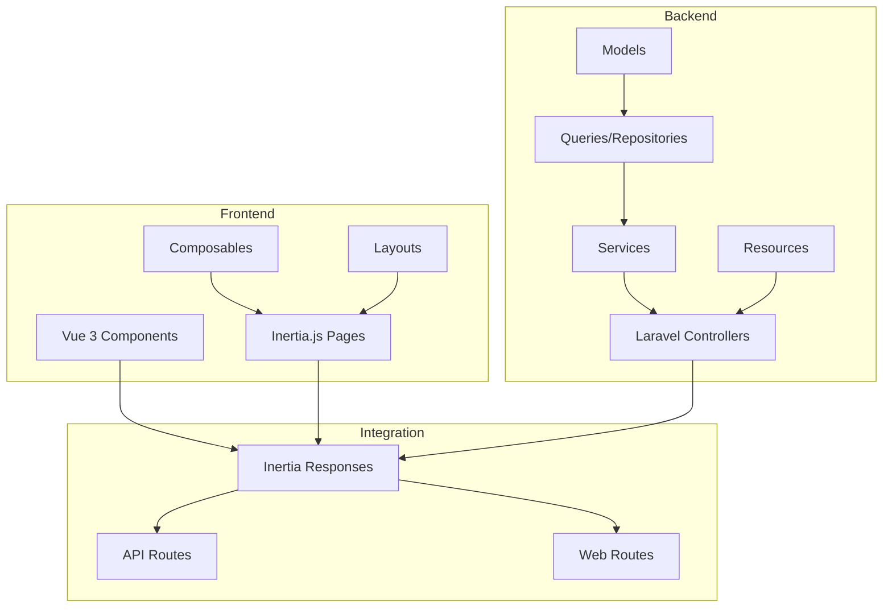
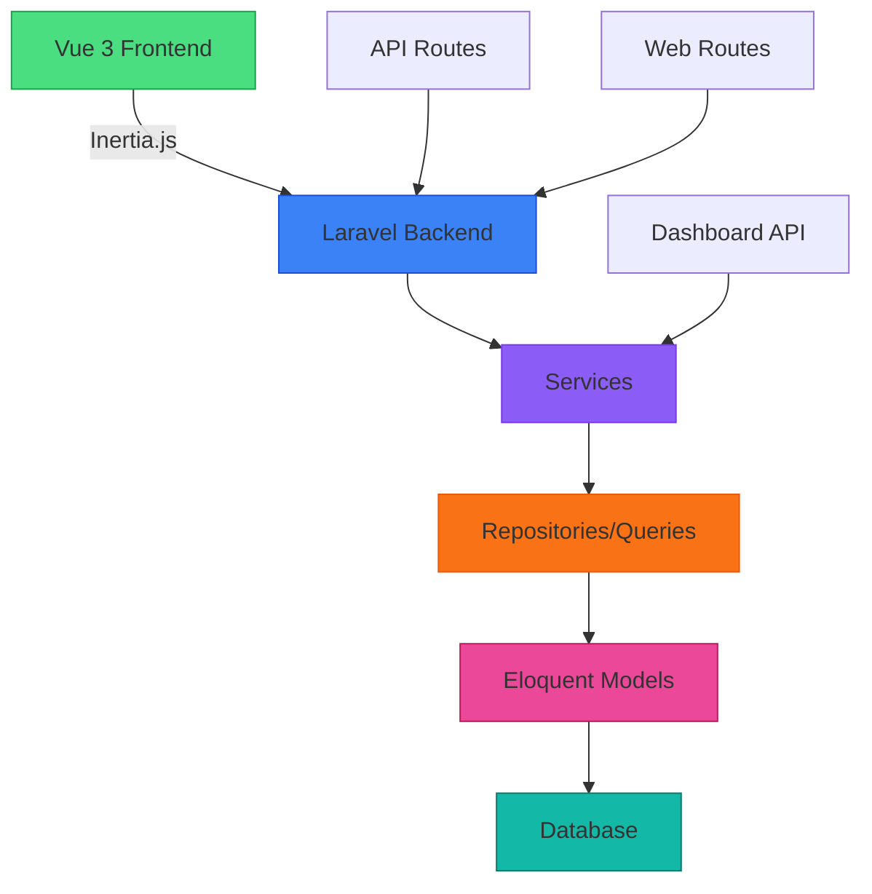
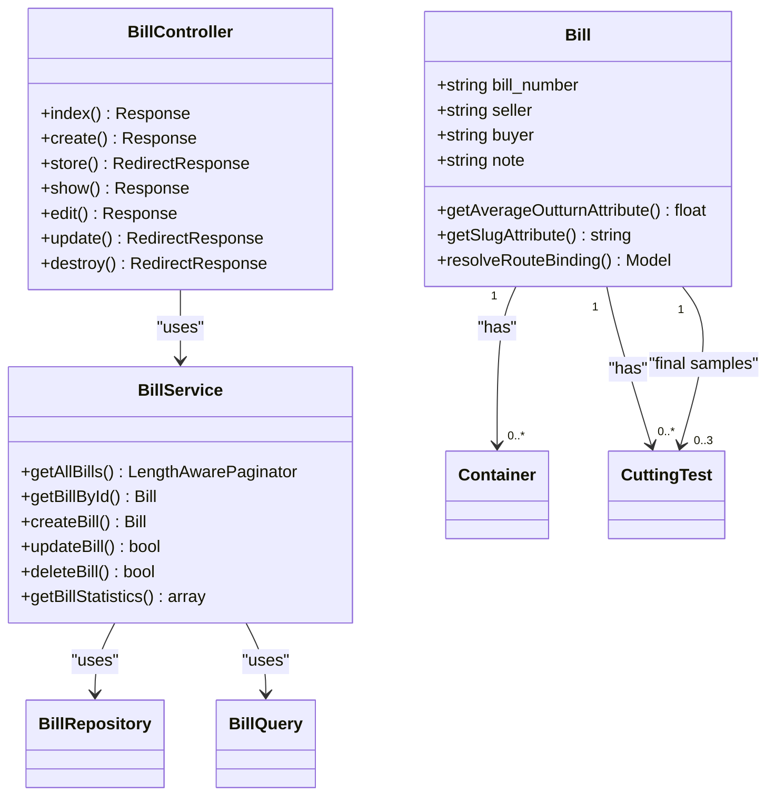
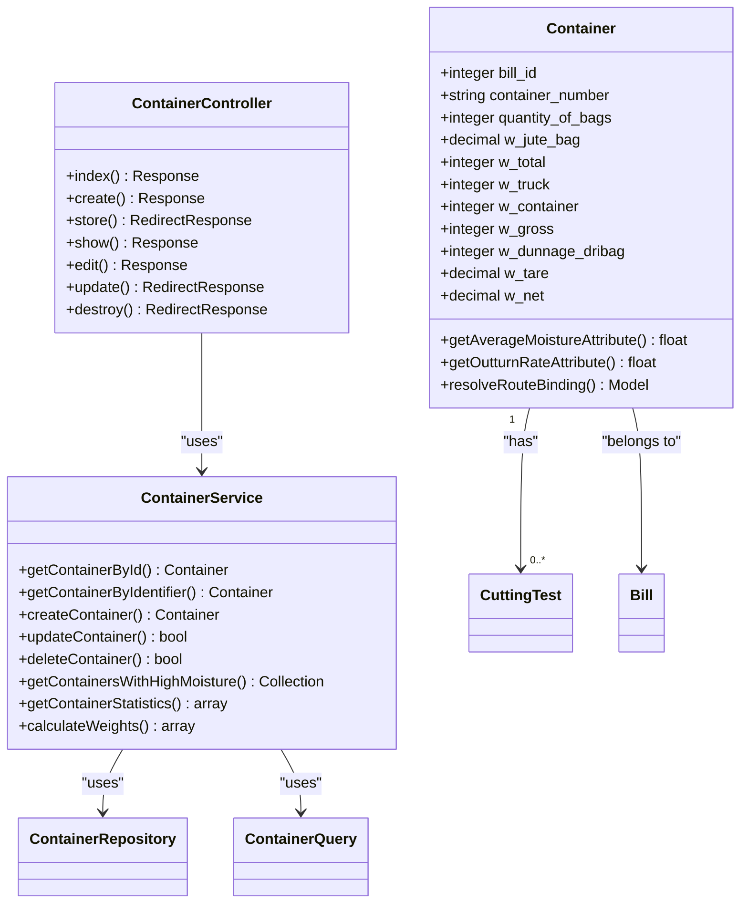
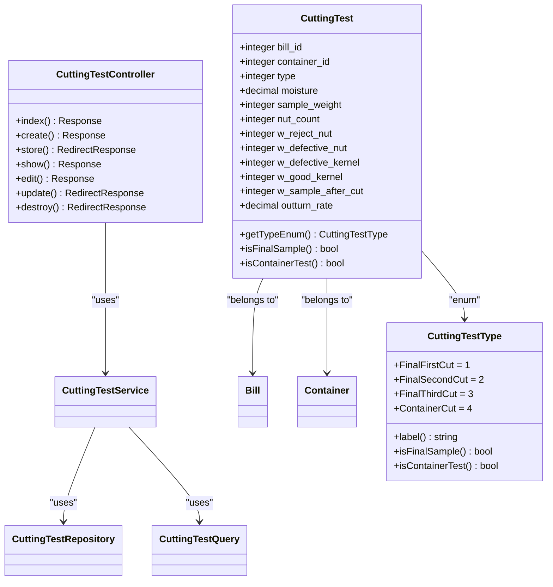
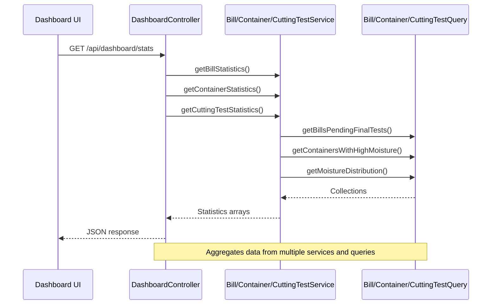
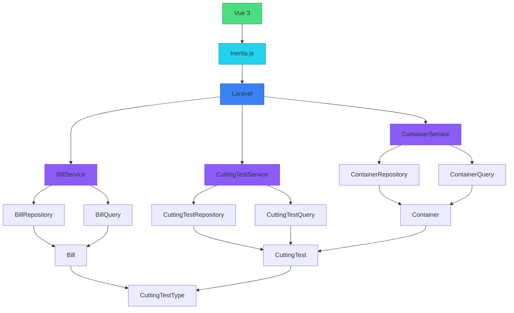

# System Overview

<cite>
**Referenced Files in This Document**   
- [Bill.php](file://app/Models/Bill.php)
- [Container.php](file://app/Models/Container.php)
- [CuttingTest.php](file://app/Models/CuttingTest.php)
- [CuttingTestType.php](file://app/Enums/CuttingTestType.php)
- [BillController.php](file://app/Http/Controllers/BillController.php)
- [ContainerController.php](file://app/Http/Controllers/ContainerController.php)
- [CuttingTestController.php](file://app/Http/Controllers/CuttingTestController.php)
- [DashboardController.php](file://app/Http/Controllers/Api/DashboardController.php)
- [BillService.php](file://app/Services/BillService.php)
- [ContainerService.php](file://app/Services/ContainerService.php)
- [CuttingTestService.php](file://app/Services/CuttingTestService.php)
- [web.php](file://routes/web.php)
- [api.php](file://routes/api.php)
- [app.ts](file://resources/js/app.ts)
- [app.blade.php](file://resources/views/app.blade.php)
- [ARCHITECTURE.md](file://ARCHITECTURE.md)
</cite>

## Table of Contents
1. [Introduction](#introduction)
2. [Project Structure](#project-structure)
3. [Core Components](#core-components)
4. [Architecture Overview](#architecture-overview)
5. [Detailed Component Analysis](#detailed-component-analysis)
6. [Dependency Analysis](#dependency-analysis)
7. [Performance Considerations](#performance-considerations)
8. [Troubleshooting Guide](#troubleshooting-guide)
9. [Conclusion](#conclusion)

## Introduction
The CFCCashew Inspection System is a full-stack web application designed to manage cashew processing operations. It provides comprehensive functionality for tracking bills, managing containers, and analyzing cutting test results. The system enables quality control through moisture and outturn rate metrics, supports user authentication with two-factor verification, and delivers real-time analytics via a dashboard interface. Built using Laravel and Vue 3 with Inertia.js, the application follows modern full-stack patterns to deliver a seamless user experience while maintaining clean separation of concerns between frontend and backend layers.

## Project Structure

**Diagram sources**
- [app.ts](file://resources/js/app.ts)
- [app.blade.php](file://resources/views/app.blade.php)
- [web.php](file://routes/web.php)
- [api.php](file://routes/api.php)

**Section sources**
- [app.ts](file://resources/js/app.ts)
- [app.blade.php](file://resources/views/app.blade.php)
- [web.php](file://routes/web.php)
- [api.php](file://routes/api.php)

## Core Components

The CFCCashew Inspection System consists of three primary business domains: Bills, Containers, and Cutting Tests. Each domain follows a consistent architectural pattern with dedicated models, controllers, services, repositories, queries, and frontend components. The system also includes authentication functionality with two-factor support and a dashboard for analytics and alerts. Key features include bill tracking with final sample calculations, container weight computations, cutting test analysis for quality control, and real-time statistics on moisture levels and processing status.

**Section sources**
- [Bill.php](file://app/Models/Bill.php)
- [Container.php](file://app/Models/Container.php)
- [CuttingTest.php](file://app/Models/CuttingTest.php)
- [CuttingTestType.php](file://app/Enums/CuttingTestType.php)

## Architecture Overview

**Diagram sources**
- [ARCHITECTURE.md](file://ARCHITECTURE.md)
- [app.ts](file://resources/js/app.ts)
- [web.php](file://routes/web.php)
- [api.php](file://routes/api.php)

## Detailed Component Analysis

### Bill Management System
The bill management system handles the creation and tracking of cashew processing bills. Each bill can have multiple containers and cutting tests associated with it. The system calculates average outturn rates from final sample tests and provides filtering capabilities for recent bills, those pending final tests, or missing final samples. Bills are identified by a slug format that combines ID and bill number for clean URLs.

**Diagram sources**
- [Bill.php](file://app/Models/Bill.php)
- [BillController.php](file://app/Http/Controllers/BillController.php)
- [BillService.php](file://app/Services/BillService.php)

**Section sources**
- [Bill.php](file://app/Models/Bill.php)
- [BillController.php](file://app/Http/Controllers/BillController.php)
- [BillService.php](file://app/Services/BillService.php)

### Container Management System
The container management system handles the tracking of individual cashew containers, including weight calculations and moisture analysis. It automatically computes gross weight, tare weight, and net weight based on input parameters. Containers are linked to bills and can have multiple cutting tests. The system identifies containers with high moisture levels (above 11%) and those pending cutting tests for quality control purposes.

**Diagram sources**
- [Container.php](file://app/Models/Container.php)
- [ContainerController.php](file://app/Http/Controllers/ContainerController.php)
- [ContainerService.php](file://app/Services/ContainerService.php)

**Section sources**
- [Container.php](file://app/Models/Container.php)
- [ContainerController.php](file://app/Http/Controllers/ContainerController.php)
- [ContainerService.php](file://app/Services/ContainerService.php)

### Cutting Test Analysis System
The cutting test analysis system manages quality control tests for cashew processing. It supports different test types including final samples (first, second, third cut) and container cuts. The system calculates moisture distribution and identifies tests with high moisture levels. Cutting tests are associated with either bills (for final samples) or specific containers, enabling comprehensive quality tracking throughout the processing workflow.

**Diagram sources**
- [CuttingTest.php](file://app/Models/CuttingTest.php)
- [CuttingTestType.php](file://app/Enums/CuttingTestType.php)
- [CuttingTestController.php](file://app/Http/Controllers/CuttingTestController.php)
- [CuttingTestService.php](file://app/Services/CuttingTestService.php)

**Section sources**
- [CuttingTest.php](file://app/Models/CuttingTest.php)
- [CuttingTestType.php](file://app/Enums/CuttingTestType.php)
- [CuttingTestController.php](file://app/Http/Controllers/CuttingTestController.php)
- [CuttingTestService.php](file://app/Services/CuttingTestService.php)

### Dashboard and Analytics System
The dashboard system provides real-time analytics and alerts for cashew processing operations. It aggregates data from bills, containers, and cutting tests to display key performance indicators and highlight potential issues. The system includes widgets for recent bills, pending tests, missing samples, and high moisture alerts. Data is delivered through API endpoints that return structured JSON responses for frontend consumption.

**Diagram sources**
- [DashboardController.php](file://app/Http/Controllers/Api/DashboardController.php)
- [BillService.php](file://app/Services/BillService.php)
- [ContainerService.php](file://app/Services/ContainerService.php)
- [CuttingTestService.php](file://app/Services/CuttingTestService.php)

**Section sources**
- [DashboardController.php](file://app/Http/Controllers/Api/DashboardController.php)
- [BillService.php](file://app/Services/BillService.php)
- [ContainerService.php](file://app/Services/ContainerService.php)
- [CuttingTestService.php](file://app/Services/CuttingTestService.php)

## Dependency Analysis

**Diagram sources**
- [package-lock.json](file://package-lock.json)
- [ARCHITECTURE.md](file://ARCHITECTURE.md)
- [app.ts](file://resources/js/app.ts)

**Section sources**
- [package-lock.json](file://package-lock.json)
- [ARCHITECTURE.md](file://ARCHITECTURE.md)

## Performance Considerations
The CFCCashew Inspection System implements several performance optimizations to ensure responsive operation with large datasets. The architecture separates read and write operations through dedicated Query and Repository classes, allowing optimized queries for reporting and analytics. Pagination is implemented across all list views to prevent memory issues with large result sets. Eager loading is used strategically to avoid N+1 query problems when retrieving related data. The dashboard API endpoints are designed to aggregate data efficiently, minimizing database queries while providing comprehensive statistics. Frontend components use Inertia.js for seamless page transitions without full reloads, enhancing perceived performance.

## Troubleshooting Guide
Common issues in the CFCCashew Inspection System typically relate to data consistency, routing, or authentication. For data issues, verify that weight calculations are correct and that required fields are populated. Routing problems may occur with container numbers that don't match the expected format (four letters followed by seven digits); ensure proper validation and error handling. Authentication issues, particularly with two-factor verification, should be checked in the user model and Fortify configuration. When debugging performance issues, examine query efficiency and consider adding indexes to frequently searched columns. For frontend issues, verify that Inertia.js is properly configured and that Vue components receive the expected data props.

**Section sources**
- [Container.php](file://app/Models/Container.php#L120-L140)
- [ContainerController.php](file://app/Http/Controllers/ContainerController.php#L70-L85)
- [app.ts](file://resources/js/app.ts)

## Conclusion
The CFCCashew Inspection System provides a comprehensive solution for managing cashew processing operations with robust features for bill tracking, container management, and quality control testing. The application follows a clean architectural pattern with clear separation of concerns between presentation, business logic, and data access layers. The integration of Laravel and Vue 3 through Inertia.js enables a responsive single-page application experience while maintaining server-side rendering benefits. Key strengths include the systematic approach to weight calculations, moisture monitoring, and outturn rate analysis, which support quality assurance in cashew processing. The dashboard analytics provide valuable insights into operational efficiency and potential issues, helping managers make informed decisions. The system's modular design allows for future enhancements and adaptation to evolving business requirements.