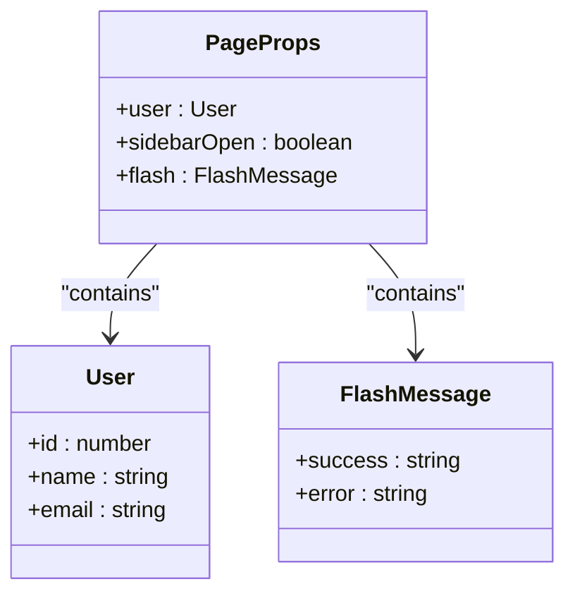
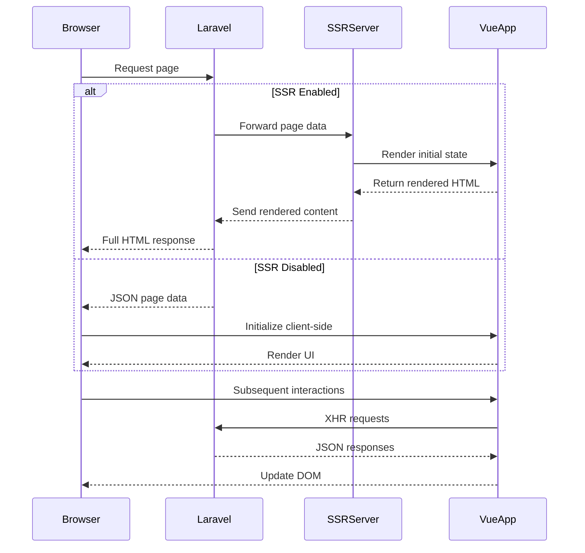
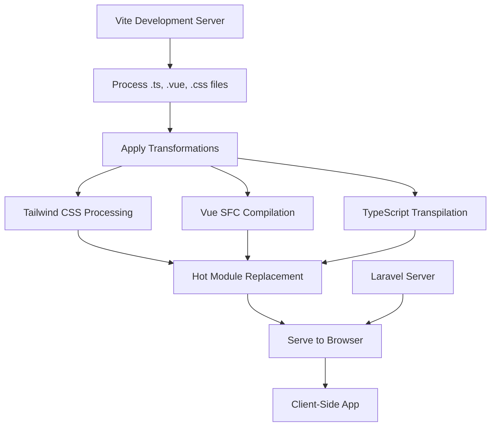
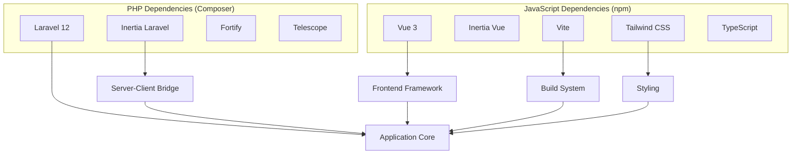

# Technology Stack

<cite>
**Referenced Files in This Document**   
- [composer.json](file://composer.json)
- [package.json](file://package.json)
- [vite.config.ts](file://vite.config.ts)
- [config/inertia.php](file://config/inertia.php)
- [resources/js/app.ts](file://resources/js/app.ts)
- [resources/js/ssr.ts](file://resources/js/ssr.ts)
- [app/Http/Middleware/HandleInertiaRequests.php](file://app/Http/Middleware/HandleInertiaRequests.php)
- [resources/views/app.blade.php](file://resources/views/app.blade.php)
- [tsconfig.json](file://tsconfig.json)
- [resources/js/types/globals.d.ts](file://resources/js/types/globals.d.ts)
</cite>

## Table of Contents
1. [Introduction](#introduction)
2. [Backend Technology: Laravel 12](#backend-technology-laravel-12)
3. [Frontend Technology: Vue 3 with TypeScript](#frontend-technology-vue-3-with-typescript)
4. [Server-Side Rendering with Inertia.js](#server-side-rendering-with-inertiajs)
5. [Build Tool: Vite](#build-tool-vite)
6. [Integration Patterns](#integration-patterns)
7. [Dependency Management](#dependency-management)
8. [Development Setup and Configuration](#development-setup-and-configuration)
9. [Troubleshooting Common Issues](#troubleshooting-common-issues)
10. [Conclusion](#conclusion)

## Introduction
The CFCCashew application leverages a modern full-stack architecture combining Laravel 12 for backend services, Vue 3 with TypeScript for frontend development, Inertia.js for seamless server-client integration, and Vite as the build tool. This technology stack enables rapid development of a responsive, maintainable single-page application while preserving Laravel's robust backend capabilities. The integration of server-side rendering enhances initial load performance and SEO capabilities.

## Backend Technology: Laravel 12
Laravel 12 serves as the foundation of the CFCCashew backend, providing routing, authentication, database management, and API services. The framework's elegant syntax and comprehensive feature set streamline development of complex business logic for cashew processing operations.

The application utilizes Laravel Fortify for authentication, Laravel Telescope for debugging, and follows Laravel's service repository pattern for business logic organization. Key components include controllers in `app/Http/Controllers`, models in `app/Models`, and service classes in `app/Services` that encapsulate domain-specific operations.

**Section sources**
- [composer.json](file://composer.json#L15-L20)

## Frontend Technology: Vue 3 with TypeScript
The frontend implementation uses Vue 3 with TypeScript to create a type-safe, component-based user interface. Vue 3's Composition API enables better code organization and reusability through composables located in `resources/js/composables`. The application leverages Vue's reactivity system for dynamic UI updates without full page reloads.

TypeScript integration is configured through `tsconfig.json`, enabling static type checking and enhanced developer experience. The type system defines interfaces in `resources/js/types` and extends global types in `resources/js/types/globals.d.ts` to provide type safety for Inertia page props and Vue component properties.

**Diagram sources**
- [resources/js/types/globals.d.ts](file://resources/js/types/globals.d.ts#L1-L25)
- [app/Http/Middleware/HandleInertiaRequests.php](file://app/Http/Middleware/HandleInertiaRequests.php#L45-L55)

**Section sources**
- [tsconfig.json](file://tsconfig.json#L12-L28)
- [resources/js/types/globals.d.ts](file://resources/js/types/globals.d.ts#L1-L25)

## Server-Side Rendering with Inertia.js
Inertia.js bridges Laravel and Vue by enabling server-side rendering of Vue components while maintaining a SPA-like experience. The configuration in `config/inertia.php` enables SSR with a dedicated server at `http://127.0.0.1:13714`. This setup improves initial page load performance and enhances SEO by serving pre-rendered HTML.

The `HandleInertiaRequests` middleware shares global data such as authentication state, sidebar status, and flash messages with all pages. The root template `resources/views/app.blade.php` includes the `@inertia` directive and proper SSR handling through `@inertiaHead` and conditional SSR response rendering.

**Diagram sources**
- [config/inertia.php](file://config/inertia.php#L5-L25)
- [resources/js/ssr.ts](file://resources/js/ssr.ts#L1-L24)
- [resources/views/app.blade.php](file://resources/views/app.blade.php#L40-L47)

**Section sources**
- [config/inertia.php](file://config/inertia.php#L5-L25)
- [resources/js/ssr.ts](file://resources/js/ssr.ts#L1-L24)
- [app/Http/Middleware/HandleInertiaRequests.php](file://app/Http/Middleware/HandleInertiaRequests.php#L1-L55)

## Build Tool: Vite
Vite serves as the modern build tool for the CFCCashew frontend, providing fast development server startup and hot module replacement. The configuration in `vite.config.ts` integrates Laravel-specific plugins including `laravel-vite-plugin` for asset management and `@laravel/vite-plugin-wayfinder` for form variant support.

Vite processes TypeScript, Vue components, and CSS through plugins for Tailwind CSS and Vue. The build process compiles assets from `resources/js/app.ts` as the entry point and generates optimized production bundles. Development scripts in `package.json` enable concurrent execution of Laravel server, queue listener, and Vite development server.

**Diagram sources**
- [vite.config.ts](file://vite.config.ts#L1-L27)
- [package.json](file://package.json#L5-L10)
- [resources/js/app.ts](file://resources/js/app.ts#L1-L29)

**Section sources**
- [vite.config.ts](file://vite.config.ts#L1-L27)
- [package.json](file://package.json#L5-L10)

## Integration Patterns
The CFCCashew application follows established patterns for integrating Laravel with Vue through Inertia.js. Page components are located in `resources/js/pages` and automatically resolved by name. The `app.ts` entry point initializes the Inertia application, sets the page title, and mounts the Vue app to the DOM element with ID "app".

Shared data flows from Laravel middleware to Vue components through Inertia's shared data mechanism. Asset compilation is coordinated through Vite's `@vite` directive in Blade templates, ensuring proper loading of development or production assets. The TypeScript configuration uses path aliases (`@/*` maps to `resources/js/*`) for cleaner imports.

**Section sources**
- [resources/js/app.ts](file://resources/js/app.ts#L1-L29)
- [resources/views/app.blade.php](file://resources/views/app.blade.php#L45-L47)
- [tsconfig.json](file://tsconfig.json#L30-L45)

## Dependency Management
Dependency management is handled through Composer for PHP packages and npm for JavaScript dependencies. The `composer.json` file specifies Laravel 12 and Inertia Laravel integration, while `package.json` defines Vue 3, Inertia Vue client, and development tools including Vite, ESLint, and Prettier.

Production dependencies include Vue, Inertia, Tailwind CSS, and UI component libraries, while development dependencies support code formatting, linting, and testing. The optional dependencies for various CSS preprocessors provide flexibility for future styling requirements.

**Diagram sources**
- [composer.json](file://composer.json#L15-L20)
- [package.json](file://package.json#L20-L40)

**Section sources**
- [composer.json](file://composer.json#L15-L20)
- [package.json](file://package.json#L20-L40)

## Development Setup and Configuration
Development environment setup is automated through Laravel Artisan commands defined in `DevSetupCommand.php`. Running `php artisan dev:setup --fresh` executes database migration, seeds development data, and creates a default user account with predefined credentials.

The development workflow uses the `dev` script in `composer.json` to concurrently start the Laravel development server, queue listener, and Vite development server. For SSR development, the `dev:ssr` script additionally starts the Inertia SSR service. Environment variables are managed through `.env` files with `VITE_APP_NAME` exposed to the frontend through Vite's environment variable system.

**Section sources**
- [composer.json](file://composer.json#L90-L93)
- [app/Console/Commands/DevSetupCommand.php](file://app/Console/Commands/DevSetupCommand.php#L1-L50)

## Troubleshooting Common Issues
Common setup issues include Vite development server connection problems, which can be resolved by verifying the Vite server is running and checking firewall settings. SSR-related issues may occur if the SSR server is not started; ensure the `dev:ssr` script is used when SSR is enabled in `config/inertia.php`.

TypeScript compilation errors often stem from incorrect import paths; verify that path aliases in `tsconfig.json` are correctly configured. Inertia page resolution errors typically indicate a mismatch between the page name in the Laravel controller and the actual component file name in `resources/js/pages`.

When encountering asset loading issues, clear Vite's cache and rebuild assets using `npm run build`. For persistent problems, verify Node.js version compatibility (Vite 7 requires Node 20.19.0 or higher) and ensure all dependencies are properly installed with `composer install` and `npm install`.

**Section sources**
- [vite.config.ts](file://vite.config.ts#L1-L27)
- [config/inertia.php](file://config/inertia.php#L5-L25)
- [package.json](file://package.json#L40-L50)

## Conclusion
The CFCCashew application's technology stack combines Laravel 12, Vue 3 with TypeScript, Inertia.js, and Vite to create a modern, maintainable full-stack application. This combination provides the robustness of Laravel's backend ecosystem with the responsiveness of a Vue-powered frontend, enhanced by server-side rendering for optimal performance. The tooling and configuration support efficient development workflows and ensure type safety across the codebase.