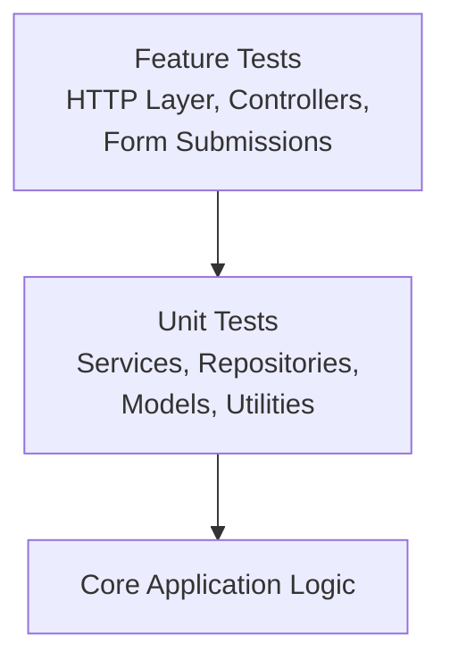
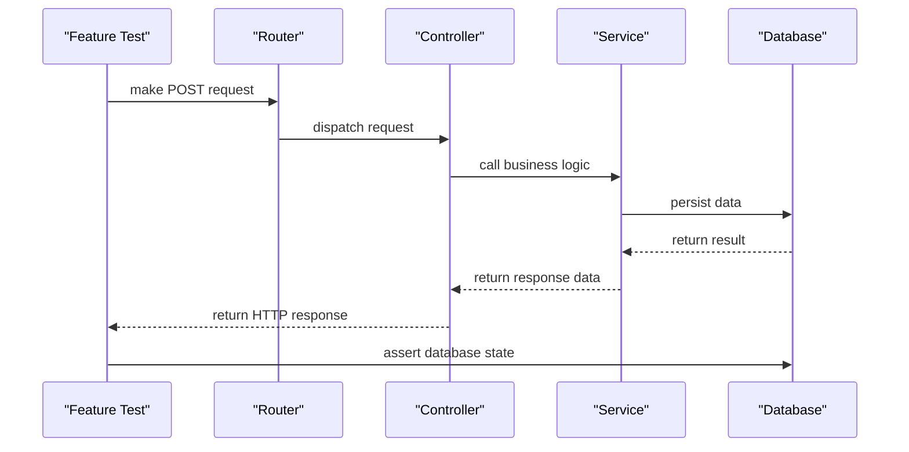
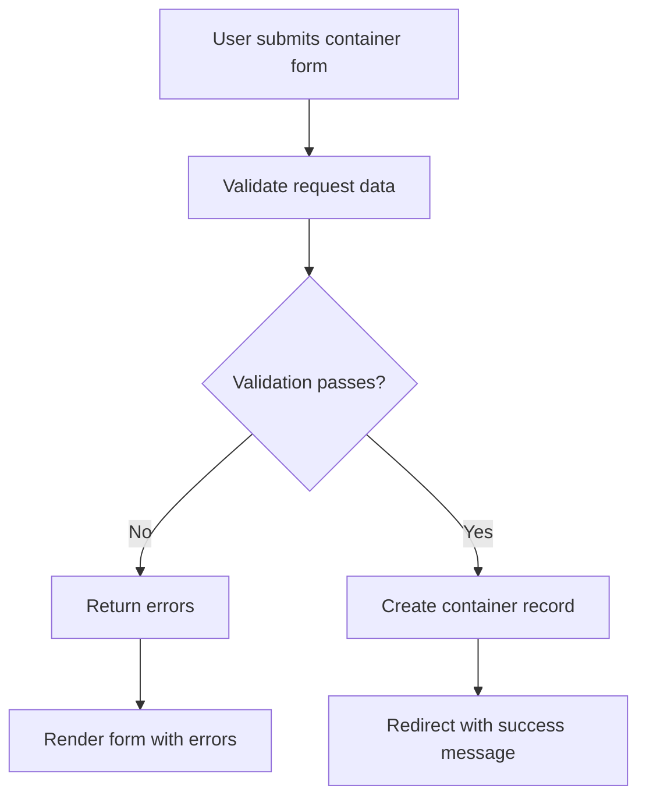

# Testing Strategy

<cite>
**Referenced Files in This Document**   
- [phpunit.xml](file://phpunit.xml)
- [Pest.php](file://tests/Pest.php)
- [TestCase.php](file://tests/TestCase.php)
- [AuthenticationTest.php](file://tests/Feature/Auth/AuthenticationTest.php)
- [BillControllerTest.php](file://tests/Feature/BillControllerTest.php)
- [ContainerFormTest.php](file://tests/Feature/ContainerFormTest.php)
- [ContainerFormIntegrationTest.php](file://tests/Feature/ContainerFormIntegrationTest.php)
- [PasswordUpdateTest.php](file://tests/Feature/Settings/PasswordUpdateTest.php)
- [ProfileUpdateTest.php](file://tests/Feature/Settings/ProfileUpdateTest.php)
- [DatabaseSeeder.php](file://database/seeders/DatabaseSeeder.php)
- [BillSeeder.php](file://database/seeders/BillSeeder.php)
- [DefaultUserSeeder.php](file://database/seeders/DefaultUserSeeder.php)
- [BillFactory.php](file://database/factories/BillFactory.php)
- [ContainerFactory.php](file://database/factories/ContainerFactory.php)
- [UserFactory.php](file://database/factories/UserFactory.php)
- [Bill.php](file://app/Models/Bill.php)
- [Container.php](file://app/Models/Container.php)
- [User.php](file://app/Models/User.php)
- [BillController.php](file://app/Http/Controllers/BillController.php)
- [ContainerController.php](file://app/Http/Controllers/ContainerController.php)
- [StoreBillRequest.php](file://app/Http/Requests/StoreBillRequest.php)
- [StoreContainerRequest.php](file://app/Http/Requests/StoreContainerRequest.php)
</cite>

## Table of Contents
1. [Introduction](#introduction)
2. [Testing Pyramid Overview](#testing-pyramid-overview)
3. [Pest PHP Testing Framework Configuration](#pest-php-testing-framework-configuration)
4. [Unit Testing Strategy](#unit-testing-strategy)
5. [Feature Testing Strategy](#feature-testing-strategy)
6. [Authentication Testing](#authentication-testing)
7. [API Endpoint Validation](#api-endpoint-validation)
8. [Business Logic Verification](#business-logic-verification)
9. [Database Testing with Migrations and Seeders](#database-testing-with-migrations-and-seeders)
10. [Test Organization and Coverage Requirements](#test-organization-and-coverage-requirements)
11. [Running Tests and Interpreting Results](#running-tests-and-interpreting-results)
12. [Test Data Management and Mocking](#test-data-management-and-mocking)
13. [Best Practices](#best-practices)
14. [Conclusion](#conclusion)

## Introduction
The CFCCashew application implements a comprehensive testing strategy to ensure reliability, maintainability, and correctness across all layers of the system. This document details the testing approach, tools, patterns, and best practices used throughout the codebase. The strategy emphasizes a testing pyramid model with a strong foundation of unit tests and targeted feature tests for critical workflows such as bill creation and container management.

## Testing Pyramid Overview
The CFCCashew application follows a testing pyramid approach with two primary layers:
- **Unit Tests**: Located in `tests/Unit`, these tests focus on isolated logic within services, repositories, and utility functions.
- **Feature Tests**: Located in `tests/Feature`, these tests validate HTTP interactions, controller behavior, form submissions, and end-to-end user workflows.

This structure ensures fast feedback from unit tests while maintaining confidence through integration-level feature tests.



**Diagram sources**
- [phpunit.xml](file://phpunit.xml#L5-L10)
- [BillControllerTest.php](file://tests/Feature/BillControllerTest.php#L1-L10)

## Pest PHP Testing Framework Configuration
The application uses Pest PHP as the primary testing framework, built on top of PHPUnit. Pest provides a more expressive and concise syntax for writing tests while maintaining full compatibility with PHPUnit's features.

The `tests/Pest.php` file serves as the entry point for Pest and is automatically loaded before test execution. It configures global test behaviors, macros, and helpers specific to the Laravel application context.

Pest integrates seamlessly with Laravel's testing utilities, enabling expressive assertions, HTTP testing, and database interactions using a clean, readable syntax.

**Section sources**
- [Pest.php](file://tests/Pest.php)
- [TestCase.php](file://tests/TestCase.php#L1-L20)

## Unit Testing Strategy
Unit tests are designed to verify the correctness of individual components in isolation. The `tests/Unit` directory contains example tests that demonstrate the basic structure, though the current implementation appears minimal.

Best practices for unit testing in CFCCashew include:
- Testing business logic within service classes (e.g., `BillService`, `ContainerService`)
- Validating model scopes and custom query methods
- Ensuring repository methods correctly interact with Eloquent models
- Using mocks to isolate dependencies

Future development should expand unit test coverage to critical business logic components.

**Section sources**
- [Unit/ExampleTest.php](file://tests/Unit/ExampleTest.php)
- [BillService.php](file://app/Services/BillService.php)
- [ContainerService.php](file://app/Services/ContainerService.php)

## Feature Testing Strategy
Feature tests validate the application's behavior from the outside in, simulating real user interactions. The `tests/Feature` directory contains a comprehensive suite of tests covering authentication, settings management, and core domain workflows.

Key feature test categories include:
- Authentication flows (login, registration, password reset)
- User settings updates (profile, password, two-factor authentication)
- Bill management (creation, update, deletion)
- Container management (form submission, listing, detail view)
- Dashboard functionality

Tests leverage Laravel's HTTP testing tools to make requests, validate responses, and inspect database state.



**Diagram sources**
- [BillControllerTest.php](file://tests/Feature/BillControllerTest.php#L20-L40)
- [ContainerFormTest.php](file://tests/Feature/ContainerFormTest.php#L25-L45)

## Authentication Testing
The application includes a dedicated suite of authentication tests in the `tests/Feature/Auth` directory. These tests validate:
- Successful and failed login attempts
- User registration process
- Email verification workflows
- Password reset functionality
- Two-factor authentication challenges
- Password confirmation requirements

Each test ensures proper validation, session management, and security controls are enforced. The tests also verify appropriate redirect behavior and flash message presentation.

**Section sources**
- [AuthenticationTest.php](file://tests/Feature/Auth/AuthenticationTest.php)
- [RegistrationTest.php](file://tests/Feature/Auth/RegistrationTest.php)
- [PasswordResetTest.php](file://tests/Feature/Auth/PasswordResetTest.php)
- [TwoFactorChallengeTest.php](file://tests/Feature/Auth/TwoFactorChallengeTest.php)

## API Endpoint Validation
API endpoints are tested through feature tests that validate request/response contracts. The `api.php` route file defines endpoints consumed by the frontend, and corresponding tests ensure:
- Correct HTTP status codes
- Proper JSON response structure
- Validation error formatting
- Authentication requirements
- Authorization policies

Tests for API controllers (e.g., `DashboardController`) verify data serialization through resources like `BillResource` and `ContainerResource`.

**Section sources**
- [api.php](file://routes/api.php)
- [DashboardController.php](file://app/Http/Controllers/Api/DashboardController.php)
- [BillResource.php](file://app/Http/Resources/BillResource.php)
- [BillControllerTest.php](file://tests/Feature/BillControllerTest.php)

## Business Logic Verification
Critical business workflows are verified through feature tests that exercise the full stack from HTTP request to database persistence. Two key workflows are thoroughly tested:

### Bill Creation Workflow
Tests validate the complete bill creation process, including:
- Form validation rules defined in `StoreBillRequest`
- Controller handling via `BillController`
- Database persistence through `Bill` model
- Proper redirection and session messaging

### Container Management Workflow
The container management suite includes:
- `ContainerFormTest`: Validates form validation logic and error handling
- `ContainerFormIntegrationTest`: Tests complete form submission and persistence
- `ContainerIndexTest`: Verifies listing page displays correct data
- `ContainerShowTest`: Confirms detail view renders properly

These tests ensure data integrity and proper user feedback throughout the workflow.



**Diagram sources**
- [StoreContainerRequest.php](file://app/Http/Requests/StoreContainerRequest.php#L10-L30)
- [ContainerController.php](file://app/Http/Controllers/ContainerController.php#L15-L40)
- [ContainerFormTest.php](file://tests/Feature/ContainerFormTest.php#L20-L50)

## Database Testing with Migrations and Seeders
The testing environment uses a dedicated database configuration with in-memory or test-specific MySQL databases. The `phpunit.xml` file configures the `DB_DATABASE` environment variable to `cfccashew`, which should point to a test database.

Database migrations in `database/migrations` are automatically applied before test execution. Key tables include:
- `bills`
- `containers`
- `cutting_tests`
- `users`

Seeders in `database/seeders` provide test data:
- `DatabaseSeeder` orchestrates the seeding process
- `DefaultUserSeeder` creates initial admin accounts
- `BillSeeder` and `ImportDataSeeder` populate domain data

Factories in `database/factories` enable dynamic test data creation:
- `BillFactory`, `ContainerFactory`, `UserFactory`

Tests use Laravel's `RefreshDatabase` trait to migrate the schema and reset data between tests.

**Section sources**
- [phpunit.xml](file://phpunit.xml#L20-L30)
- [DatabaseSeeder.php](file://database/seeders/DatabaseSeeder.php)
- [BillSeeder.php](file://database/seeders/BillSeeder.php)
- [DefaultUserSeeder.php](file://database/seeders/DefaultUserSeeder.php)
- [BillFactory.php](file://database/factories/BillFactory.php)
- [ContainerFactory.php](file://database/factories/ContainerFactory.php)

## Test Organization and Coverage Requirements
Tests are organized by type (`Unit`, `Feature`) and further categorized by domain area:
- `Auth`: Authentication workflows
- `Settings`: User preferences and account management
- Domain-specific controllers (Bill, Container)

Recommended coverage requirements:
- 100% coverage for authentication flows
- 90%+ coverage for critical business workflows
- 80%+ coverage for form validation and error handling
- 70%+ overall application coverage

Future improvements should include code coverage reporting via PHPUnit configuration.

**Section sources**
- [phpunit.xml](file://phpunit.xml#L5-L10)
- [tests/Feature](file://tests/Feature#L1-L50)

## Running Tests and Interpreting Results
Tests are executed using the Artisan command:
```bash
php artisan test
```

This command runs all tests and displays results in the console. Additional options include:
- `--filter` to run specific tests
- `--group` to run tests by group
- `--coverage` to generate code coverage reports

Test results show:
- Number of tests passed/failed
- Error messages and stack traces
- Performance metrics
- Code coverage (if enabled)

The `phpunit.xml` configuration ensures tests run in a consistent environment with appropriate Laravel configuration overrides.

**Section sources**
- [phpunit.xml](file://phpunit.xml)
- [TestCase.php](file://tests/TestCase.php)

## Test Data Management and Mocking
Effective test data management is achieved through:
- Eloquent factories for dynamic model creation
- Seeders for predefined test data sets
- Database transactions that are rolled back after each test

External dependencies are mocked when necessary:
- Mail facade for email testing
- HTTP clients for external API calls
- Queue jobs for background processing

Best practices include:
- Using factories instead of hardcoded data
- Creating minimal necessary test data
- Cleaning up after tests that interact with the filesystem
- Mocking time-sensitive operations

**Section sources**
- [UserFactory.php](file://database/factories/UserFactory.php)
- [BillFactory.php](file://database/factories/BillFactory.php)
- [TestCase.php](file://tests/TestCase.php#L25-L40)

## Best Practices
Key testing best practices implemented in CFCCashew:
- **Descriptive test names**: Using clear, readable test method names
- **Single responsibility**: Each test verifies one specific behavior
- **Isolation**: Tests do not depend on each other
- **Speed**: Fast execution through in-memory databases and mocked services
- **Maintainability**: Clear structure and organization
- **Realistic data**: Using factories to generate valid, realistic test data

Additional recommendations:
- Add more unit tests for service and repository classes
- Implement API contract testing for critical endpoints
- Add performance tests for database-heavy operations
- Introduce mutation testing to verify test quality

## Conclusion
The CFCCashew application has a solid foundation for testing with a well-structured feature test suite covering authentication, user settings, and core business workflows. The integration of Pest PHP provides a modern, expressive testing experience. By expanding unit test coverage and implementing additional best practices, the testing strategy can further enhance code quality and development velocity.